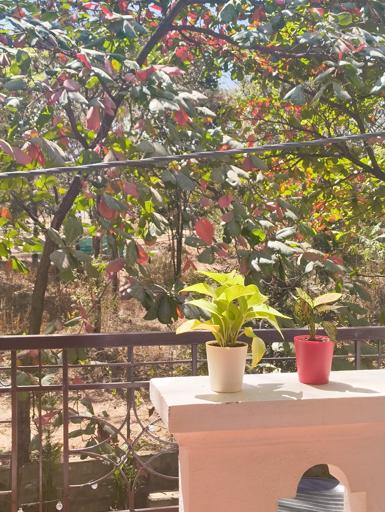

> This post was written as a part of [IndieWebClub Meetup #24](https://blr.indiewebclub.org), where the prompt I chose was, "Write a care guide for an item, pet, or something esoteric in your house."

PP (short for Paisa Paudha), is my [money plant](https://en.wikipedia.org/wiki/Epipremnum_aureum) that I've had for a few months. He's a healthy growing lad, and he's been provided with male pronouns because I'm not sure a lady plant would feel comfortable in a nerdy bachelor's room. This is a picture of him bathing in the sun with his brother, Pinku (a [pink syngonium](https://en.wikipedia.org/wiki/Syngonium_podophyllum)).

### Likes

So far, PP has seemed to enjoy half a cup of water every other day. The soil soaks up as much water as it wants to, and lets the rest collect in the water drain at the bottom of the pot. PP has a pretty advanced home.

He also enjoys the occasional spray of [Ugaao's Plant Tonic Spray](https://www.ugaoo.com/products/plant-tonic-ready-to-use-spray-500-ml). I got this spray as a pair with their Neem Spray, but there's a problem -- the Tonic Spray smells like the Neem Spray, while the Neem Spray doesn't smell at all. I end up giving both of them to PP together, and he doesn't seem to mind.

### Dislikes

PP (or rather I) recently learned that he doesn't like humidity. Leaving clothes to dry in the room seem to be bad practice in general, but I've noticed white fungi build up on PP sometimes that needs clean-up.

A few of his leaves recently started blackening from the same thing, so I had to sadly prune away some of his proud leaves. He will recover soon, but I want to make sure this happens to him less. I now have a separate Neem Spray bottle that definitely smells like Neem Spray. That should do the trick.

### Musings

PP usually sits next to my monitor on my table. Over the past couple weeks, I've seen some of his leaves grow and bend towards my screen, sometimes even touching it. He seems to take interest in my work, which is cool. He might become a React developer some day.

He's probably going to cling to a wall soon, which might lead to more updates to this care guide. I'll keep y'all posted on his adventure. :)
