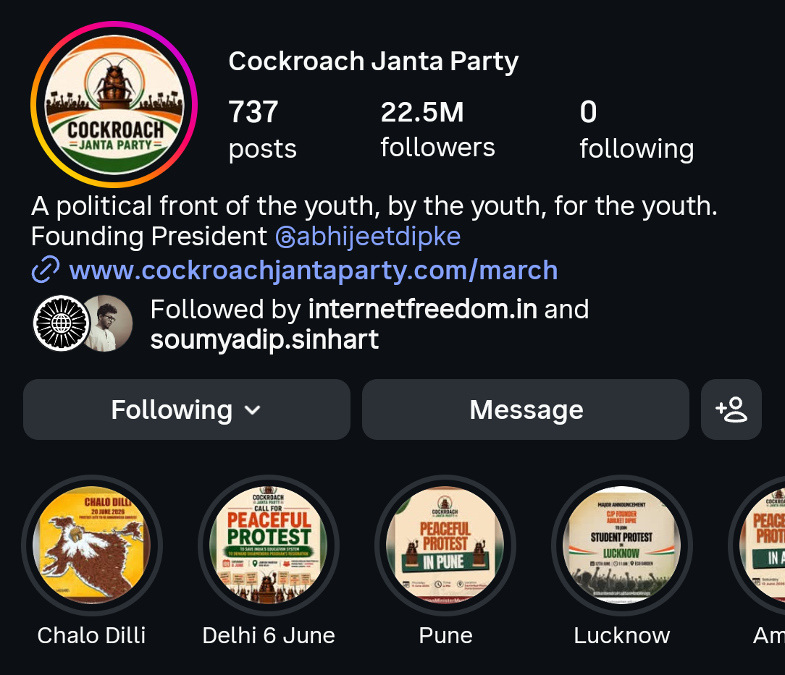
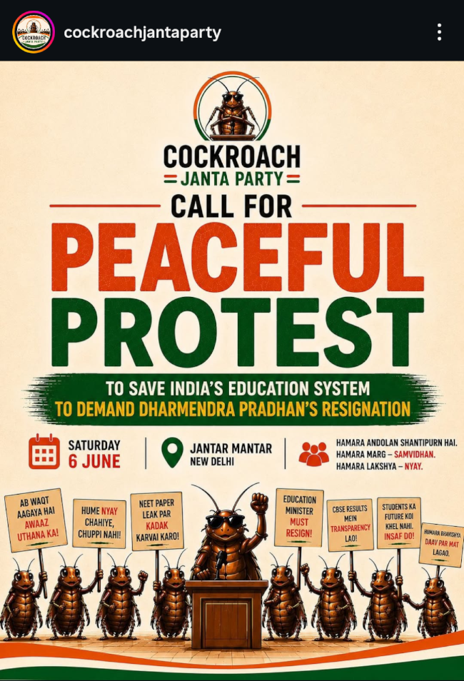
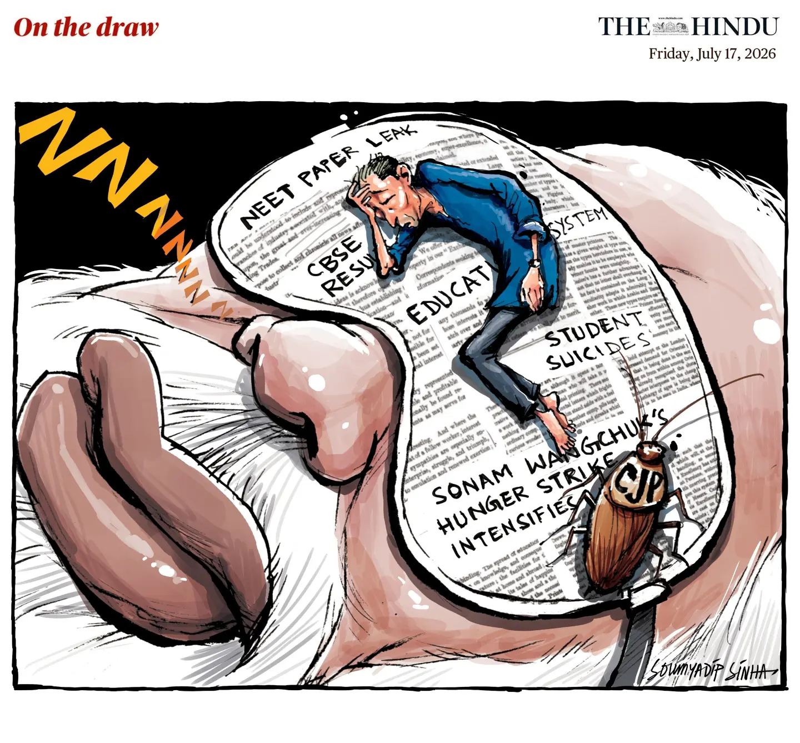
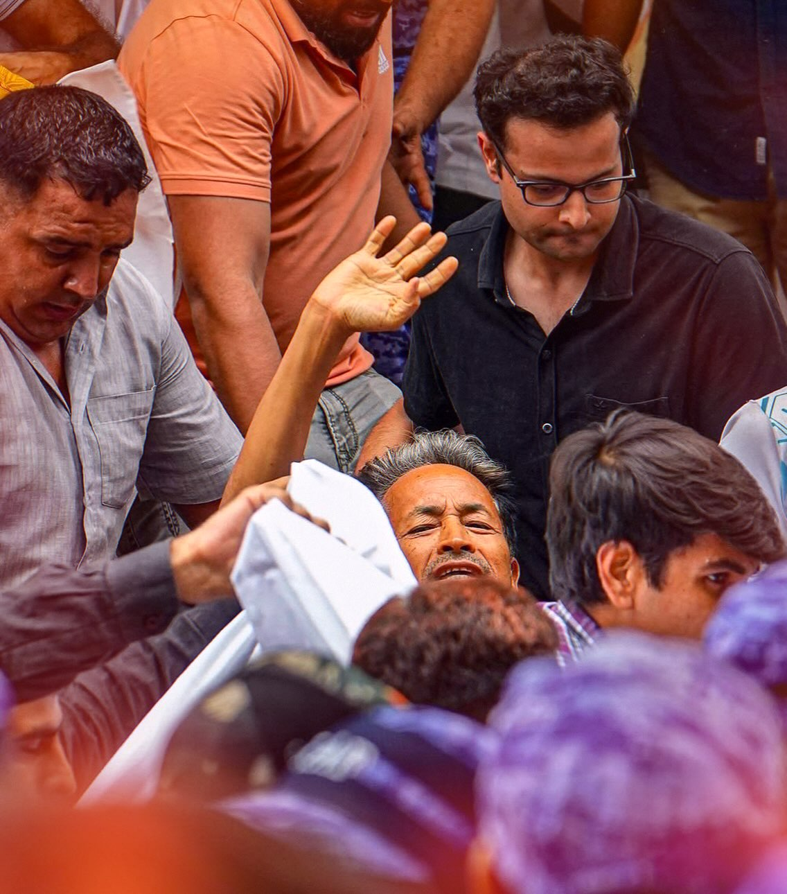
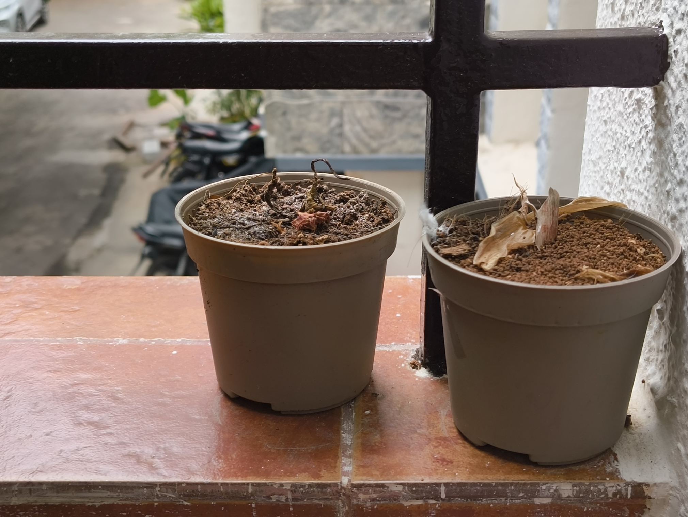
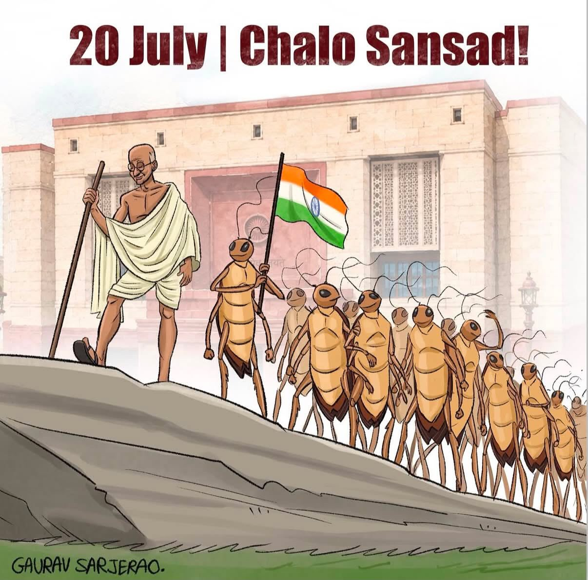

  <i>"The arc of the moral universe is long, but it bends towards justice."</i>
   
<b>&ndash; <a class="text-(--color-text-muted)! hover:text-(--color-bg)!" href="https://en.wikipedia.org/wiki/Theodore_Parker">Theodore Parker</a></b>

I saw the clip on Instagram. The one where a former Chief Justice of India referred to the youth as "cockroaches" who continue to remain unemployed. I sighed out of sadness and huffed out of anger at how unemployment was phrased as something the youth did to themselves. Then I scrolled along.

A few days later, I spotted the page for [Cockroach Janta Party](https://cockroachjantaparty.org). It was great that someone decided to own the label and convert it into a satirical retort, but it still felt lackluster -- the website was almost completely AI-generated with a manifesto that listed five large, ambitious points:

1. No Chief Justice would be granted a Rajya Sabha seat as a post-retirement award.
2. Deletion of a vote (to any party) would lead to the arrest of the Chief Election Commissioner of India under the Unlawful Activities (Prevention) Act, 1967 (UAPA).
3. Women shall receive 50% reservation in the Parliament instead of 33%, without an increase in the strength of Parliament (the same being extended to the Cabinet).
4. All media houses under the umbrella empires of [Mukesh Ambani](https://en.wikipedia.org/wiki/Mukesh_Ambani) and [Gautam Adani](https://en.wikipedia.org/wiki/Gautam_Adani) will have their licenses cancelled, and bank accounts of <abbr title="Refers to media entities that are related to (or favor) the government under Narendra Modi. This can either be a direct/monetary relation, or a relation through private entities that are said to be favored by the current government.">Godi Media</abbr> anchors would be investigated.
5. Any MLAs/MPs that defect from one party to another would be barred from contesting in elections (or holding public office) for a period of 20 years.

It felt weird; I didn't know we (the youth) were going to start forming an actual political party. The site said that you only need to be unemployed, lazy, and chronically online to join (a reference to the comment the former Chief Justice made). But a satirical eligibility criteria after such a serious manifesto was confusing. I shrugged and scrolled along.

Then the page blew up.

Influencers were collaborating everywhere and sharing their dissent and rants about their experiences with the government. Some of them were quite radical and asked the entire government to step down and be re-elected, while others were just young people taking action by cleaning up their neighbourhoods with a cockroach mask on.

It felt good to see _real action_ being taken, but the scale and intensity of the rants was also uncomfortable. I understood the rage myself -- it was an amalgamation of emotions that had built up every time my opinion was sidelined, because I was "a kid that didn't understand the world yet". But the same rage had now rushed forth and shown the youth as a wailing kid throwing a tantrum. "All they can do is sit and complain online," I remember hearing.

Then they started the protests and the call for volunteers.

They set their goal to be the resignation of [Dharmendra Pradhan](https://en.wikipedia.org/wiki/Dharmendra_Pradhan), the Education Minister of India. This was after a continuous set of missteps in India's education sector -- first by [CBSE using an insecure On-Screen Marking Portal from a known-bad software vendor](https://sarthaksidhant.com/coempt/), then from the [NEET paper leaking, which led to a large number of students having to re-take the exam](https://en.wikipedia.org/wiki/2026_NEET_controversy).

This may seem like a weird shift from what they started with, because it is. The truth is that the content and collaborations slowly (but actually quickly) formed the realization that much of the current issues faced by the youth revolve around the failure of the education system. That, paired with a call to action to the most chronically online generation to exist, led to the physical manifestation of the peaceful protests.

They have done much since then. People have gathered under the banner of the Cockroaches in Delhi, Bengaluru, Lucknow, Amritsar, Jaipur and Pune. They gained their own anthem called _"Main Hoon Cockroach"_ and were joined by prominent figures like [Sonam Wangchuk](https://en.wikipedia.org/wiki/Sonam_Wangchuk), [Prakash Raj](https://en.wikipedia.org/wiki/Prakash_Raj) and [Yogendra Yadav](https://en.wikipedia.org/wiki/Yogendra_Yadav). Creators like [Arpit Speaks](https://instagram.com/iarpitspeaks) have been constantly churning out content and satire in collaboration with the organization's page to bring in engagement.

Celebrities tiptoe around the topic carefully, but there are people like [Sonakshi Sinha](https://instagram.com/aslisona) and [Vishal Dadlani](https://instagram.com/vishaldadlani) who are showing their support openly. _Real_ people have been showing up to _real_ protests. Independent journalists have been giving the movement _real_ coverage. My <abbr title="'Greatest of All Time'">GOAT</abbr> [Samdish Bhatia](https://www.youtube.com/@UNFILTEREDbySamdish) covered the movement first [through the lens of the people](https://www.youtube.com/watch?v=KmoEtxzwmeQ), then [through a direct interview with Abhijeet Dipke](https://www.youtube.com/watch?v=WFnGg9w_Hdo), the Founding President of CJP.

The Government didn't respond for a long time, until the Union Education Minister was asked about them in an interview and [literally, genuinely called them terrorists](https://www.newindianexpress.com/india/2026/Jun/24/arent-you-ashamed-to-call-us-terrorists-cjps-dipke-slams-pradhan-appears-before-meity-over-blocking-of-x-account) -- straight-up, no reasoning at all -- and went on his merry way. The people didn't take the comment lightly.

The student protesters have tried many different ventures since then; there was "Pradhan Go Back", then a 7-day ultimatum asking him to resign (which he didn't), then a "Diaper Movement" where people could "donate a diaper to Dharmendra Pradhan to fix the paper leak". Not exactly effective, but you can give the youth credit for variety.

The movement didn't stutter. There were many campaigns and collaborations. The protest at Jantar Mantar turned from the length of a weekend into a fortnight, and is now at almost a month. They stand there still, fighting to save the future of education.

Now that I've caught you up with the past, let me bring you to the present.

On June 28th, Sonam Wangchuk initiated an indefinite hunger strike to support CJP's movement. He hoped to compel the Union government to engage in dialogue with the protesters. Days went by as the educationist was visited by multiple prominent political figures -- [Arvind Kejriwal](https://en.wikipedia.org/wiki/Arvind_Kejriwal) and [Atishi Marlena](https://en.wikipedia.org/wiki/Atishi_Marlena) from AAP, [Sushma Andhare](https://mr.wikipedia.org/wiki/%E0%A4%B8%E0%A5%81%E0%A4%B7%E0%A4%AE%E0%A4%BE_%E0%A4%85%E0%A4%82%E0%A4%A7%E0%A4%BE%E0%A4%B0%E0%A5%87) from Shivsena UBT, and [Dimple Yadav](https://en.wikipedia.org/wiki/Dimple_Yadav) from Samajwadi Party.

Many people sat next to him as he smiled through the fast. Doctors would come and go to conduct regular check-ups -- the order from the Delhi High Court mandated that Wangchuk Ji's strike will only be interrupted if the doctors declare his health in grave condition.

There are many people who don't care about Cockroach Janta Party, but have known Sonam Wangchuk for his contributions to the country. Protesters mingled and media outlets picked at the truth to find their own translations and eye-catching headlines. The people found a voice and a hope through Wangchuk Ji as things started to look up.

The entire country watched as undercover police officers stormed the protest site with a _lathi charge_, pushed their way onto the stage where Sonam Wangchuk lied defenseless, and carried him away to the hospital in a blanket.

He fast was forcefully ended as his diagnostics were conducted. Police officers were stationed on the entire floor of the hospital he was admitted in, and his wife wasn't allowed to take her phone when she visited him. They wouldn't allow him to make a statement. The hospital also refused to provide a digital copy of Wangchuk Ji's medical report. Here's [a reel where his wife talks to BBC in detail](https://www.instagram.com/reel/Da8HibrEQxU).

This was, admittedly, an extremely well-planned operation by the Delhi Police. The officers were called early in the morning under the guise of a "security drill", and were asked to dress in civilian clothes instead of their uniform. They were only told last-minute that they were to abduct Sonam Wangchuk from the protest site within 30 seconds.

They entered the area as "the doctors' crew", and proceeded to push their way to Wangchuk Ji as recorded by the volunteers. Phone jammers were simultaneously initialized to block communications during the plan. The planners knew that Abhijeet Dipke (CJP's Founding President) had gone to freshen up at a friend's at the time, and deployed a police team to stop him from reaching back in time. The plan has been covered thoroughly by The Indian Express [in this post](https://indianexpress.com/article/india/sonam-wangchuk-removal-jantar-mantar-delhi-policesonam-wangchuk-removal-jantar-mantar-delhi-police-10792040/).

People cried out at the chaos while Sonam Wangchuk raised his hand one last time, before getting ushered into an ambulance to Safdarjung Hospital.

Hearing the news in the morning made my heart drop. Learning each facet of the incident made it more and more unbelievable. The depths to which the government can go to shut down opposing voices is fearsome. But the Cockroach Janta Party did its best to gather its wits and is trying to walk again.

As of writing, Abhijeet Dipke has declared an indefinite strike in Sonam Wangchuk's stead, and continues the campaign for Dharmendra Pradhan's resignation. The celebrities and creators continue to raise their voices, and the youth continue to rage. Oh, how they continue to rage.

The reason for writing this piece, though, is that I got tired of people who gloss over the criticality of CJP's current motive and how it affects the younger generation. I feel like the older people saw the bloated, unfinished past of CJP's journey and stopped listening along the way. Every time that I've tried to bring up the issue with an adult, I've received one of the following responses:

1. **"Changing the system takes time, Abhigyan."** Yes, it does. But it also take the _urge_ to change. The change doesn't occur itself.
2. **"Did you know Sonam Wangchuk's father was a Congress MP?"** Okay, how the _hell_ does that matter?
3. **"What are you going to do, remove corruption on every single level of the country? That's impossible."** These are the people who haven't understood the motive of the movement in the first place.

After a bunch of these, and after closely following the path of the Cockroaches, I felt like I had an obligation to create a run-down of the events that have occurred and the motives of the Cockroach Janta Party. That's what brings us here.

Now, let me tell you about my fear.

My fear isn't that things won't change or won't get better. Even if these leaders continue to remain in power, we will inherit the country and make change one day; the old always makes way for the new. My fear is that the change might be _too late_.

1. The NEET paper leaks have been an issue for _decades_ and the National Testing Agency continues to be inefficient. There are students who are giving _years_ of their young life to the testing process, only to be deceived by the process and having to re-take the exam, again and again.
2. The CBSE On-Screen Marking Portal has lead to many cases where students have been assigned marks _based on the answer sheet of another student_. There are hard-working toppers who have failed their exams because, when they requested a re-evaluation, the found that the answer sheet under their name isn't even theirs.

A student, whose entire life revolves around academics (even more so in India compared to other countries), sees their work fall apart because of faults in a system out of their control. The faults persist and are known to exist, _and yet_ their futures are decided based on the same percentiles and rankings. _And yet_ the system asks for their marksheets from their Board exams. _And yet_ they cannot pursue a respectable degree unless they receive the rank they worked hard for.

Students, who have seen nothing but the merit of a rank, lose their will to live when hard work wasn't enough. Students who take their lives in this case aren't a death toll to be displayed in a news flash. That's blood on the hands of a broken system. That's what the Cockroaches are fighting.

The Good may prevail in the long run. The arc of the moral universe may bend towards justice. But how many innocent lives are we willing to lose, how many deserving candidates are we willing to rob of their merit before we reach the good place we dream of?

Tomorrow, on Monday (20th July, 2026), the Cockroach Janta Party shall march to the Parliament and demand the resignation of the Union Prime Minister. This will most likely be the largest crossroads for our future and the future of those that come after us.

If you are in Delhi, and if you have a child or a sibling that is going to face the whims of the education system soon, then you should show up. If you are a Cockroach yourself, then I'm sure you already understand the gravity of the movement.

  <i>"A democratic government is a better government because it is a more accountable form of government. Thus, democracy improves the quality of decision-making. Democracy provides a method to deal with differences in conflict.   Democracy enhances the dignity of citizens. It is better than other forms of government because it allows us to correct its own mistakes."</i>
   
<b>&ndash; Page 11, Democratic Politics - I (Political Science Textbook), NCERT.</b>

We've been called "ignorant kids", "terrorists" and "anti-nationals" already. It's high time we add "revolutionaries" to that list.

Signing off, a citizen of Bharat.
