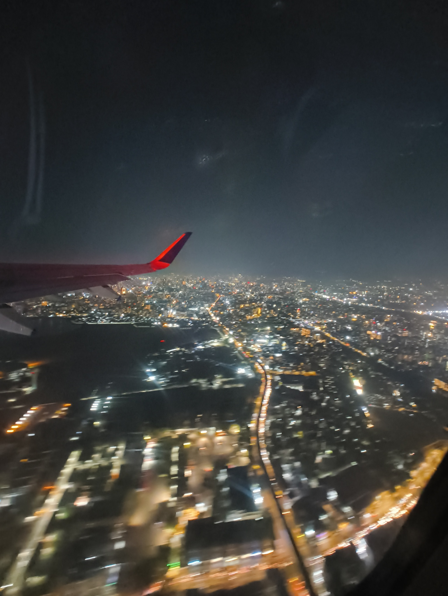

> As I wrote this post, I realized that I described an incident at an airport. I don't know if that counts as "hospitality", but I'd say the message of the post remains the same.

It was around 11PM on a Sunday. I'd just landed back in Bangalore after a long vacation back home. The trip back to the hostel would take another hour, and I had classes at university the next day. I'd have to wait for my monitor to come through the Special Baggage section before I can book a cab. I grab my luggage from a belt, park my trolley in front of the "Out of Gauge" cargo entrance and begin my wait for the monitor.

Fifteen minutes go by. Thirty. An hour. The airport has been emptied of its crowd from the late arrival. I probably shouldn't be sitting on a trolley for this long. I get up and go over to the luggage assistance section.

The environment changes. There are some angry families scolding airline representatives quite intensely; as if they'd personally hurt them. The uniformed reps respond with a flurry of apologies, discount coupons, and mentions of company policies. Damaged luggage cannot be repaired, and delayed luggage can only be expedited for investigation.

With nervousness that I don't normally feel, I go over and mention my monitor; showing a picture of what the box looks like. The representative forwards it into a WhatsApp group with the ground team. Twenty minutes later, a dude in a neon vest brings over a familiar cardboard box. I thank the neon dude and the representative, and start booking my cab home.

As I'm about to leave, I get the urge to ask the rep, "How many complaints do you have to handle in a day?" She shrugs, smiles, and says, "Probably hundreds. It's a part of the job." I thank her for her service and depart for the cab pickup zone.

That, is the incident which led to this post. I want to note that I'm _definitely_ not above all this; I've gotten angry before, and I've showed selfish annoyance to others before. If I'd had a worse day, I might be venting at the same desk. But witnessing the attitude from afar -- whether it was because of the timing, or the polarity between the quiet and the loud -- made me suddenly aware of how lightly we take these representatives.

Being scolded honestly feels pretty bad, especially if I can't fix the problem immediately. Dealing with hours of that -- with no access to a complete solution -- feels really scary. So many people leaving the conversation with disappointment. Worse, an online review that might directly affect my employment. So many factors out of control...

Yeah, no, I've learned to treat these people with some respect. So far, I've only experienced these issues as one-off. If they were repetitive, then they seem like a bigger problem than someone sitting at a help desk or reception.

To all those who listen to complaints on behalf of larger organizations, and treat troubled customers with care, I sincerely thank you for your work. Thank you for listening to our problems, and doing your best to provide a solution. To the ones that go the extra mile and call in their connections, I am grateful for your dedication. If I ever forget about this gratitude, and end up at your desk with a bad temper, please use this post to give me a reminder. It'll make me shut up. :)
