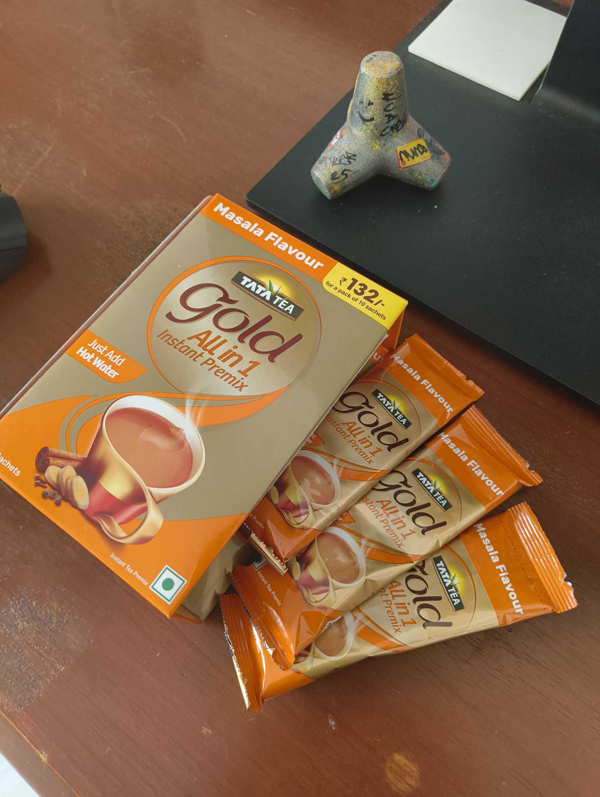
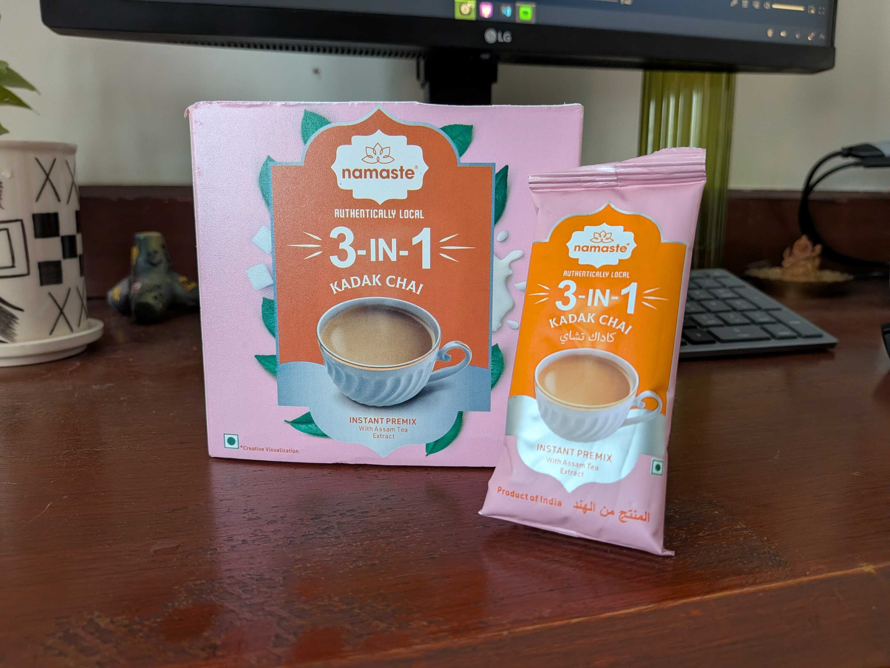
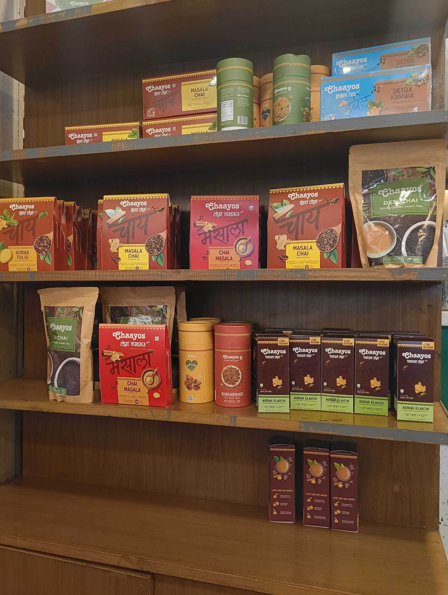
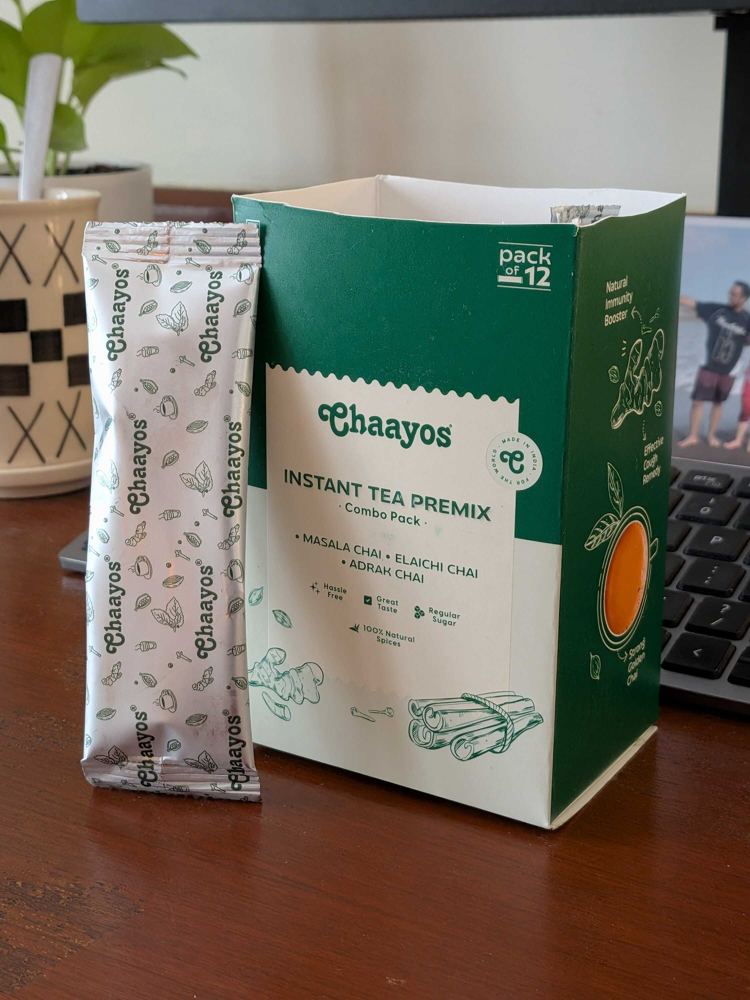
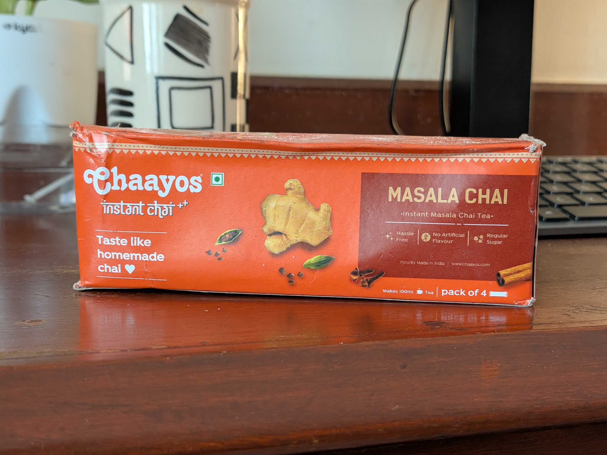
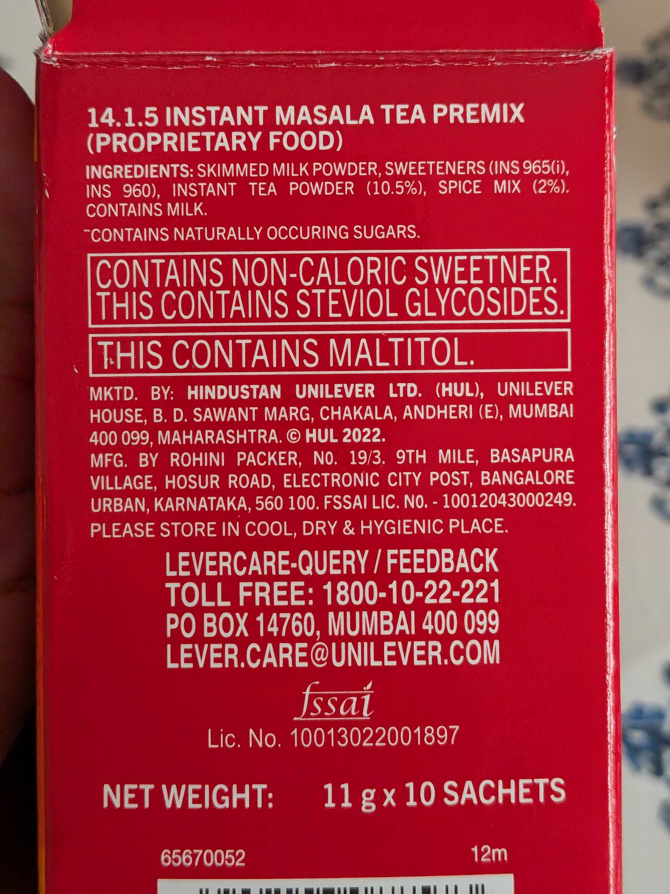
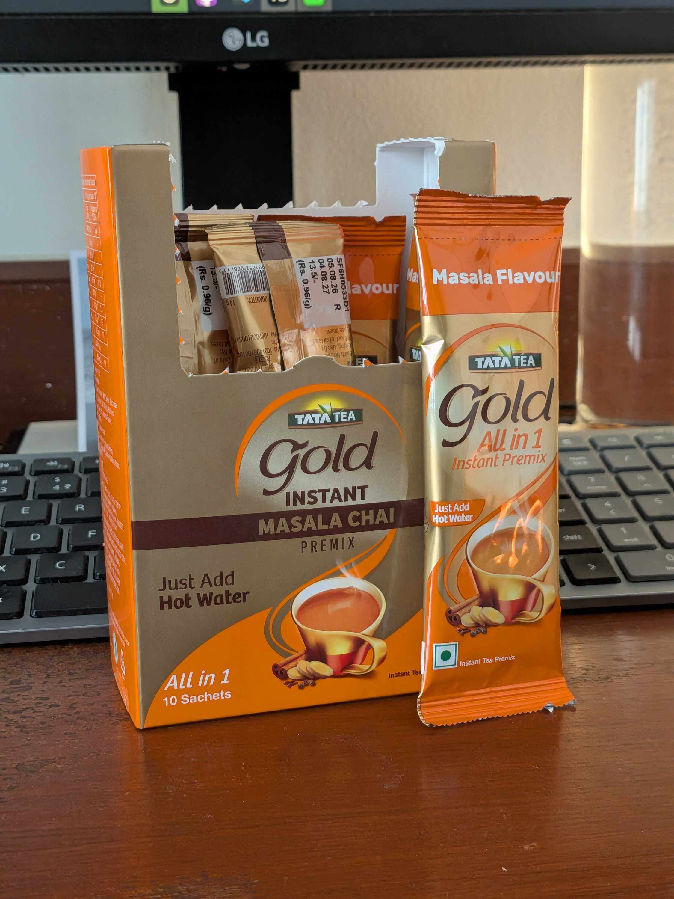
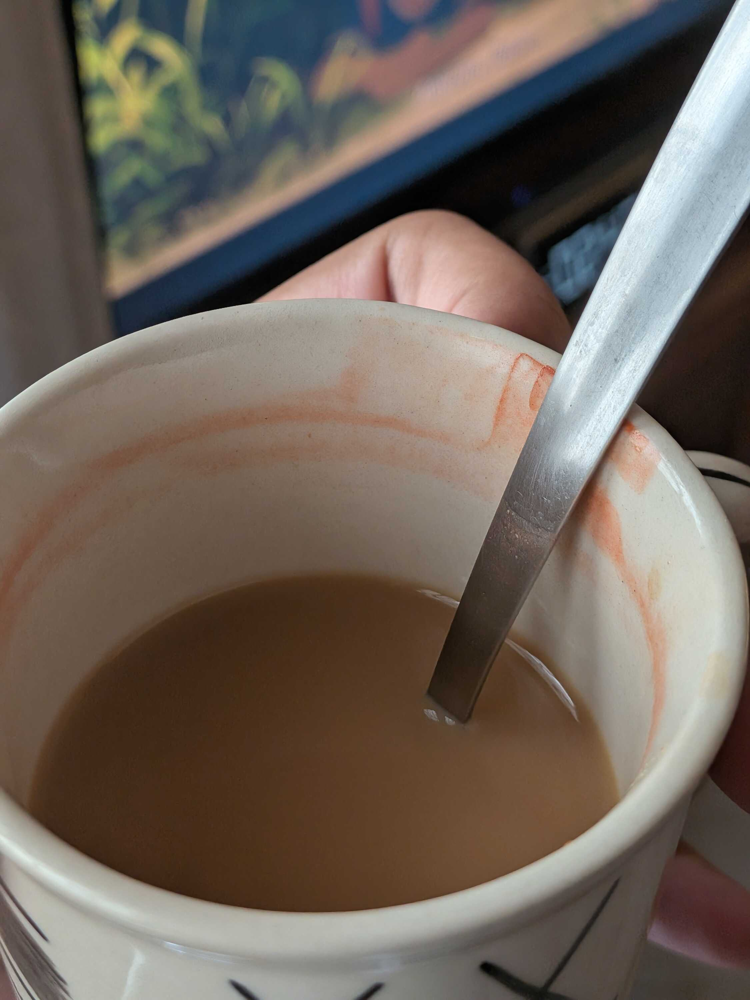
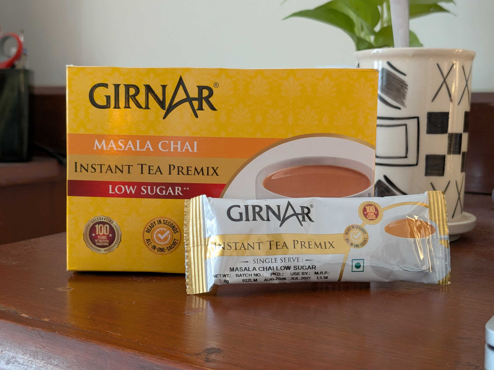

Hello! I like _chai_ a lot, as you [might know](/blog/the-perfect-chai). I also like making it; as soon as I learned how to grate _adrak_ and boil milk, I became the staple person to make _chai_ for the family. It could just be that no one else wants to do it, but I like to think it's because I make it so well. :P

Ever since I shifted to hostel though, getting my hands on a stove and a boiler has been... "difficult" might be an understatement. The hostel declared that stuff as basically illegal. But I've had to look for many alternatives to get that same satisfaction that I get after a sip of hot _chai_. So far, the only solution I've reached is _chai premixes_.

I've tried many of them on and off throughout hostel. I remember there were times I grimaced at the taste of the _chai_ or even greatly enjoyed it, but I never really kept track of which ones I liked/disliked. Now that I've graduated, I feel like I have an obligation to reach a conclusive staple, for my own future grocery runs. So let's do that.

For both our sakes though, I'm not going to italicize _chai_ for the rest of the post. We both know I'm referring to tea, so let's keep it that way. This is also a good place to point out that none of these brands sponsored me; I meticulously spent my own money every 15 days when a premix box ran out. :P

### Namaste Chai

This was one of my favourites in college, and I was worried I'd set some high expectations if I started with this one. But it was already in my inventory, so I proceeded with testing it.

Namaste Chai always has a very strong aroma for every flavour. You might find this too much, but I personally found it calming as I had chai after a long day of classes/work. I have no idea which company they originate from (I'm writing this while sitting in an [IndieWebClub Meetup](https://blr.indiewebclub.org), so I can't really check the box), but the aesthetic is all very cool anyway.

They have one of the largest catalogs on this list, including -- apart from "Kadak", "Cardamom" or "Masala" chai -- _Lemongrass_ chai. Like what even? I remember ordering this flavour by accident in college, and making a face at the smell at the start. But by the time the packet ended I actually kinda enjoyed it. I haven't been able to find presently though, so that hunt continues.

Their sachet size is the largest on this list; around 22 grams. This is good for adding for flavour to each cup which I enjoy, but it also means there's more total sugar in each sachet, if that's something you're concerned about (around 11 grams in each, to be specific).

The taste itself though is one of the best. I come back to this brand time and again, and their variety has kept me a semi-loyal customer.

### Chaayos

If you've ever used chai premixes, this is probably the brand that comes to your mind first. Chaayos I feel has had a large impact on the café scene in India, particularly because of their,

1. very, _very_ custom chai ingredient choices,
2. the _desi_ vibe which makes them feel more at-home compared to Western establishments, and
3. a pretty large collection of things that you'd commonly eat with chai.

Chaayos is also a relatively expensive place, which makes them more like an Indian version of Starbucks, but I digress. We were talking about chai premixes.

The first premix I used was from Chaayos, because my mom got it delivered from Amazon. The branding was all very cool and I remember liking it at the time too. But I think it's _because_ of the variety that I ended up getting a low-sugar variant by accident, didn't like it, and decided to set out on my own premix discovery. So in a way they are to be thanked for this post.

The premix from the above picture was my first Chaayos trial. It included three variants, and all three of them were... fine? The taste and notes were less distinct than I remember them being, so that was a little disappointing.

One thing to note is that most of these premixes have sugar to premix ratio that's around 1:2. So half of the premix is just sugars, which was the case here too (7 grams in 14 grams of premix). But the sugar here was much less distinct compared to Namaste Chai.

I also have biscuits with my chai, specifically "Sunfeast Farmlite Oats & Chocolate". So the sugar from those is bound to overpower the sugar from the chai. But I still usually notice it while drinking this one, which I usually do.

This is the other premix of theirs I tried, which for some reason only comes in a Pack of 4 (and was covered in oil when I ordered it from Blinkit). I liked this one a lot more because the presence of _adrak_ was noticeable, and felt a lot more like chai at home. Still though, these premixes are relatively expensive.

### Red Label

I kinda like Red Label as a brand, in a purely aesthetic sense. I mentioned [in a previous blogpost](/blog/the-perfect-chai/#paragraph-4) that our family was trying out their _chaipatti_ as an alternative to Taj Mahal, which is still an experiment in progress. But I was excited to have their chai premix anyway.

After making the first cup and drinking it without an accompaniment (biscuits or otherwise), I was left frowning at my mug. The colour and smell were fine, but the taste itself felt like it was _artificially sweetened_. Which is when I looked at the information and the box and went, "Ah."

The concoction tasted how those yellow SugarFree&trade; powders used to smell, and the experience got a little worse when having it with biscuits that had real refined sugar, because the made the chai taste weird. I was disappointed with this one overall.

### Tata Tea Gold

This one, much like Red Label, came across my radar as a brand that makes normal _chaipatti_ but is expanding to other forms of chai. The packaging was very cool and I liked the colours, now I just had to boil some water and taste it.

The taste was okay, and the different notes battle a little bit to stand out, but I _think_ there's something wrong with this one? The chai itself was nice and masala-y, and didn't have any noticeable amount of sugar. But every time I'd make this chai, I noticed a ring of red residue left at the top of the mug.

I've made sure it's not something that was already in the mug. From what I've observed though, it's the foam from the premix that first starts out orange and then later on shifts to red. I don't know if this points to how real or synthetic the premix is, but I'm probably not going to buy this one again. Ever.

Also the premix, per calculation, contains about 7 grams of sugar for every 14 gram serve. I couldn't for the life of me taste any reasonable sugar inside the thing though.

### Girnar Instant Tea

This is one that I got after trying everything else, just to make sure I'd gone through all my options. I relate Girnar to railways for some reason? Like I expect this chai to be served when travelling on the train. But I don't know why, Girnar seems more like an afterthought to me when considering chai premixes.

I, once again, accidentally got the low sugar variant here and wasn't happy with it. I don't even know if they have a normal sugar one. I tried adding honey to it which was okay, but I'd like to give this one a fair shot again with a proper amount of jaggery/sugar. Until then, this is not the one.

---

I was having chai on the balcony for this last one, grimacing at the taste. I was just waiting for the mug to finish when one of my neighbours dropped in and we started chatting. It was normal stuff about work and weekends, but I noticed over time that the chai tasting better. That was interesting.

I don't want to end this post on a cheesy "the real good chai was the friends we made along the way," though. So I'll instead be a kid and just declare an objective winner that I prefer personally.

That winner for me, in this post, is **Namaste Chai**. Remember how I was foreshadowing that I don't want to set high expectations for the rest of the premixes? It looks like I did. And I'm fine with the slightly higher sugar content I think, because the chai is good enough that I feel satisfied and don't crave another one for a while. So that's that.

I'll continue to experiment with newer ones from time to time though. For example, none of the premixes mentioned here were dairy-free, so I'm keen to look for something in that department. None of these are a replacement for chai by any means, and some of them are probably even using artificial colours to _look_ like chai. But the sloppy imitation will suffice for now.

> By the way, this draft started originally on 31st May, 2026. So it has been in the works for a loong time. Very glad I finally published this, and this post is dedicated to all the people I have been telling about this post for weeks. :)
