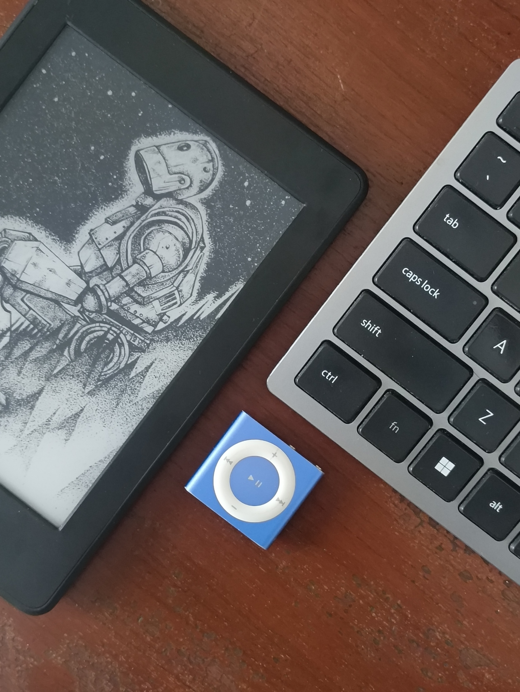
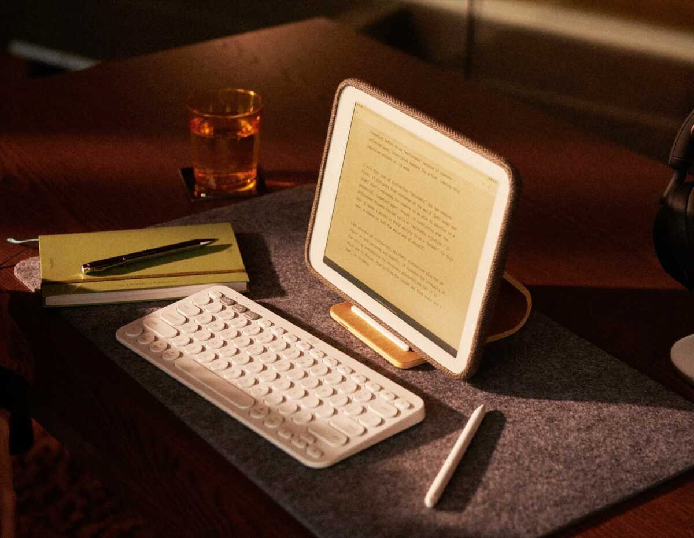
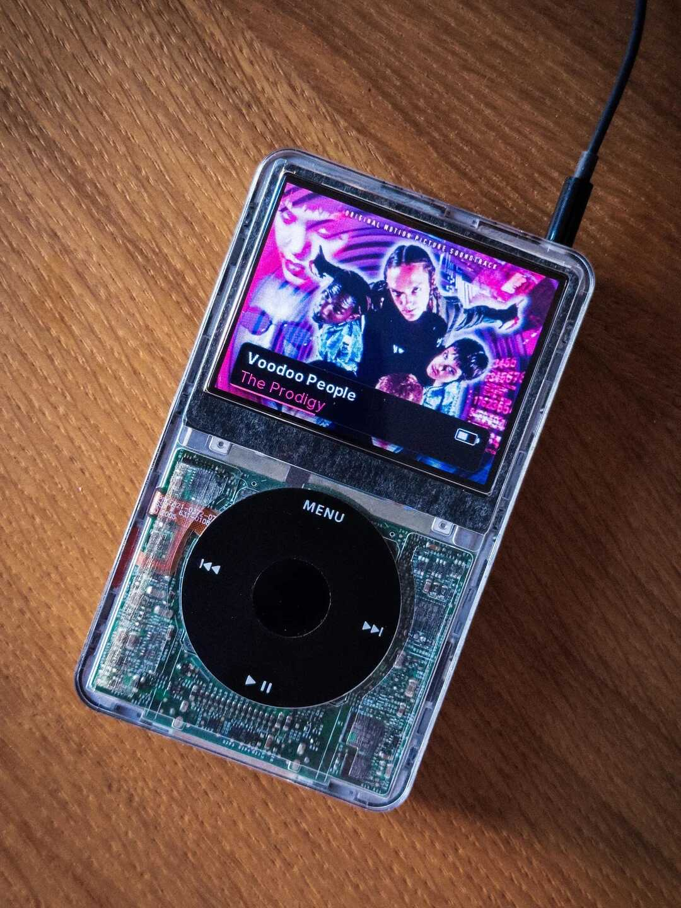
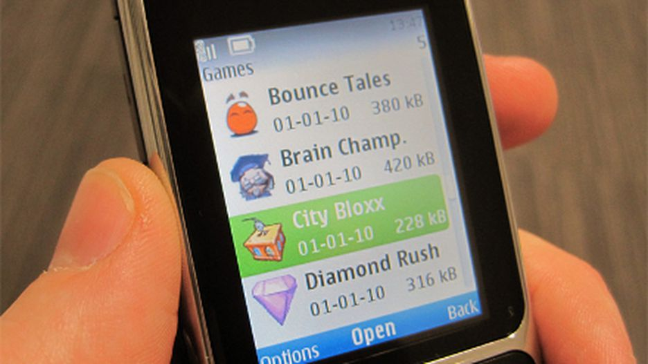
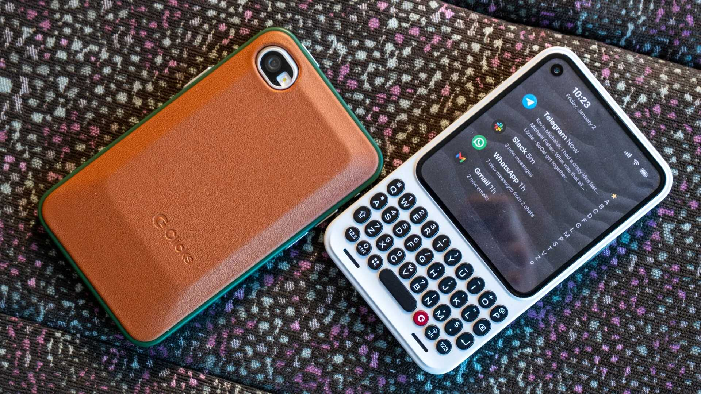
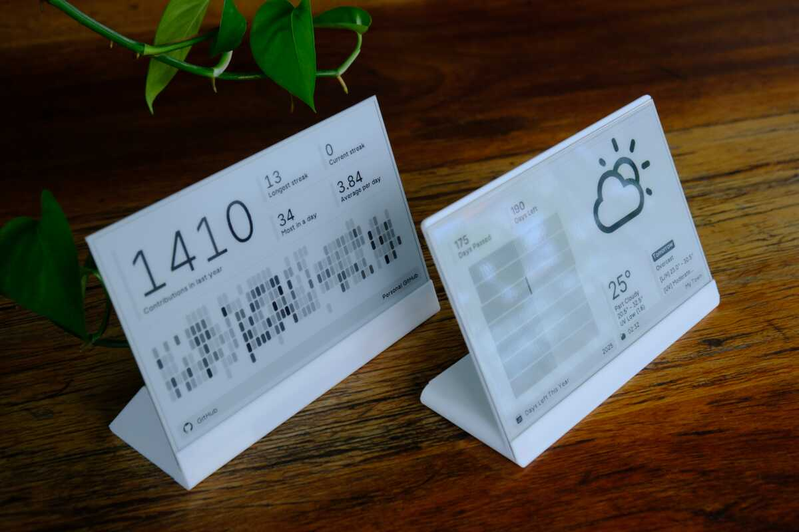
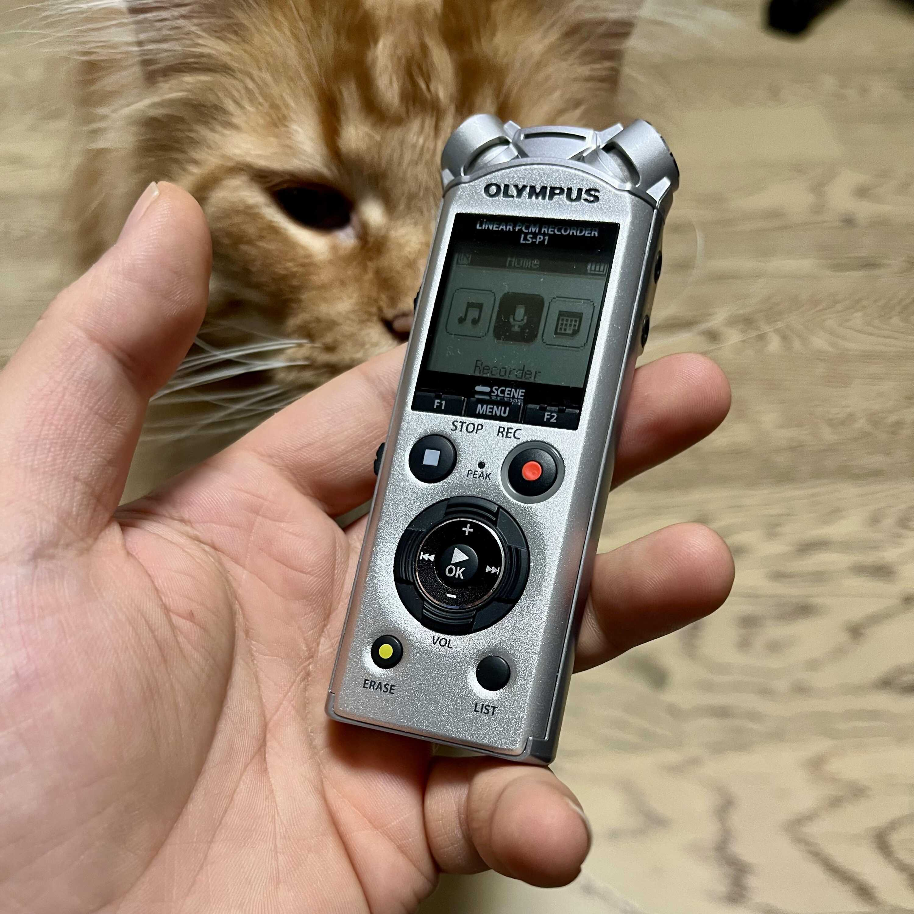

I believe that technology should be an enabler, not a subjugator. The tinkerers that love messing with dials and diving into code should continue to do so! But otherwise, technology should help you do a thing and then stand back as you hold the reins of your human experience. I'll try to write more about this later on.

For now, though, my main gripe with my tech interactions is how everything has _steps_. I have to jump through multiple hoops to reach the one thing I want to do in the moment. And even when I _am_ doing a thing, there's always something else that's trying to grab my attention -- an SMS, a UPI reward unlocked, or a spam call for a credit card.

Even when the device isn't trying to distract me, I now have an inbuilt _**Distractor 5000**_ in my head that impulsively checks all communication channels, just because it can. The drawback of having a rectangle that can do everything is that it can do _literally everything, all the time_. That can be, safe to say, quite turbulent.

There was a brief Golden Age I experienced in middle school; I would use a [Kindle](https://en.wikipedia.org/wiki/Amazon_Kindle) for reading, my mom's [iPod Shuffle](https://en.wikipedia.org/wiki/IPod_Shuffle) for listening to music, and the family computer for any Internet shenanigans. Time felt more dedicated and worry-free back then, even if that's partly because I was still in school. :P

Replicating that exact setup today would have its own problems, ofcourse -- music players would be more useful if they had Bluetooth, and [e-readers](https://en.wikipedia.org/wiki/E-reader) would be more useful with an independent Internet connection (and without [companies locking down the software](https://blog.the-ebook-reader.com/2026/06/12/amazon-locking-down-10th-gen-kindles-with-new-software-update/)). But we've gotten good at building devices that communicate well with each other, and can do more things when they are offline.

What I dream of is an era of Focused Compute&trade;, where devices target one human function and exist as a thin layer to smoothly do that function. What excites me is that we're already getting there, from new competing entrants to old products that are being seen in a different light due to paths that software unlocks.

I would like to highlight the ones that really stick out to me this year, and I'm closely tracking to buy. I also hereby give you full permission to gift these to me if you want. I won't complain. :P

### The Daylight Computer

[E-ink](https://en.wikipedia.org/wiki/E_Ink) is very, very cool. It literally moves ink on the screen to change the picture, and doesn't need any extra power to maintain the state of that ink[^1]. This leads to low power usage and a long battery life, but what I like the most is that these displays can have paper-like textures and still be visible in direct sunlight. They act more like paper that can change content instead of a greyscale display.

The trade-off here is that the ink takes time to move, and changing content is slow. This has been fine for reading books, but not as much for anything else. Fast-moving content was left to normal displays, until [Anjan Katta](https://www.linkedin.com/in/anjan-katta-250b232b4) came along with [Daylight Computing Co.](https://daylightcomputer.com).

This guy worked on a version of [Transflective LCDs](https://en.wikipedia.org/wiki/Transflective_liquid-crystal_display) called [LivePaper](https://www.slashgear.com/1655111/daylight-computer-live-paper-display-vs-e-ink-explained/), which can still be visible under direct sunlight and maintains the speed expected from normal displays (around 60 frames per second).

They've showcased it with their first product, the [DC-1](https://support.daylightcomputer.com/daylight-dc-1-press-kit-1), which is an Android tablet with a comfy physical build that's in line with their notion of building a "Calm Computer". It comes with some homely textured accessories and has a very, _very_ yellow frontlight. I love it.

"Why not go ahead and get it, then?" Well, the DC-1 is still their first iteration at trying out LivePaper displays and I'm observing it from afar. They also don't currently deliver to India. And even if they did, the DC-1 is currently $729 USD (which is roughly ₹70,200 INR). That's a lot for an Android tablet with large bezels and a greyscale screen.

But hey, I'm excited for a future where reading blogs and documents doesn't need me to look at some really bright colourful pixels. Imagine reading out in the Sun with this thing!

### Restored/Modded iPods

It was around last year when my YouTube algorithm slowly started moving towards videos of iPods being restored; sometimes receiving storage or battery upgrades. That slowly turned into adding [USB-C](https://en.wikipedia.org/wiki/USB-C), then having a custom exterior, and then rooting the operating system to be completely different.

As smartphones arrived, music players slowly reduced to either really simple ones with basic playback controls, or really sophisticated ones for audiophiles (by companies like [Fiio](https://www.fiio.com/)). The mainstream was left to smartphones, and later on to streaming services like Spotify.

I'd been fine with streaming music on the daily, until a few things merged into a giant snowball of reasons to move away from the green Wi-Fi symbol:

1. My recommendations all started... sounding the same. It was all the same drums and the same beat. There's a video on this called "[The Playlistification of Music](https://www.youtube.com/watch?v=bQDudbp-pag)" which I'd recommend. I stopped being able to discover different music unless I really went out of my way, as if Spotify was trying to keep me in a bubble.
2. I started being pushed more nonsensical music, as of late. [Drew Gooden](https://www.youtube.com/@drewisgooden) made a video on this called "[The Music Industry is Broken](https://www.youtube.com/watch?v=Yx7baJMQuVA)", which talks about how Spotify is literally, genuinely pushing AI artists in your feed -- partly because they have created their own fake artist accounts where they earn from the streaming revenue. That sucks.
3. On top of the above point, it's known that the revenue earned from your listening is split between _all_ artists you listen to, in proportion of your listening minutes. The more diverse your listening taste, the less money each of the artists receive from your streaming. And that's on top of the shitty way music labels treat their artists through contracts, so Spotify eats up a lot of what would normally support your favourite artists.

The final blow was when I heard about how [the CEO of Spotify invested a large sum of money into military drones and other defense technologies](https://techcrunch.com/2025/06/16/spotifys-daniel-ek-just-bet-bigger-on-helsing-europes-defense-tech-darling/). Money that he received from subscriptions like the Family Plan I pay for. People sometimes tell me that everything indirectly contributes to evil and we can't really do much about it, but I felt too close to evil in this case. So I decided to start shifting.

The first iteration of migrating was using this app called [Classipod](https://github.com/adeeteya/Classipod), which simulates the iPod interface on your phone. I downloaded FLAC versions of my favourite albums and just started listening.

The experience was much calmer than before, since my options were limited and I chose the albums wisely. Streaming had turned listening to music into a constant background activity; sound that kept droning on without distinction between songs or lyrics. The _intentionality_ of "turning on the iPod" and choosing an album to queue was more mechanical and felt more fruitful, which stuck with me.

The current scene for purchasing a modded iPod in India is still, ofcourse, quite low. The two places I found (neither of which I've actually purchased from, FYI) were [The Revolver Club](https://www.therevolverclub.com/collections/ipod) (which had limited options) and [RetroPodz](https://retropodz.com/) (which had AI-generated images but is run by one dude as a hobby). I'm still conflicted about the product that will fulfil this need of mine[^2], but a music player is definitely on the list.

### The Clicks Communicator

Smartphones are a pain, aren't they?

We use the same portal for accessing both our loved ones and some of the worst events currently going on in the world. It's the harbinger of both good news and the bad -- from breakup texts to salary updates, from rejection emails to messages from old friends. This is my completely unbiased opinion. :)

None of that relates to this specific product, though.

We got the first smartphone in the family at the start of the 2010's. Before that, it was all squat button phones from Nokia and Motorola. I didn't particularly care for the form factor, all I remember is playing Bounce Tales on my <abbr title="My mom's dad.">Nannoo</abbr>'s Nokia E63.

What I realize looking back though is that a lot of the doom content consumption today is dependent on the vertical form factor. First it was just short-form video, but platforms like Instagram have also made 4:3 photographs their new default (a choice that has faced much criticism from artists).

I feel like a lot of that could be fixed (or rather, I could steer myself away from doomscrolling) by just _not_ having a screen that shows this content properly. This is where I'd like to introduce my solution, the Clicks Communicator.

Worked on by [Michael Fischer (Mr. Mobile)](https://www.youtube.com/@TheMrMobile)'s company [Clicks](https://clicks.tech), the Communicator is meant to be a secondary Blackberry-like device meant primarily for communication during working hours. Its main pitch is "focus and simplicity in communication", which I'm reading as "an attempt to best distract you from distractions".

The device has a physical keyboard as well as a square touchsreen. The keyboard's spacebar also functions as a fingerprint sensor, and there's a special key you can use to create any shortcuts you want. It's lighter than the average smartphone and has a "signal light" on the side which is similar to the notification LED's you'd get on older smartphones.

I love this as my concept for minimalism because it doesn't compromise on all the extensibility we've gained from modern technologies. I shouldn't have to move away from the gains of WhatsApp or a dedicated maps application just to take back my time and focus. This also comes at a good time where the outer screens of modern flip phones have the same screen aspect ratio as the Communicator, meaning that developers have more incentive to fit their apps to such smaller screens.

The current drawbacks are led by the fact that this phone doesn't currently exist; even the one showed above is a dummy for media coverage. The company has [started taking reservations](https://clicksphone.com) for the phone, but it will still be another year before they can start shipping them out by current progress speeds. With some leeway to check other people's reviews after that, there's definitely some time before I can get something like this. And oh, they don't ship to India right now.

### The TRMNL Ecosystem

Returning to my love for e-ink, [TRMNL](https://trmnl.com) is an ecosystem where you can set up multiple e-ink displays as periodically updating dashboards for whatever you want. This can either be a new display/setup that you buy from them directly, or you can give old e-readers a new life by connecting them to TRMNL.

> In technical terms, TRMNL works by having a central [web server](https://en.wikipedia.org/wiki/Web_server) (either self-hosted or provided by [trmnl.com](https://trmnl.com)), which sends images to the e-ink device every 30 seconds. The receiver then accepts the image and updates the data on its display.
>
> This lets the device maintain its low-power and passive nature, with the addition of only one-way communication so the device does not send data back to the server.

I really like this idea of data calmly updating in the background, like a photo frame I can turn to and see the information I need at a glance. The current ideas to use it are,

1. I can have the display mounted at a semi-permanent place, and I can always turn to it to see my task list and incoming important emails.
2. I can have a smaller display next to my plants, and it can visually show when the plants need watering according to their schedule.

The best part is that the entire ecosystem can be self-hosted -- an old Kindle can become a receiver, and you can host your own web server on something like a [Raspberry Pi](https://www.raspberrypi.com/). There's also a large library of integrations with the ability to create your own plugins for any platform you want. I really respect the determination of the developers to keep it all open-source.

### Dictaphones

A lot of my thoughts worthy of pursuing pass by like blips. I have to quickly _catch_ them off the train of thought and store them somewhere to revisit later.

I've tried doing this with sending WhatsApp messages to myself or using my phone's audio recorder, but they both have the same problem of requiring too many steps between thinking and recording.

I want it to be as simple as maybe holding a button that starts recording my voice and saves it on release -- which _does_ exist on some phones, but is being portrayed as an AI feature and is most likely sending that data somewhere else.

Enter, dictaphones.

The last time you probably saw one was in the hands of a journalist, interviewer, or a documentary anchor. They're meant for recording conversations or solo "in-the-moment" experiences that can later be accumulated and looked back upon.

There's a large range for these products thanks to their professional purpose and demand. I've not researched them that well yet, but it is my assumption that these things just store audio files which you can then connect and import over. That's only half the equation for me.

My goal with a dictaphone would be to automatically receive the files at, say, the end of the day and transcribe them so I can search through them or summarize the ideas. I can see it being useful for [writing weeknotes](/weeknotes), or otherwise compiling thoughts I've had about certain projects over time. They're tiny too (relative to smartphones), so it would a small addition to my <abbr title="Everyday Carry, referring to the items that one carries on a daily basis.">EDC</abbr>.

> **P.S.:** There's this field recorder from [Teenage Engineering](https://teenage.engineering/) called the [TP-7](https://teenage.engineering/products/tp-7). It plays music, looks beautiful, can scrub through tracks by rotating the disc, and can record notes that can be transcribed through a companion mobile app. It's a piece of art that records things as a side hustle.
>
> The only problem, again, is that the thing $1,499 USD (roughly ₹1,44,000 INR). What in the world.

---

I think we've caught on to the fact that gaining more information and speed through our tools doesn't particularly mean that we get to relax more; in most cases, it just means that our deadlines get shorter. A busy day can leave us catching our breath afterwards, and the rest we take needs to keep technology at an arm's length, as much as it can.

The desire for calmer compute has grown past the stage of indie projects and tiny scales. We deserve rest, and a space where our thoughts can be mulled over without being bombarded with information. Let's look for technologies that give us that space.

#### Footnotes

[^1]: Any compute or frontlight in front of the display still uses power, ofcourse. But the display itself can retain images without power.

[^2]: Another product that I'm following is the [Fiio Snowsky Disc](https://www.headphonezone.in/products/snowsky-disc).
