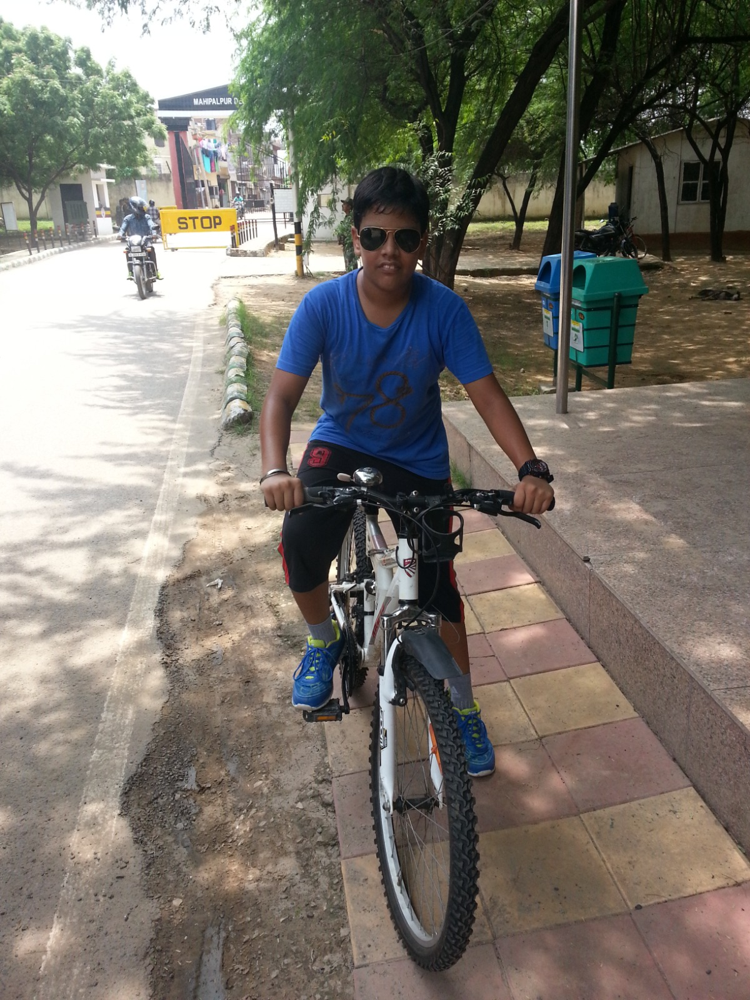
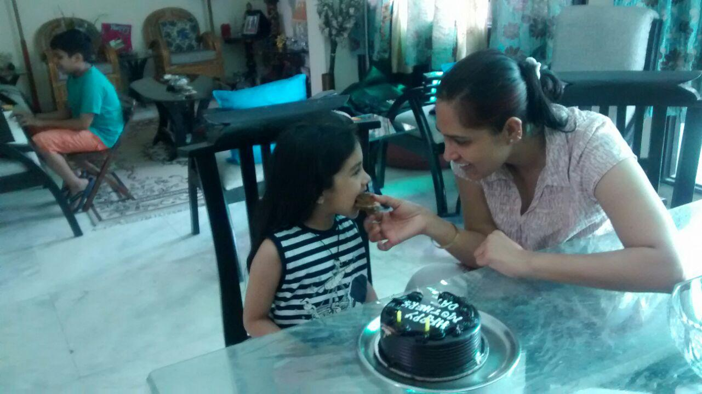

I was in 5th Grade when we moved to Dwarka. The one in Delhi NCR, not Rajasthan. It was the typical semi-urban area attached to a metropolitan city -- reasonably tall apartment buildings, wide roads and flyovers connecting to the main city, and a few good hangout spots (I _think_, will consult my parents on that one). But nothing urban about the place itself. No big malls or "IT hubs" that would mark the city as a significant presence. I didn't mind it.

We shifted into one of these residential societies while we waited for a vacant quarter in Delhi Cantt[^1]. I don't remember much about the area itself, but the few memories that stand out are pretty distinct from one another. It was my first room with my own balcony, and I remember seeing pigeons come and go. I remember the view, seeing other societies in and around. It's the first time I remember looking at some resemblance of a skyline.

> I couldn't find any images of the view from my balcony. So instead, just imagine a bunch of buildings around the same height but in different shades of beige. Imagine a lot of pigeons too. Like, a <u>lot</u> of them. The sky is cloudless and a pale baby blue. You can hear an ambulance go by as its siren gets louder and then quietly fades away.

It was the first civilian place I remember properly staying in, which means it was also one of my first experiences using an elevator regularly[^2]. The lift's doors were a matte blue, and they both opened to the same side. You could tell it was old; the elevator grunted every time it went up, and sighed deeply every time it descended towards the ground floor. Pretty similar to the sounds I make when getting up from my chair. I should probably exercise more.

The other memories are few in number but just as vivid. Going down to the park after applying Odomos (not sponsored), visiting the Dwarka Sports Complex with dad to go for a swim, going to the roof of the society building to watch the clouds and not telling my parents (sorry mamma) and--

Cycling. Oh, there was a lot of cycling.

This was when I had just gotten my first cycle with gears. It was from Kross; white and red in colour, with the front part of the frame shaped like an arrow. It had 21 different gear combinations, which was a very cool number to show off to my friends. With the pride I had in it, I named this cycle Rocky.

Rocky was my new best friend. We went everywhere together, which was basically just inside the society. With the number of rounds I would take around the buildings, it was a miracle I hadn't dug a moat surrounding the complex. I felt one with the wind. For once, I understood where the "dudes just like things that go fast" notion comes from. "I am become dude," I thought to myself.

But I wasn't aware of the hurdle my life as a 10-year old was about to face.

One day, a guy in a blue t-shirt came and set up a plastic arch in the society park. He carried a speaker as large as a suitcase, with a _bhaiya_ behind him bringing in large blue plastic boxes. I would later learn to call them "iceboxes".

> By the way, y'all know about [Capri-Sun](https://www.capri-sun.com/)? If you don't, it's just a pouch of fruit juice that's well-known outside India. The context for the next part is that this guy was from an Indian \*cough\* inspiration of Capri-Sun. I can't remember their name though. So for the purpose of this story, we'll be calling them "Fruity-Dhoop".

Blue Guy started playing music that could only be described as _boppy_, and picked up the mic with all the flamboyance of a magician about to pull a rabbit out of his hat.

"GOOD MORNING, INSERT SOCIETY NAME," said Blue Guy. "Fruity-Dhoop is excited to show you a glimpse of our Summer Festival this year. We welcome all kids and adults to try out our fun mini-games, and win exciting prizes in return -- including loads of Fruity-Dhoop!"

I would later learn to call this a "corporate marketing strategy". But 10-year old Abhigyan could only describe the Fruity-Dhoop Summer Festival as a blast. If there was anything I enjoyed as much as cycling back then, it was sugar.

I pulled up to the park on Rocky as other kids started to gather around the big plastic arch. I don't remember the full list of games they had, but there was one item that stood out right away.

  > ...
  > SLOW-CYCLING COMPETITION
  > ...

It would be an easy win if I got into that. You see, Rocky is great at going fast. But if you get into the right gear combinations, he's also really good at going slow. There would be no competition; Rocky was the greatest cycle in Insert Society Name.

I get in line and fill out the form with my name and my mom's phone number as I'd memorized. I reach the small crowd of people participating in slow-cycling; they're being briefed by Blue Guy on the rules. As I joined the gathering, I just heard one thing:

  "You can't use geared cycles."

I would later learn to call this "levelling the playing field", and even come to think of it as common sense. But as a 10-year old, I was in shock. You couldn't just write off Rocky like that! I would later learn to call the action "preposterous".

They had apparently anticipated this, and kept normal cycles for people as a backup. It was really sad to leave Rocky behind, but I still wanted to win. I still wanted Fruity-Dhoop. I carried that determination and lined up for the race.

Turns out, it's pretty hard to drive a normal cycle slowly. You need to pedal just enough for the chain to catch the back wheel, but not enough to gain momentum. All while not letting your feet touch the ground. The race occurred in groups, and I saw multiple people get disqualified before they even reached the finish line. Winners were applauded and handed boxes of Fruity-Dhoop from the blue plastic boxes. I was still stuck on the feeling that I couldn't win without Rocky.

Next, it was my group's turn. I picked up the smallest backup cycle I could find, which was still quite big for me. We lined up and waited for Blue Guy to raise his yellow flag. As he did, we started pedalling and were (quite literally) off to the races.

My memories of the race are blurry. Probably because it was only 15 meters -- from one edge of the park to the other -- but I was just focused on reaching the finish line. I still _felt_ like I was going fast, with my feet tapping the pedals as little as they could. In about 10 seconds, I reached the finish line and decided to look back.

I was the only one who had crossed the finish line. Everyone else had been disqualified at some point.

I lugged the too-big backup cycle back to the start as Blue Guy congratulated me. I was still in awe when he handed me a Fruity-Dhoop box that was a bit too heavy for my 10-year old self. He asked me if I would be able to handle it; I just remember telling him "thank you" in a rush and going back to Rocky. _Mamma_ wouldn't believe what I'd just won.

The blue elevator grunted under the weight of my winnings as it started floating towards our house. I rung our doorbell, and showed off the Fruity-Dhoop box to my mother as she opened the door. I remember her being surprised and happy. I remember that we couldn't find enough place for the box in the fridge, and had to keep it in the freezer instead.

For the rest of the month, you would find me picking out frozen pouches of Fruity-Dhoop from the fridge; trying to break the solid juice blob into smaller pieces with my plastic straw, so it would melt faster.

I would still cycle with Rocky. Pigeons would still flock around my balcony when no one was on it. School still went on as it would, since I didn't tell many people about Fruity-Dhoop. But for a while, I was elated with my newfound victory.

#### Footnotes

[^1]: Cantt. = Army Cantonment. Refers to a closed-off area where Army Units, Battalions, and their constituents reside. If you're wondering why we'd be waiting for that, refer [my about page](/whoami#as-an-army-brat).

[^2]: Defence quarters are _usually_ only two of three floors tall at max. There have been recent residential areas that are tall and modern and all that, but I hadn't stayed in any of them so far.
