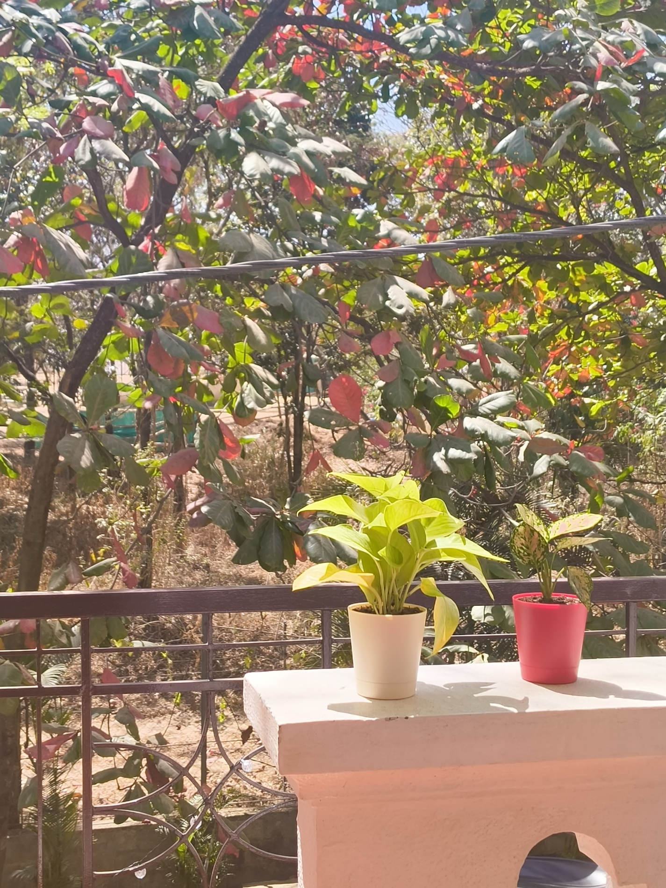
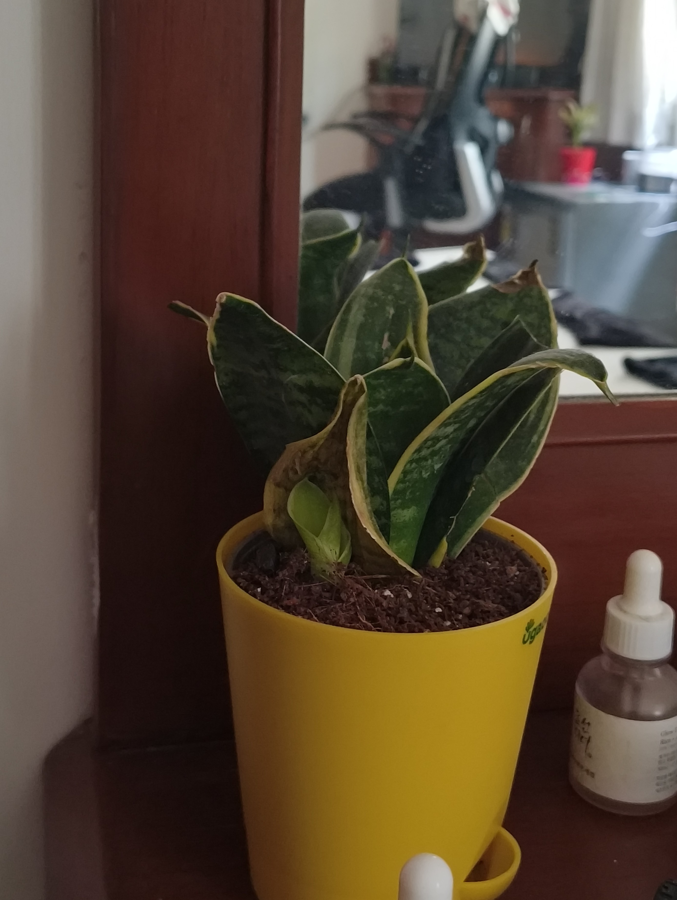
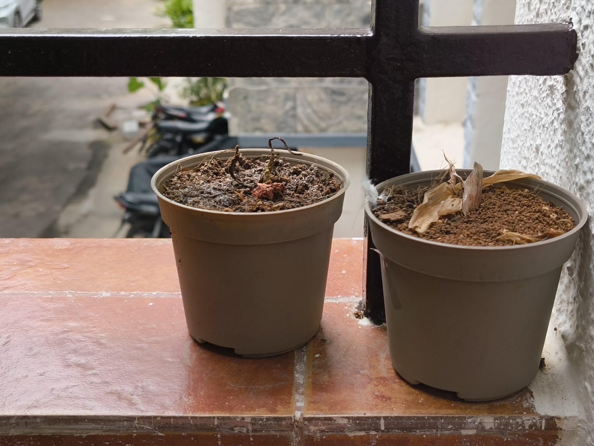

A few months ago, I wrote a post about [how I take care of my moneyplant, PP (Paisa Paudha)](/blog/a-caring-guide-for-pp). There, I made a note about the well-being of the plants at that time:

> A few of his leaves recently started blackening from [humidity], so I had to sadly prune away some of his proud leaves. He will recover soon, but I want to make sure this happens to him less. I now have a separate Neem Spray bottle that definitely smells like Neem Spray. That should do the trick.

What I learned over the month was that the Neem Spray, in fact, _did not_ do the trick. PP's leaves blackened one-by-one. I tried taking out the healthy parts, washing them, and moving them to another pot. The little sapling left in the aftermath tried to stay alive for a month, before succumbing to the same black plant plague that had affected his ancestor.

I couldn't tell what exactly had caused it. My mother (the plant expert of the house) told me that it must've been a bacterial infection. But I couldn't find the cause nor the solution in time.

I tried to get past the sadness and take care of the other plants -- Pinky, the [Pink Aglaonema](https://en.wikipedia.org/wiki/Aglaonema) and Snakey, the [Snakeplant](https://en.wikipedia.org/wiki/Dracaena_trifasciata). I watered them and gave Pinky the indirect sunlight he needed. All seemed to be going well, until I tried to reposition Snakey one day and one of his leaves just dropped into my hand. Snakey's roots had started loosening up.

Another call to my mother was made where she theorized that I'd over-watered the plant. I didn't fully agree, but still tried my best to revive Snakey. The process went on for a week before Snakey just completely detached from his pot.

I was now left with two empty pots of soil.

I will admit, I was slightly numb at this point. I've been taking care of plants myself for about four years. All of them would stay with me for a year in hostel -- an environment far noisier and unpredictable than a personal room -- before flying back home with me. They're all living happily in my mom's personal ~jungle~ terrarium. They're all still _alive_. Why couldn't these guys be alive too?

Pinky must have felt the negativity oozing from me, because his leaves started going yellow and drooping down. He might have been sad for his brothers, but I didn't come to that conclusion in time either. Even as I tried to give him the sunlight and water he needed, Pinky slowly folded in on himself until the stem itself turned yellow. He had now left me too.

I was sad for a while. I tried asking my mom why it happened; she usually has all the answers. She told me that things just happen sometimes. I nodded but didn't know what to do with that.

I tried cleansing the room of any negativity with the staple _pooja_ rituals and _mantras_. I had been a brooding mess the last couple months, and wondered if that had gotten to the plants somehow. It was too late to tell if the _mantras_ would've helped the plants, but they definitely helped me sleep better.

It's been a couple weeks since the plants returned to soil. I wake up to a lot less green in the room, and PP isn't peeking into my monitor anymore. I feel better than before, but definitely still miss the plants. So I wanted to create this space for them where they are remembered as long as I keep the website up.

If they do come back by some miracle, I am going to dance and celebrate. But in the meantime, I'll let the pots rest; before I return the soil of the pots to the soil of the Earth.
