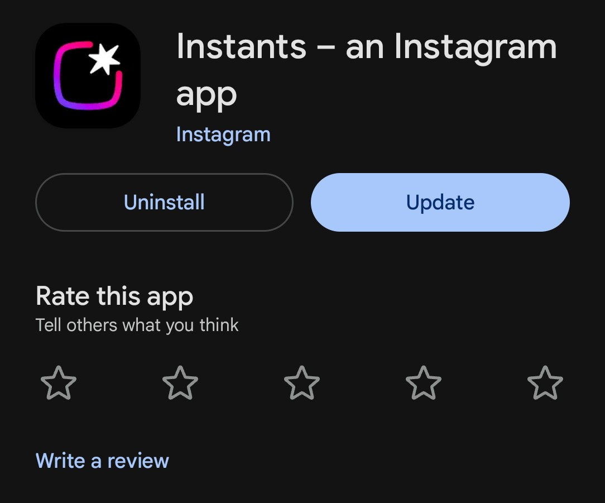
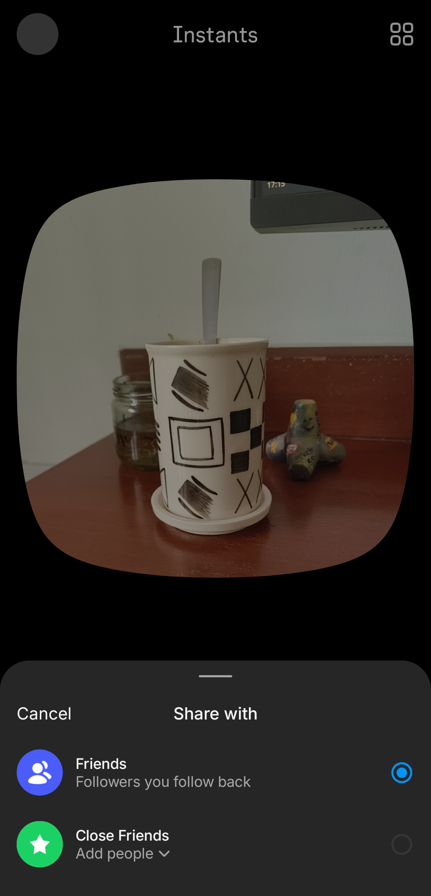
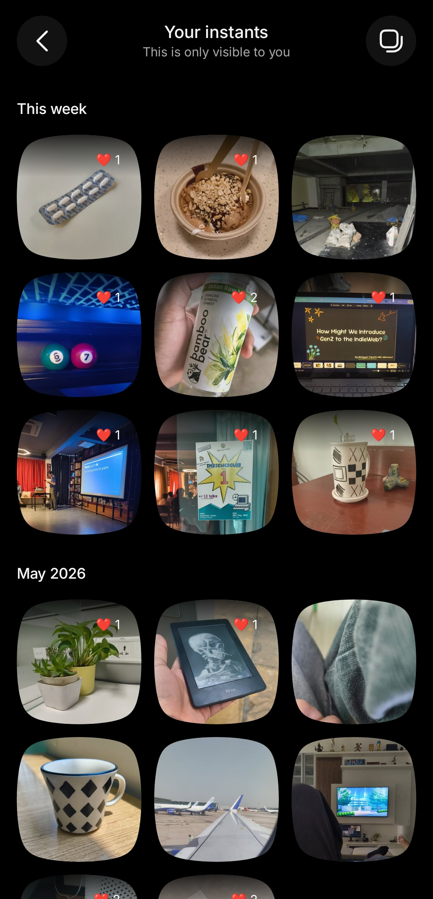

I think it was last week when I was checking in on my Instagram DM's, and saw a bunch of [squircles](https://en.wikipedia.org/wiki/Squircle) peeking in from a corner. Clicking on them opened an enthusiastic pop-up introducing me to **"Instagram Instants"**.

At first, it looked like an imitation of [BeReal](https://en.wikipedia.org/wiki/BeReal); the user interface was just a squircle viewfinder and a button to click a picture. But the concept of Instants is even simpler:

1. Take a picture at any time you want, and as many as you want.
2. It is instantly sent to all your "Friends", without any extra editing.
3. You can look at other people's Instants "once", and either react to them with an emoji or leave a reply.

I'll have you note that "Friends" here is referring to people you follow, that follow you back. I've written it in quotes because this is the first time I've seen Instagram refer to mutual following as "friendship" on their app. But yeah, there's still an option to set "Close Friends" like you would on an Instagram story or a note.

Now that introductions are out of the way, I actually kinda like this format! You capture a glimpse of what you're doing right now, with zero extra noise. There's no hesitation of a caption or a song to add (that no one will listen to :P). They even made it a separate app because they probably realized that something as small as this would easily get lost in the other distracting features of the main app.

Everything is meant to be "view-once" -- you see someone's Instant in the stack, react/reply to it if you want, otherwise tap the picture and it goes away. I would share a screenshot, but they've done the courtesy of blocking those for other people's instants[^1].

The settings section is limited to general shenanigans about muting certain accounts, controlling notifications, and an option to save the Instants you click to your own gallery. The saved pictures are also, in fact, squircles. They really love this shape.

Lastly, you can go through your own previous Instants and see what you've posted so far -- along with the reactions people have left on them. If you want to see replies, that can still only be done on the Instagram app.

It really is lovely to look back on your day or week this way. I would like to have this capturing mechanism even without the social aspect of it. It can just be a visual diary of _me_ taking pictures with _my_ emoji reactions saved, instead of something for everyone to look at.

Now, the reason that "view-once" is in quotes because, up until a very recent update, it didn't work that way. Every time you swiped through all incoming Instants, closed the app and reopened it, all previous Instants would appear again. They probably haven't added the complexities of Over-The-Air updates or server-driven UI to this app, which is why fixing this required manually updating the application through the Play Store.

But in the end, Instagram Instants still feels half-baked to me. This app most likely exists in its current state because Meta wanted to try out a content format, and the creation of prototype applications has become much cheaper in terms of time taken. That paired with a generation that will try out features just for the novelty of it[^2], and you have yourself a good testing ground to receive tangible statistics of its performance.

As someone who adopted it as soon as it started, I'm already starting to get a little bored of it. I have my camera for when I want to take pictures, and I have Instagram Stories for when I want to share something with friends. I don't really need this minimal option that is trying to get me to post when I could just be looking at the current moment by myself.

But hey, it was cutesy while it lasted. If Meta is listening[^3], can you spin up an Instagram DM's app in your free time instead? It will probably be much better appreciated.

#### Footnotes

[^1]: Please note that I learned this through consensual experimentation on friends' Instants.

[^2]: Novelty aside, I was talking to my younger sister about the new feature and app. Her response was that she turned off the feature as soon as she got the pop-up, and didn't want anything to do with it. So maybe some people want Instagram to be as focused as it can be.

[^3]: ~~They're always listening.~~
