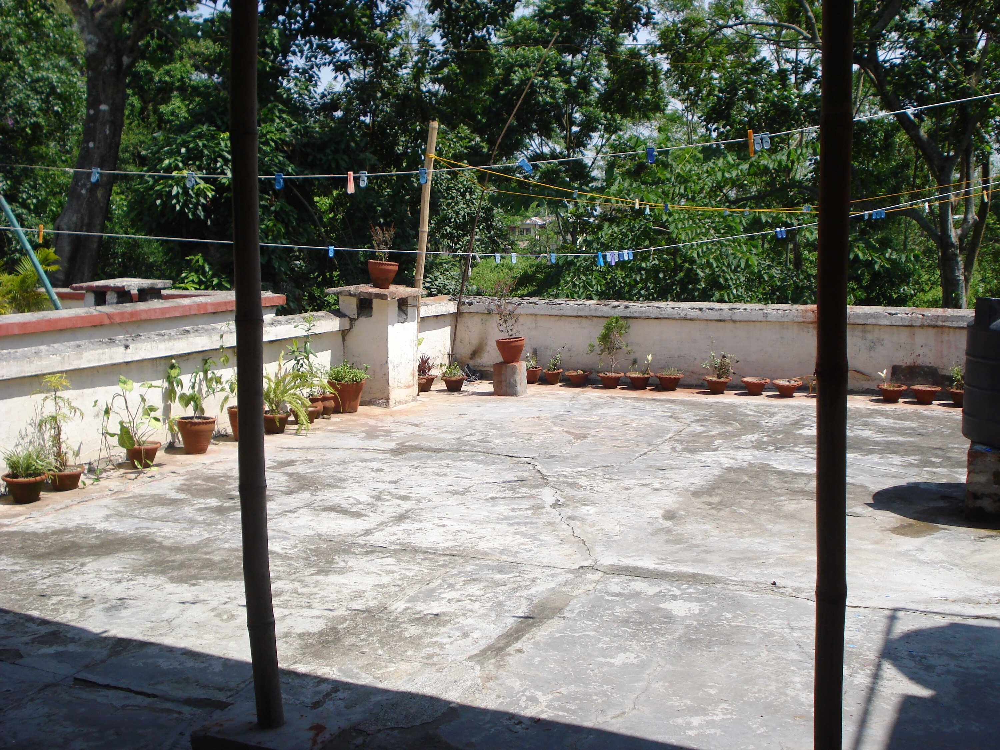
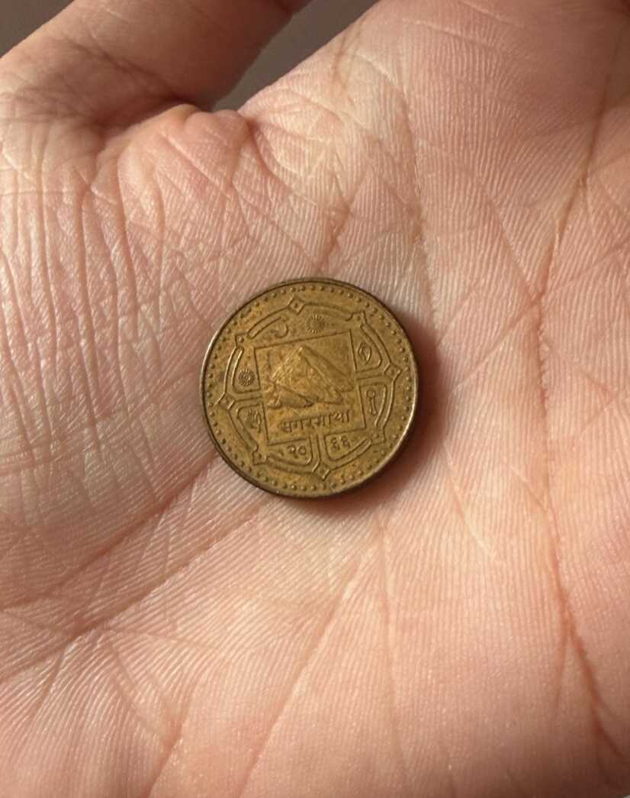
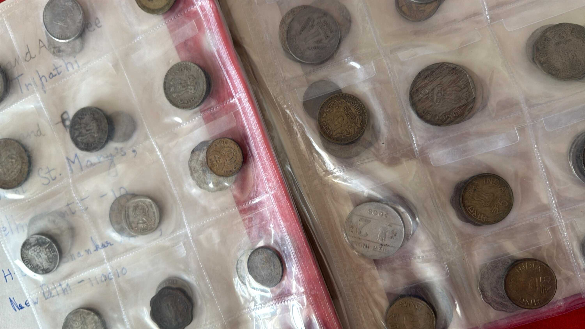

My family was posted in [Assam](https://en.wikipedia.org/wiki/Assam) for a while, in a small town in the [Sonitpur district](https://en.wikipedia.org/wiki/Sonitpur_district) called Missamari.

The 6-year old me didn't have a grasp on the fact that we were living on one of the extremities of the country. To reach my grandparents' house in [Lucknow](https://en.wikipedia.org/wiki/Lucknow), we would have to travel for hours to [Guwahati](https://en.wikipedia.org/wiki/Guwahati), stay overnight in Transit Camp, and then take an overnight train to Lucknow. "They live really far from us," is what I thought.

I didn't question the variety of wildlife either. The living quarters in Army Cantonment were surrounded by thick forests. I'd heard stories about brown, red and white monkeys, and lizards that could fly. It was an unwritten rule that Missamari was as much their home as it was ours, and I would come to realize later in my life how precious that was.

But anyway, this story is about a <abbr title="A coin from Nepal.">_Nepali Sikka_</abbr>.

I started my K-12 journey in Army Public School, Missamari. I sat in the classroom and gave tests, sang in the music period and played outside during P.T.[^1]. It was during one of these P.T. periods that I was taking a break from running around, somehow went to the see-saw in the park and found a golden coin next to it.

The coin was unlike anything I'd seen my dad keep in his wallet before. It was smaller than a Re. 1 coin, was golden, and had a picture of some mountains inside an intricate pattern. The backside said "Nepal" in Hindi (or rather Devanagari, since I could read it).

I think I told my P.T. teacher about the coin, because there was soon a crowd of my classmates (and the teacher) gathered around me. He inspected the coin and told me it was a _Nepali Sikka_. A coin from Nepal, a different country "nearby". The concept felt so unfamiliar but also so cool, back then. I asked if I could keep the coin and took it home.

That coin, a shiny thing I just picked up, soon led me to understand that there are _many_ other countries, and each of them has their own "currency". Different currencies have different values, and are used in different places. The world was far bigger than little Abhigyan could comprehend, but was in awe of it nonetheless.

Having the _Nepali Sikka_ somehow attracted even more foreign currencies. Turns out my relatives had been gathering these notes and coins in secret, and -- once they discovered my newfound interest -- decided to share their little secret with me.

I soon had my own little Velcro wallet filled with coins in a variety of colours and notes in a variety of materials.

Once my sister was old enough to talk and start copying my interests, I received an order from higher authority (my parents) to share my revered collection with her. I grudgingly shared the treasure, and later on -- when we shifted to Delhi, and I was in 6th Grade -- we got a Coin Collecting book from [Archies](https://archiesonline.com/) to give our collection its own museum[^2].

That collection is now safely kept in one of my drawers at home, with mine and my sister's signatures inside. One golden coin started a new journey of learning and collecting, that is still safely kept to this day.

There was also a time in between when I lost the _Nepali Sikka_. I'd dropped it somewhere while taking it to school to show off, from what I remember. Little Abhigyan didn't know about _karma_ back then, so the best he could do is cry. The coin remained lost for months until -- while we were packing up and getting posted somewhere else -- I found it behind some piece of furniture.

The moment I found it again was as new and happy as the first time I found it next to the see-saw.

---

I recently learned, through the news, about [the flash floods in Nepal](https://www.bbc.com/news/live/cr0qxd1y219kt). Families crying over the loss of loved ones and homes that stood for decades. Countries sending their condolences and organizations offering their aid.

It was these news articles and witnessing the world move to help, that made me want to share how a small part of Nepal's heritage had left such a large impact on me. Their support to us extends beyond culture as well, as citizens of Nepal migrate to India's labour market, helping us do grunt work that we can't always do ourselves.

My heart goes out to our geographical neighbours, and I hope they find peace and relief soon.

#### Footnotes

[^1]: This is back from the good old days when it was called P.T. (Physical Training) instead of P.E. (Physical Education). There is no real reason behind this change, it's just something I noticed. :P

[^2]: Credits for the attached pictures of the coin and the book go to my sister, who sent many iterations of the same two things since I kept critiquing her photography skills. <3
