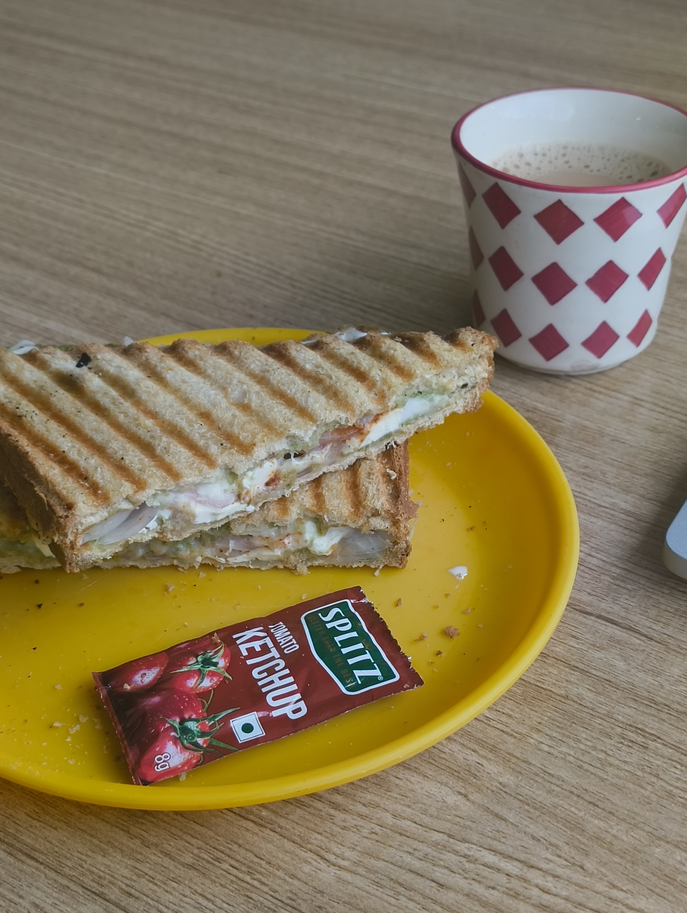
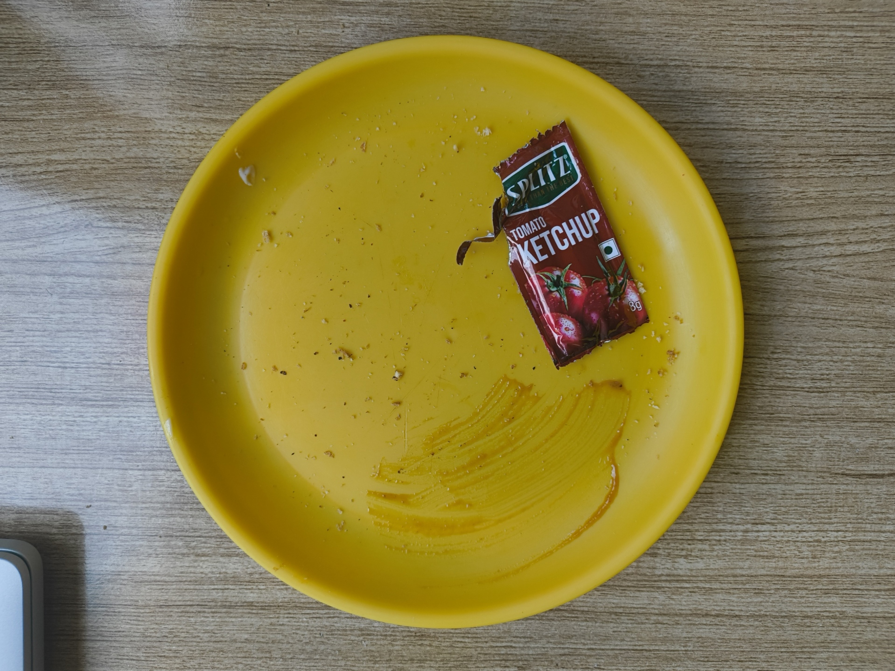

I have this habit -- it's a superpower, really -- that I can consume the same dish every day, over and over again, if I really like it.

I have been told by many experts in the field (fellow co-workers) that doing this will one day make me sick of the food items I like. But they have watched in awe and horror as they see me give the same order to the cafeteria _bhaiya_ every morning (and sometimes even afternoons) for a _Paneer Cheese Sandwich_.

For those unfamiliar: that's cottage cheese, regular cheese, onions, and a green _chutney_ brought together between two of the greatest pieces of starch to exist (bread), and then grilled _slightly_ past perfection to receive a charred, crisp taste.

When I joined my current internship, I had hoped for many things. One of those things, vainly enough, might have been the hope of finding companionship. I never would have thought that hope would manifest itself as a (delicious) cluster of carbohydrates.

It's reached a point where I show up in the cafeteria, give the cook _bhaiya_ a smile and a nod, and he already knows. I've only been here for six months, and the man already remembers. I've also seen him hold multiple pending tabs and orders in his memory, for which he has my respect. I wonder if my staple order is easier for him to remember or harder to recall.

My last addition to this post would be another habit of mine, which is that I eat my food quickly. Quick enough that the sandwich I got at the start of writing this post has already been finished.

