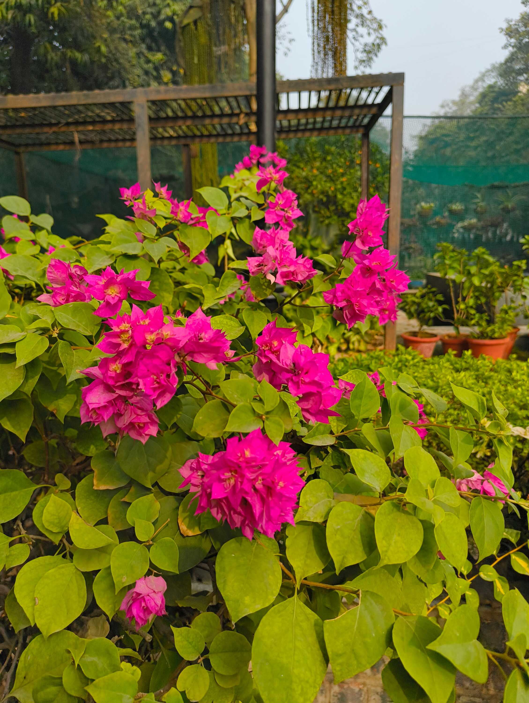

Funnily enough, after [the last time I documented "thank-you replies"](/blog/thank-you-thank-you), I started noticing even more of them. They already exist everywhere, it's just that they happen quickly and smoothly enough that I don't catch them.

But at the same time, I also notice it when people _don't_ do the special Indian "thank-you" thing that people say Indians do. I realized I almost find it _rude_ when people reply to my "thank-you" with a simple "welcome". Even though it's the expected reply! And even though it's still polite -- you're thanking someone for doing something, and they're saying you're welcome to ask them to help again.

Anyway, here's some more examples of both replies that I've received in my surroundings.

### Exhibit E: Security _Bhaiya_

At my new workplace, there's a security guard that sits at the entrance of the office. We greet each other in the morning and go about our day. When I leave in the evening, the guard _bhaiya_ usually says something like, "Bye sir, thank you!" I reply with a thank-you back.

I _think_ he's thanking me for visiting or working, something like that, while I thank him for his service and hard work. I believe it's a mutual acknowledgement of effort.

### Exhibit F: Some Cab/Auto Drivers

Sometimes, there are cab drivers that pick me up and either hurry to the destination (without a prompt from me to do so), or do dangerous wrong-side driving to reach my destination faster. I catch it and tell them not to when I can, but sometimes it's too late since they've already gone down the wrong path (pun intended).

I've noticed a pattern where, when thanking these drivers, they more often than not say "welcome" instead of "thank-you" back. And I wonder if, instead of doing it out of politeness, they genuinely think that they did me a favour by making me reach faster.

This is a PSA for all my drivers in the future if they ever read this: Please _do not_ overspeed or commit traffic crime for me to reach a place faster. I'm more interested in staying alive than being on-time. Thank you.

### Exhibit G: Bougie Places

I only recently learned what bougie means -- and I'm still not fully sure I know -- but I'm referring to more luxurious eating places.

I usually say "thank you" at the end of placing my order or when I actually receive the items, and when I finally pay the bill. Somewhere along this pipeline the servers might normally respond with a "thank you" back, but the more "classy" places _always_ reply with a "You're most welcome", or even "My pleasure!"

It's probably from not being used to it, but these make me remember that I've just made a transaction. Traded money for food. It's weird, because it makes me feel like the emotion has been taken out of the interaction. But maybe that's how it's supposed to feel?

---

There are still some kind of responses that I'm neutral about, ofcourse. I'm not a thank-you monster. There are times where I reply to a thank-you with a "<abbr title="The respectful version of 'Yes' in Hindi.">_Haanji_</abbr>" or a "<abbr title="The Hindi version of 'Ofcourse!'.">_Bilkul_</abbr>". There's also the, "Ofcourse, and thanks to you too!" which can also work. But I'm still exploring what this feeling is.

A part of me wonders if this our way of showing empathy; of understanding that there's another perspective to the interaction, which leaves both parties thankful. It could be that white-washing that with a "welcome" reduces our empathy towards the "other", but that might be looking into it too much.

Anyway, thanks again! Here are your flowers.

