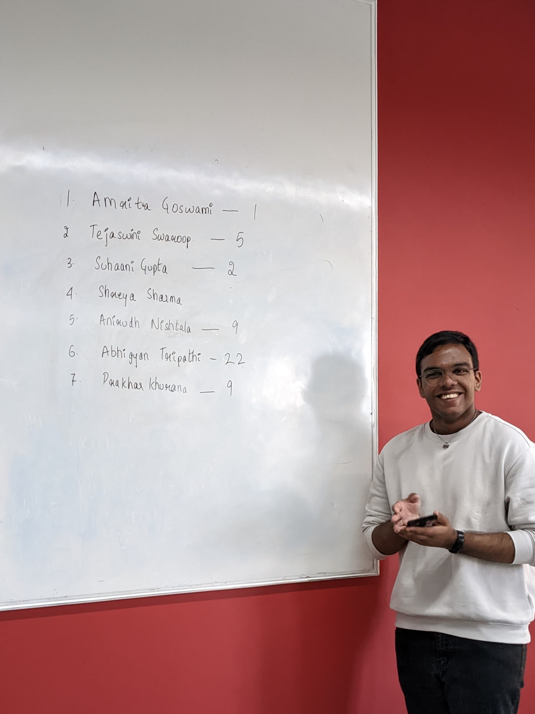
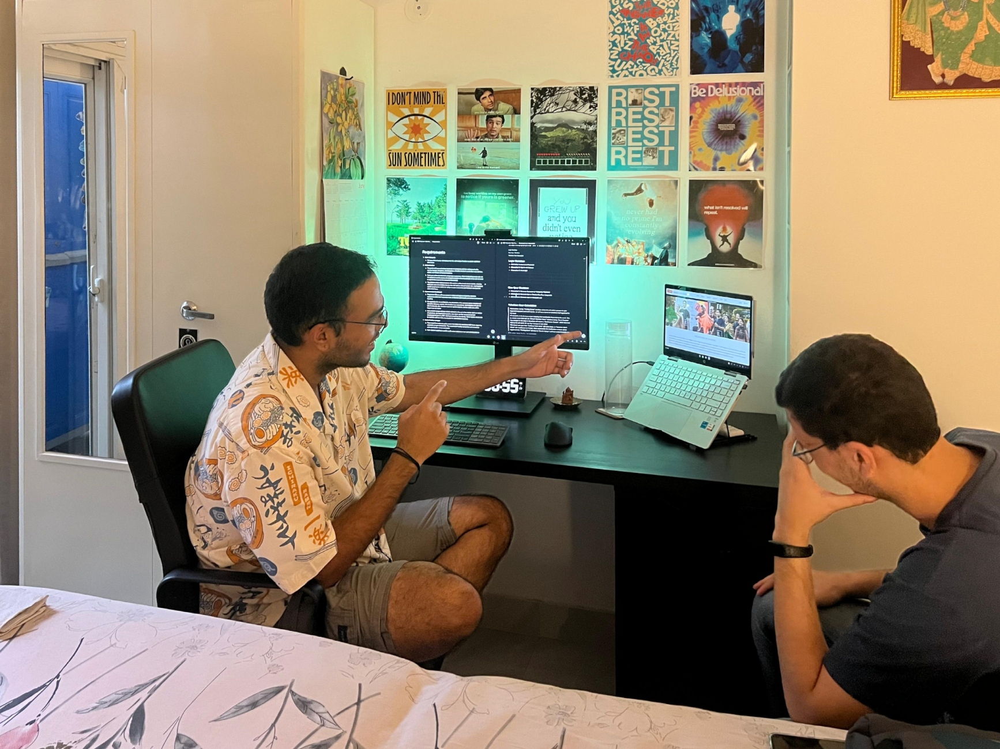

I joined my college in September of 2022. It was a new campus; the "food court" was a white tent behind the hostel building, and the path from the hostel to the singular academic block was surrounded by blue metal sheets on both sides. There were cement trucks and towering cranes everywhere. The classrooms were so new that they still had the faint smell of paint. None of this has anything to do with the nickname.

I met [Rajat](https://www.linkedin.com/in/rajat-patil-322323173/) on my first day in class. Neither of us remember how, exactly. I told him I remember our first conversation being about building PC's and computer hardware. His response was, "I just remember you were sitting next to me, so I started talking." Man, I can't comprehend extroverts.

During lunchtime on the same day is when we ended up meeting [Keshav](https://www.linkedin.com/in/hari-keshav-rajesh-b25945300/) and [Satyajit](https://www.linkedin.com/in/satyajitsinh-jhala-634057257/) and sat together at the mess. I had no idea back then -- as I ate _arhar dal_ and rice -- that I was sitting with four of my closest friends I'd have in college. This phenomenon needs to be studied.[^1]

It was one of these days in class, when our coordinator announced that he'd be selecting a new Class Representative (aka 'CR') for the year. No one really wanted the responsibility, except this one guy who raised his hand to volunteer. I didn't really like this guy, being honest, and didn't want him to be in-charge of events related to our class.

I raised my hand out of spite and received a surprising cheer from the classroom. With more contestants participating, the decision came down to a vote -- which I won. This is what I would describe as my first "POG" activity.

> "POG", for those unaware, is an abbreviation that expands to "Play of the Game". It is often used in the live-streaming/gaming spheres when someone wants to highlight how well a play was executed.
>
> The executor of a "POG" action, then, may be deemed as "Pogger".

It must have been a few days after, when I met [Raghav](https://www.linkedin.com/in/raghav-gupta-ind/) while having dinner with [Shashaank](https://www.linkedin.com/in/shashaank-singh/). We were talking about something related to [Discord](https://en.wikipedia.org/wiki/Discord) bots and working with them, when Raghav joined in out of interest. We discussed for a while before he mentioned [Disnake](https://disnake.dev), a Python library he used for building bots.

Shashaank proudly mentioned that I was -- genuinely and coincidentally -- one of the maintainers[^2] of said library. The randomness of this moment still leaves me in awe[^3], because pretty much all my college projects that have come in the four years since have been in collaboration with Raghav. I would mark this as my second "POG" activity.

It was another day of eating dinner together in the white tent, when the conversation relevant to this post actually occurred. I have to apologize to you, dear reader, because I don't remember the actual back-and-forth that led to my nickname (as it is with all nicknames that stick). But I distinctly remember two things:

1. I was told by Satyajit that my name was henceforth "Pogger".
2. If I didn't accept, I would henceforth be called "Bobby".

To summarize, I was going to get a name change no matter what, and I only had two choices. I didn't want to be called Bobby[^4], and that's how I ended up with my permanent college nickname.

Over the years, I saw many iterations on the core of the nickname and went along with them.

- Pogger
- Poggie
- PogDog (I don't know why, I think it was an iteration on "Dawg")
- Pog (The one that has stuck the longest)
- Mogger (Refer [Mogging](https://www.wikihow.com/Mogging))
- Logger (Refer [Logging in Computers](<https://en.wikipedia.org/wiki/Logging_(computing)>))
- Dog (Keshav keeps using this one, the audacity)

There was one time in Second Year, when we were in the classroom hall, and Satyajit used my real name to call me instead of "Pog". I remember being utterly confused and even slightly offended at my real name being used, like we weren't close (this is hilarious looking back at it).

Other people slowly gained their nicknames too -- Rajat became Raju, Satyajit became Jitu, Keshav became Hari/Kittu, and Raghav became Rag. Will they be slightly shook that I just revealed their nicknames? Most likely, yes. But I will revel in any discourse that ensues afterwards. These are some of my closest friends, after all.

I don't think the nickname started because I was doing something grand or good all the time, but I've tried to live up to it anyway. I became the [President of the college's coding club](https://www.linkedin.com/in/abhigyantrips/details/experience/) and a [Chapter Lead of the cybersecurity chapter](https://www.linkedin.com/in/abhigyantrips/details/experience/). I [took part in a lot of conferences and hosted a lot of workshops/events](https://www.linkedin.com/posts/abhigyantrips_we-now-take-great-pride-in-recognizing-our-activity-7412005710265249792-_TZa), and I tried to [build things that help students enjoy campus life better](https://github.com/YCN-club).

None of those things could have been accomplished alone, and it took a lot of people bearing with me to reach those milestones. So, really, Pog is just the friends I made along the way.

### Footnotes

[^1]: "Phenomenon" here is referring to how some of your closest friends were once strangers that just popped into your life. It probably has been studied, honestly. I'm open to receiving links!

[^2]: "Maintainer" might be a strong word since I mostly managed the website and Discord admin stuff, but I absorbed the comment with pride.

[^3]: Disnake was fairly small back then too; it started as a fork of the more popular Discord.py, so chances of Raghav knowing it were even lower.

[^4]: Apologies to all the people named Bobby out there, it's just not for me. :P
