Hello hello! How are ya?

A lot of you guys have been getting in touch with me recently. Placements have been a pain, haven't they? I remember feeling that way. You might also believe that you guys have it worse than our batch, and I don't disagree with that either.

My final semester of college was pretty far from sunshine and rainbows, and I remember feeling at the time that it won't get any better. I remember the exhaustion and the frustration, the late nights preparing and the early mornings revising. It felt like the world was on my shoulders.

I want to share a bit about how that burden felt for me and my friends, with the hope that you find some part of yourself in it. Through all of the storytelling, I just want to let you know that I feel ya.

I think the pressure for me began particularly at the end of 3rd Year. There had been many companies dropping in throughout 6th Semester, and I'd convinced myself that I would receive an internship in atleast one of them. But the <abbr title="The app used by our Placement department to manage registrations for incoming companies and positions.">NeoPAT</abbr> app slowly started showing less entries, as the rejection emails and ghosting piled up.

By the time I could worry about it I had to prepare for my finals, and the only time I could sit and think about it was on the flight back home.

A lot of my friends had internships, some of them stretching into their 7th Semester with the promise of conversion. There were also people who had set their eyes on higher education, and were already preparing to give the exams and fill the applications. Everyone seemed to be moving smoothly except me.

I was still known in college as a [Former President of CodeX](https://www.linkedin.com/in/abhigyantrips/details/experience/), and a [Chapter Lead of Null-OWASP](https://www.linkedin.com/in/abhigyantrips/details/experience/). [The](https://www.linkedin.com/posts/codex-mitblr_git-github-workshop-ugcPost-7157981291571728384-tBGU) [guy](https://www.linkedin.com/posts/abhigyantrips_i-participated-in-my-first-hackathon-and-activity-7187333696591380480-dda2) [that](https://www.linkedin.com/posts/codex-mitblr_techfest-nexus-codex-ugcPost-7189265093195374592-yQqM) [did](https://www.linkedin.com/posts/abhigyantrips_this-post-is-an-ode-to-mitblrclub-an-ambitious-activity-7301894524073578496-XZzp) [a](https://www.linkedin.com/posts/abhigyantrips_this-is-a-continuation-on-my-post-about-mitblrclub-activity-7301995177693343744-tH92) [lot](https://www.linkedin.com/posts/abhigyantrips_leadership-softwaredevelopment-tapmiblr-activity-7333563066393010176-xGk8) [of](https://www.linkedin.com/posts/abhigyantrips_so-last-month-i-tricked-a-backend-developer-activity-7338141558937923587-LLx0) [big](https://www.linkedin.com/posts/abhigyantrips_college-projects-are-usually-short-lived-activity-7342118784834375681-qIsg) [software](https://www.linkedin.com/posts/abhigyantrips_we-now-take-great-pride-in-recognizing-our-activity-7412005710265249792-_TZa) [things](https://www.linkedin.com/posts/abhigyantrips_mitblr-codex-github-activity-7412050948396675072-AMHu). So I also remember feeling _shame_ when I wasn't able to live up to that "reputation" I was known for. But that's a story for another day.

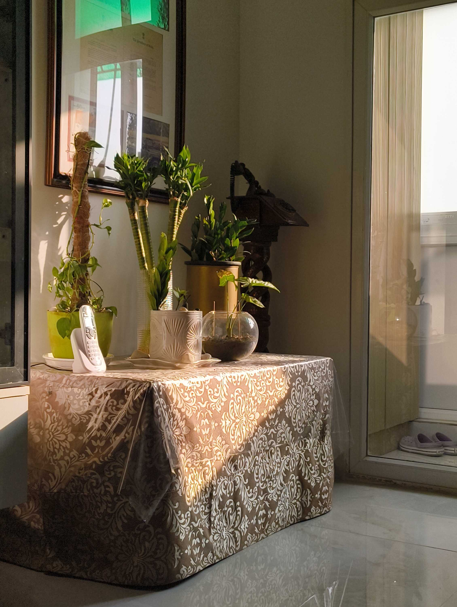

I spent a good while at home just moping. The mood shifted from "they didn't really deserve me" to "I really need to lock in now" to "should I forget about all this and give <abbr title="The Common Admission Test, taken for admission into graduate management programs. Used by most engineers as an escape from reality.">CAT</abbr> instead?" and back again.

I had my moments where I was productive, eventually. I worked with a tech consultancy for some time and built a project for them. I worked with another consultancy for a one-time website. I caught up with LinkedIn project posts so that my profile still _seemed_ active, and I also thankfully had an internship I had done during 3rd Year[^1] that I could present as summer work.

None of it was big or permanent, but I had already accepted that I would have to give my all during the Final Year to actually get placed somewhere. I'm glad that my parents were supportive throughout this, and even let me entertain the idea of giving CAT completely[^2].

I spent the rest of my vacation meeting up with friends and spending time with family, because there would be less time for all that in the months to come.

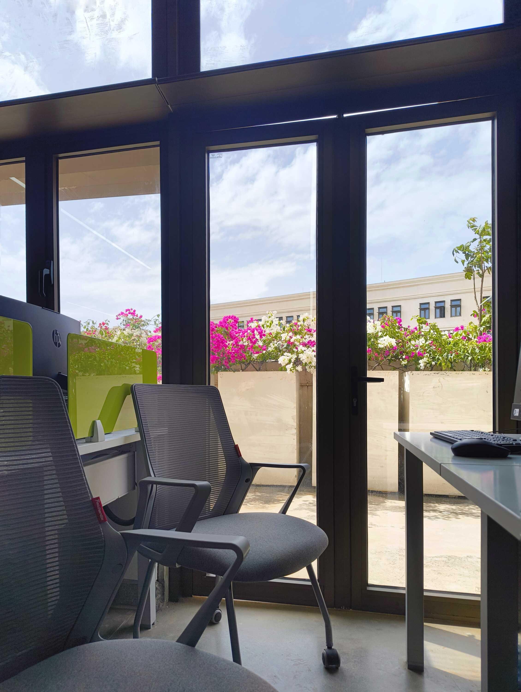

The classes were smaller and emptier in the Final Year; a lot of students had left for an internship in their 7th Semester instead of starting in the 8th. Attendance wasn't taken that seriously anymore, probably because the professors understood that our priorities were different now.

I'd never been one to pay attention in class, and would get away with studying right before the exam to learn everything. So before long, I was taking advantage of the lax schedule to spend more and more time doing my own thing. The teachers probably noticed, but decided not to say anything.

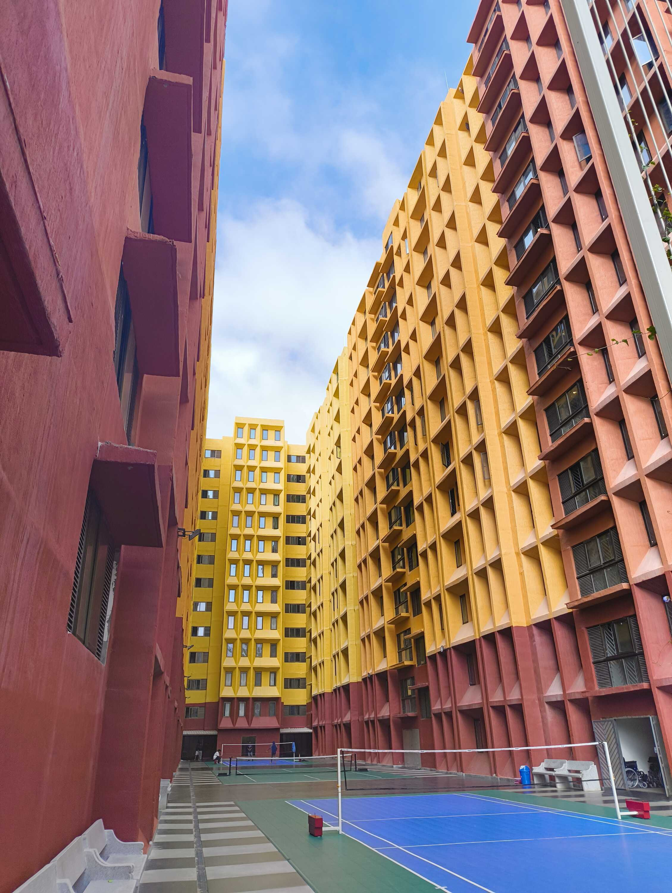

I'd always had roommates throughout being in hostel. They were different every year, and I was lucky enough that all of them were lovely; I say that because I've heard accounts from other friends about some bad, _bad_ roommates. I was even lucky enough that I could choose[^3] my roommate in 3rd Year, and got a double room with one of my closest friends.

In 4th Year though, pretty much anyone I was close to had either joined somewhere for an internship or was already paired up with someone else. I didn't want the risk of getting a bad roommate assigned, so I decided (with much privilege) to instead go for a single room. Ironically, that _might_ be where my loneliness began.

You see, a roommate is always _there_. There's always another _human_ presence in the room, doing something of their own and going about their own life. There's liveliness in the room even when you're not being lively.

Also, roommates usually go through the same thing that you are, at the same time as you. All students have assignments due during the same week, and have exams in the same time period. They all begin to stay up late preparing, become delirious, and crash out about exams and professors roughly around the same time. They remind you that there are other people going through the same thing as you.

In a single room though, time seems to move a lot slower. It only moves when _you_ move. There isn't a gauge for when you're being slow, or even when you're being productive. It is a lot more _alone_, and that feeling slowly exhausted me; as if I was continuously wading through mud, watching every step, and yet not really sure where I was going.

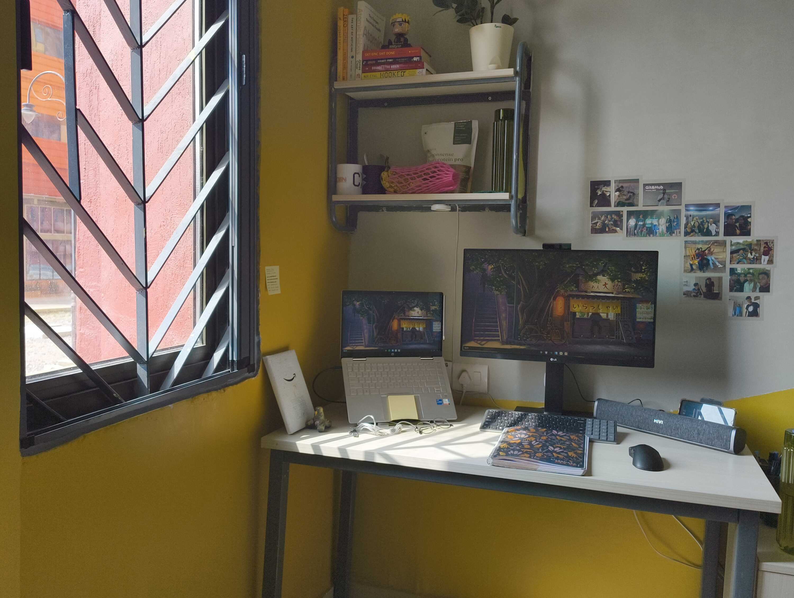

I continued on with assessments and interviews with that feeling in the back of my mind. NeoPAT would send a notification, I would register, show up on the day of the assessment, and then wait. There would almost never be a notification that you weren't taken forward; instead, you would just slowly learn that the people who were selected were contacted separately. It was a little more hurtful when received like that.

I soon learned to hate <abbr title="Data Structures and Algorithms. The type of isolated and rudimentary 'brainstormers' companies make you solve in placements to grade you on an absolute scale.">DSA</abbr>. God, I hated DSA. It was a pathetic excuse for companies to not put effort into crafting individual questions, and to grade students on an absolute scale of 0 to 100. They took away your Internet privileges in an age where almost all software is written for the Internet, with the hope that you would somehow remember every single function in your language of choice[^4].

> **Editor's Note:** The rest of the above paragraph has been cut short to stay on topic. There were many words involved that would make even sailors fluster. If you want the full version, ask the author out for chai.

But anyway, after a long and tiring routine of seeing the same graphs and matrix questions and never fully solving them[^5], I saw hope when a certain company did the whole thing differently. Let's call them... HydroWinds.

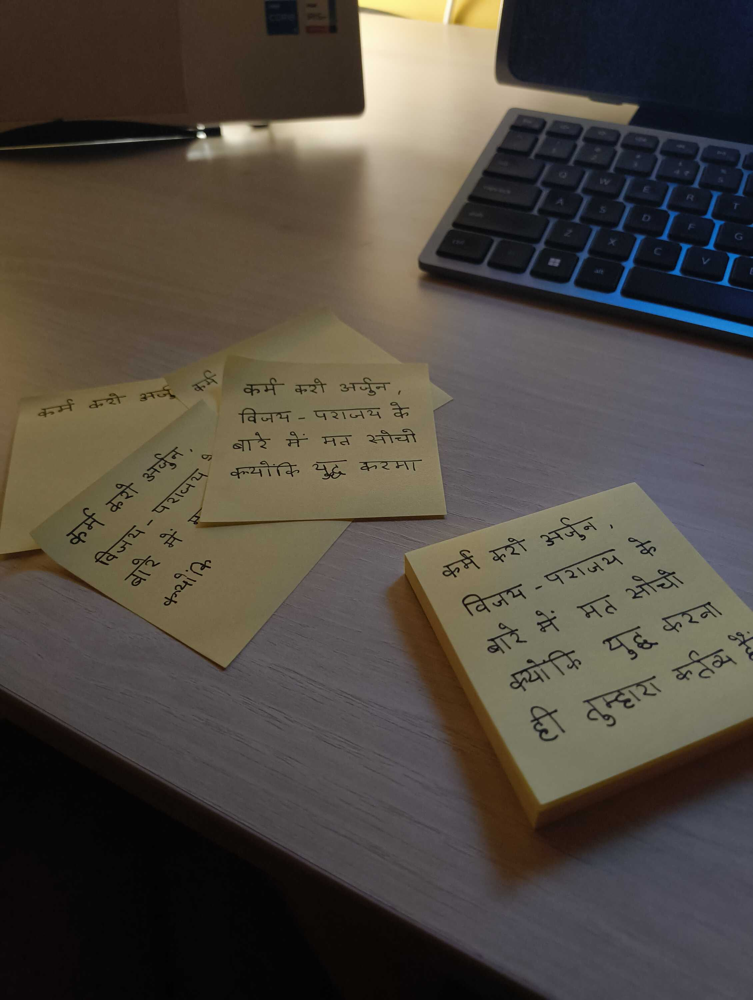

HydroWinds was special. They had coding challenges that didn't put you in a box, and _needed_ you to explore solutions to actually succeed. They wanted you to use specific languages, but with full access to the documentation (to see how quickly you can learn a new language and apply it). I could do it all, and before long I was waiting for the shortlist for the final interview.

We received the shortlist. At 4PM on Friday. The interview was at 10AM on the next day, at the <abbr title="I'm a student of Manipal Institute of Technology, Bengaluru. The 'main campus' here refers to the original branch of the college in Udupi.">main campus</abbr> in Udupi. Over 400 kilometers away.

The next 36 hours were the most chaotic of my life.

A WhatsApp group was made with all the finalists from Bengaluru. Multiple bus portals were checked and tickets were booked just before they sold out. I didn't have formal shoes, so my uncle bought them and brought them to the hostel while I packed my bag for the next two nights. All of this while coordinating the hostel outpass ourselves.

We would have to leave for our bus past our 10PM curfew, and so needed to get an approval from the Chief Student Officer (with _zero_ assistance from the Placement Committee) so we can _actually_ reach for our interviews in time. Somehow after juggling it all, we were standing on a noisy bus stop at 11PM waiting for our GreenLine bus to arrive.

The ride was bumpy. I don't believe any of us actually got any sleep. At one point while lying down, the bus jumped and my whole body was in the air, right before I crashed down and hit my head hard enough that I couldn't sleep again.

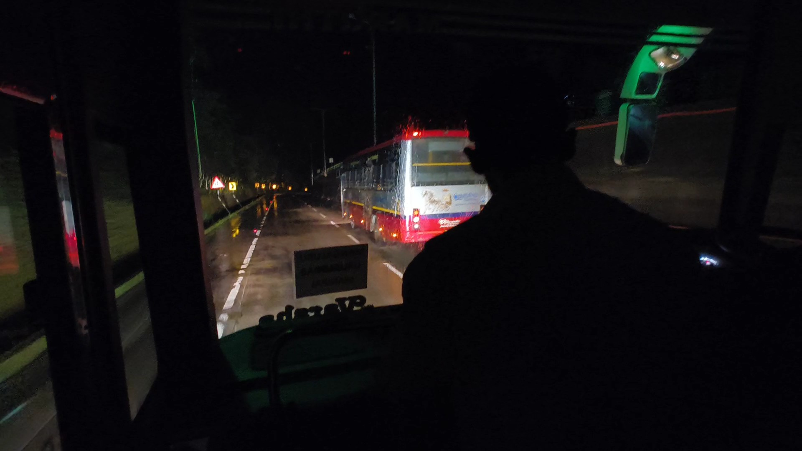

We arrive at the destination an hour later than the scheduled time. We travel from the bus stop to the hostel ourselves, without being provided any directions. Apparently the logistics weren't taken care of beforehand, so we spent another 30 minutes making payments and receiving keys to our rooms one-by-one.

We somehow enter our rooms at around 9AM and start getting ready to reach the Placement Building by 10. Ah, finally, just enough time to catch our breath---

An unknown number calls one of the interviewees:

> "Where are you all?! You were supposed to reach the Placement Hall by 7.30AM! If you don't reach in the next 30 minutes, we will remove you from the process."

After all our luck so far, we didn't question why we needed to be there at 7.30 when the email said 10. We just got ready and ran. When we arrived at the building, the placement representative looked at us dubiously. "Why did you guys rush? The interviews won't start for another hour, you could've taken your time."

We just sat down and caught our breath.

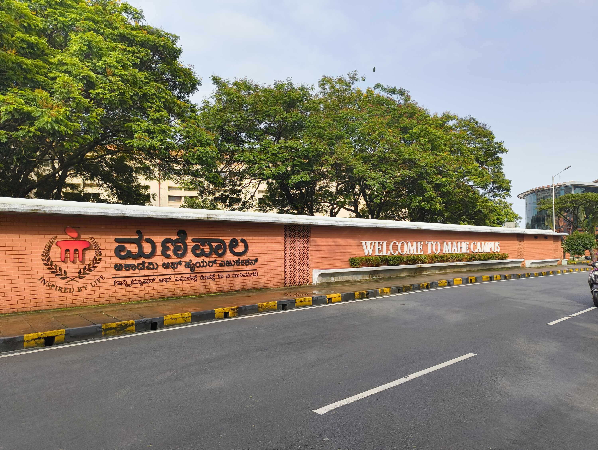

The interviews began shortly afterward. We went through our material and prepared our documents. Earlier, when we had entered the Hall, the students from main campus sitting inside had asked us if we're from MIT Bengaluru. When we affirmed, they _snickered_ at us; like a scene out of a teenage high-school drama. I'm glad they did though, because the spite kept me going.

I... had a lot of expectations from this interview. This was the farthest I'd ever gotten in the placement process. The tests seemed as if they were made for me, as if they understood how my brain worked. I really wanted to get through. I really wanted to stop going through placements.

Right before my turn, someone mentioned a concept from object-oriented programming. I didn't remember it, so I franctically tried to look it up and memorize it right as my name was called.

I entered the room, sat down, and faced the interviewer. We greeted each other. And the question that left his mouth was not about object-oriented programming.

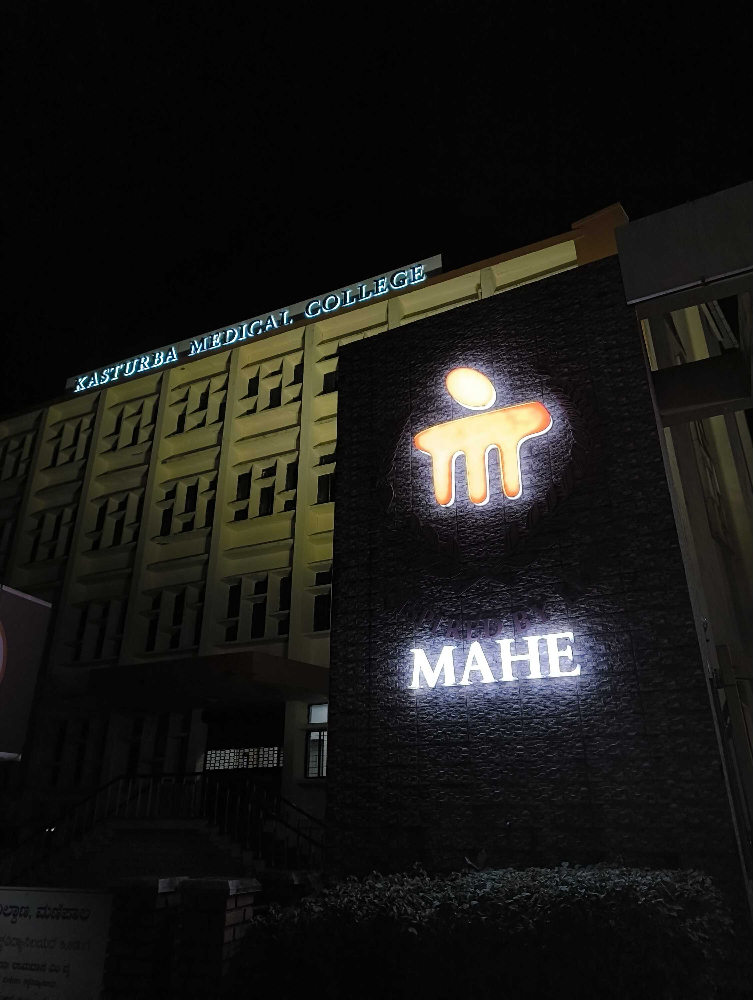

The names for the second round of interviews were called out, and they didn't include mine. I went out of the Hall, sat on the stairs, and called my mom. I couldn't remember the last time I'd cried before that, but tears streamed down my face as I tried to tell my mother that I did everything I could and it wasn't enough. "But I gave my best, mamma," I said to her.

Booking the bus ride back and re-packing was a blur. The two students who were selected were both from MIT Bengaluru, so I remember having a "Ha!" moment. One of the two students was also [Raghav](https://alphaspiderman.dev), a close friend, which made me even happier. But I was still empty as we went out for dinner to celebrate and met up with some friends from Manipal.

Soon, I was on the way back to college while bumping up and down in the bus. I didn't even try to sleep this time.

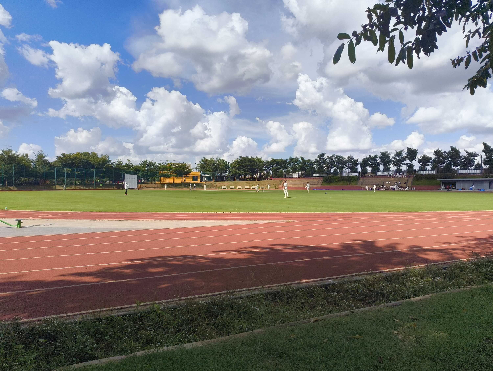

The normalcy after reaching back made the HydroWinds process seem like a fever dream. The classes continued on, NeoPAT kept sending in notifications, and I kept giving assessments. People would ask from time to time about "what happened after you went to Manipal", and I would try to tell them with a smile that I didn't get it.

Looking back, I felt a lot calmer after the main campus interview. I think it came from the bus ride back, when I was lying awake and realized that --- other than the two people who converted --- there were eight others travelling with me back to the college, "without success".

This feeling later extended towards other people in college. I remembered my friends who went for a 7th Semester internship; how they wished they were in college with friends, and how they felt like they were missing out on it all. I remembered the people studying for higher education, and how they felt --- with the constantly changing policies and politics --- that they were betting their future on a gamble. I remembered the girl I liked; how the college rejoiced in her placement into Big Tech, but how she constantly felt like she had to prove her worth there and gave away more and more of her personal time to work.

There were people who had hardships after their placement too. People who received "Internship + Conversion", but were blatantly fired during their internship and could do nothing about it[^6]. Some of them ended up pursuing higher education. Some were even left stranded after the whole process, and are now sitting at home applying under pressure. Their lives have been left desolated, but the statistic shown to the next batch will not include them.

I think I was floating on my own personal cloud of "oh woe is me" before, which dissolved and gave way to the understanding that _everyone_ is here. Preparing, practicing, struggling, and feeling let down together. Some have it worse than others, some have it the worst of all, but they're all in the same room, the same campus. They're all reaching for the same thing in a way; some form of freedom or escape, whether it is through a high package or an Ivy League college or even just graduating successfully. They're all looking for the process to end.

This, thanks to its similarity to [The Roommate Effect](#paragraph-17)&trade;, made me feel better.

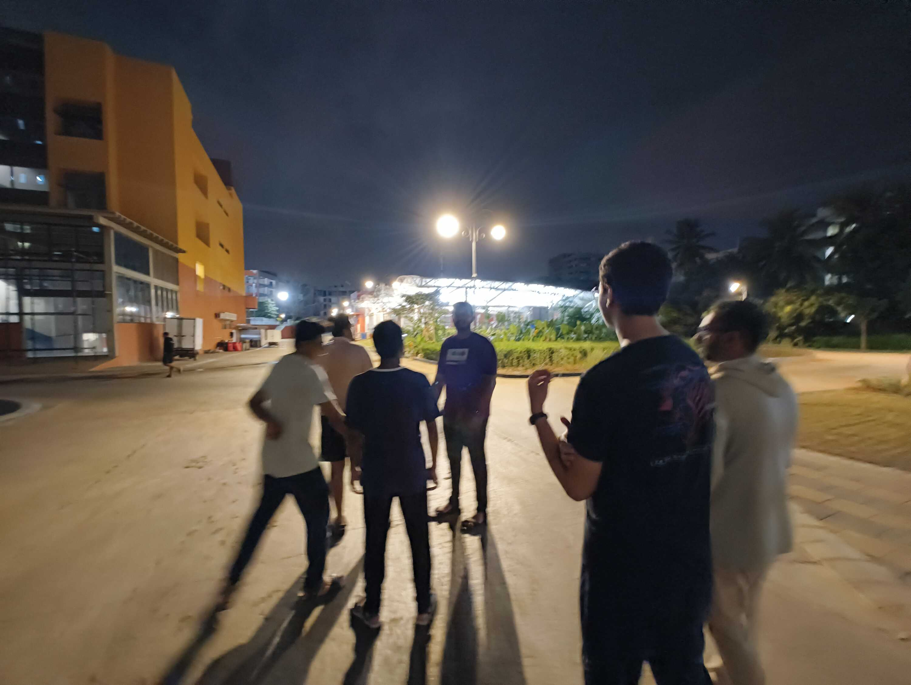

The day I got into BigBasket arrived unexpectedly.

I'd given the assessment, just like for any other company. I'd received the shortlist and seen my name in the final interview list. I remember nodding grimly at the email, as if acknowledging an enemy I was about to fight.

About 30 minutes before the interview, I decided ~to choose violence~ it would be better to trim my beard and look clean-shaven and all. I started trimming my beard and the trimmer died halfway. I was left with half a moustache and half a beard. I just giggled maniacally and sat down to join the meeting.

The interviewer asked some questions from [my resume](/resume), and then dropped in a DSA problem for me. I did the whole flow of explaining my process as I think and write code. I was stuck for a bit and told the interviewer I'm having trouble getting further. He told me it's alright and that I was pretty close, gave me the rest of the solution, and then ended the interview. I just sighed and assumed it won't go anywhere.

Aaand then I received an email next week that I'd gotten the internship.

Friends circled me and congratulated me. I was one of the last to receive an offer, so I'm sure some people were also relieved. Calls came in as the news spread across the extended family. The relief hadn't really sunk in, but every well-wish was like a hammer striking "BRO YOU DID IT" into my heart.

By the end of the day, I was grinning.

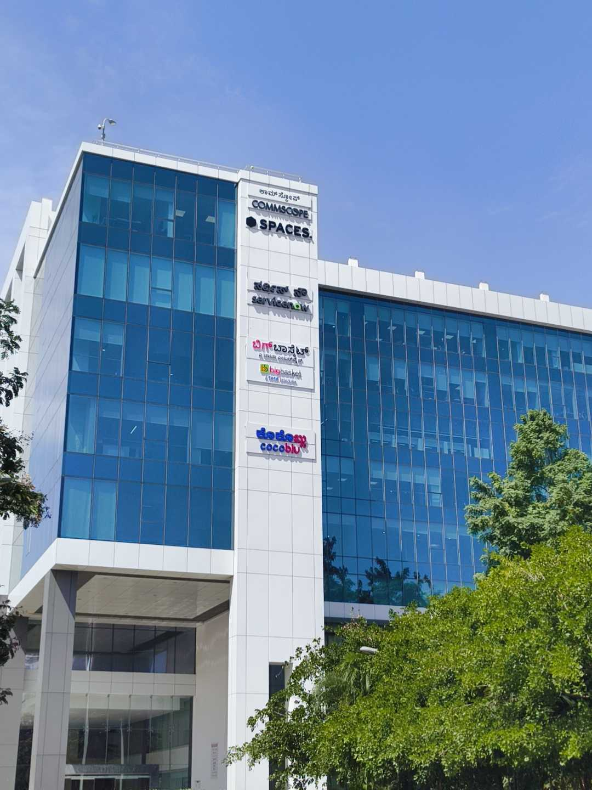

I go to an office now. A corporate job where I carry my ID card and punch my attendance in the morning. I create Jira tickets and fill in my OKR's. I go back home at the end of the day and have some time to myself. I get to meet my friends on the weekends who're in Bengaluru, and we hang out together.

There's no college assignments now, and no roommates either. I'm not surrounded by a lively hostel campus or bound by a curfew. It's a completely new place, a new leaf, whatever you want to call it. A new chapter maybe. That sounds about right.

When you call me, my junior, and tell me about all the things that trouble you, it reminds me of all the times I mentioned above. I recall my own attempts and failings, my struggles and my ideas that never saw completion. I hear you completely and feel your sorrow a little too, but the best I can tell you from the other end of the process is that it will get better. Even for people from my batch struggling right now, I have no doubt they'll find their place and comfort. Everyone eventually reaches where they want to. That's what I believe.

Oh also, never forget that your peers are experiencing the same thing as you. I say this because of some of the college happenings I've heard recently. It's all very annoying to go through, but remember that you have power in numbers. Document your communication publicly, and come together for things that trouble all of you commonly. That's the most I can say, since my degree hangs in the balance of it all too. :P

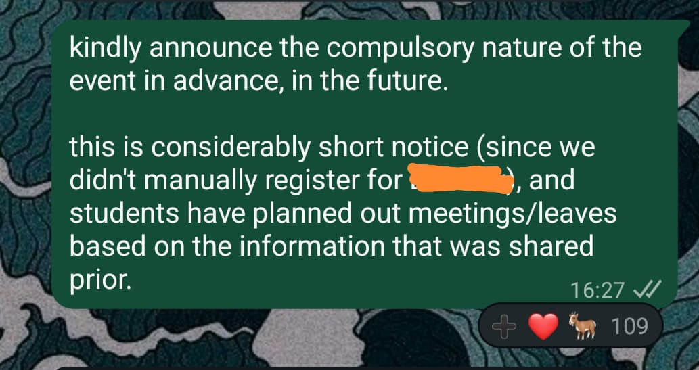

Now go off. You have much succeeding to do. It's all waiting for you.

#### Footnotes

[^1]: I'd worked on the "Accreditation and Reporting System" under the Application Development Cell, MIT-BLR, with eight other students and some faculty. The Cell eventually went on hiatus I think, but one of the incentives we received for completing the 6-month project was an Internship Certificate from the college.

[^2]: I ultimately decided not to go ahead with an MBA at the time, after a complete Pros/Cons comparison between CAT and a job. I realized that I just want to build things right now, not spend another two years studying theory.

[^3]: For those unaware (or in case this has changed), our room allotment was done on the basis of academic merit. You could put in a name for someone you want as a roommate, and if your CGPA was high enough (and ofcourse, if the other person also preferred you) then you could get the same room allotted. [Satyajit](https://www.linkedin.com/in/satyajitsinh-jhala-634057257/) always had a high CGPA, I just had to catch up to him. :)

[^4]: Sometimes not even your language of choice, actually. There were plenty of assessments that just _hoped_ you would know C or Java or even **HASKELL**, but choosing your own language was too much.

[^5]: Because, apart from hating DSA, I also never fully sat down to practice it. I think my [number of Leetcode questions solved](https://leetcode.com/u/abhigyantrips/) is in low double digits as of writing. This is because I have been very rigid when it comes to doing something I think is stupid. I was the same when I was giving JEE and had to prepare Physics/Chemistry/Mathematics to literally just study Computer Science.

[^6]: Our college has a policy that students that have secured any full-time offer, with or without internship, can no longer sit for placements afterward. So these people that were promised a full-time job (and didn't get it) were no longer supported by the college.
