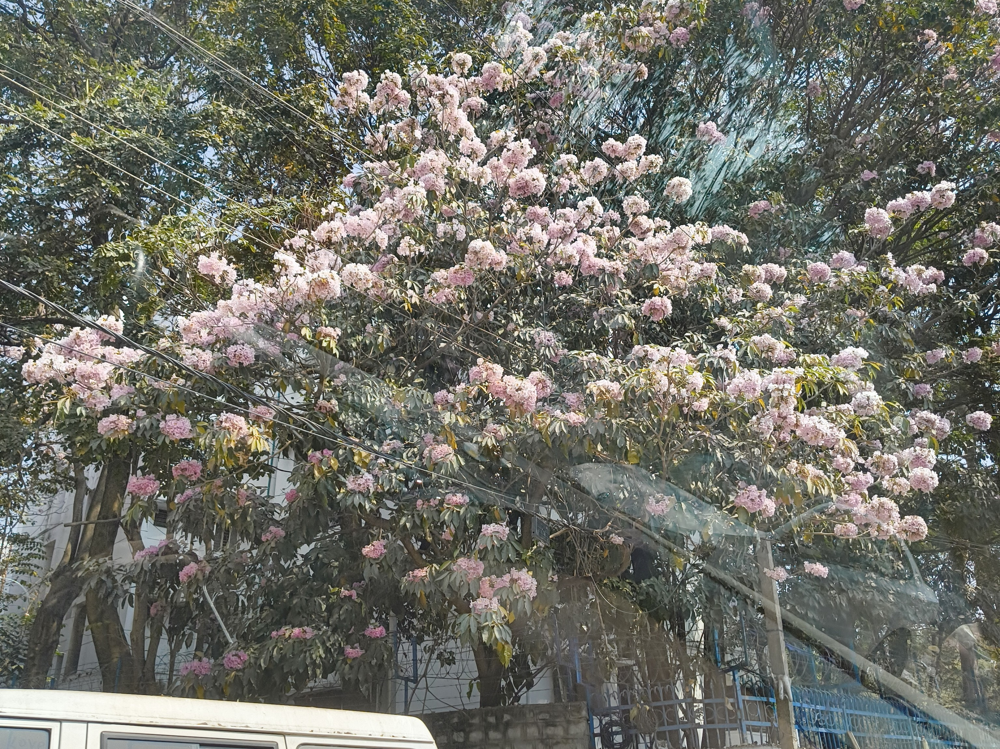

This week was [Holi](https://en.wikipedia.org/wiki/Holi) week! And I realized just how embedded [_Rang Barse_](https://www.youtube.com/watch?v=q3IHX5ASUa4) is in my head. Literally any mention of the festival rings the song in my head.

It doesn't matter what the meaning what the song is (because I can't completely remember either), and I definitely don't remember the lyrics song. But every damn Holi event I've ever gone to always has this song playing. It has taken its place in my heart and sits there on its colorful throne proudly.

All that to say, I didn't extravagantly celebrate Holi this year. Among work shenigans and non-profit contributions, I saw it more as a day off to relax. But I visited my relatives for lunch and had fun playing with my little cousins and sitting around with family. Apparently I had very narrowly missed a bombard of water balloons that had been meant for me, and I made sure to be grateful to the universe about it.

This is me still figuring out what weeknotes mean. And this is my first official weeknote, meaning that any notes from before were written in retrospect _after_ this one. I don't really know if that's considered betrayal to the readers, but I'm enjoying the time-travelling privileges that come with hosting my own site. :)
