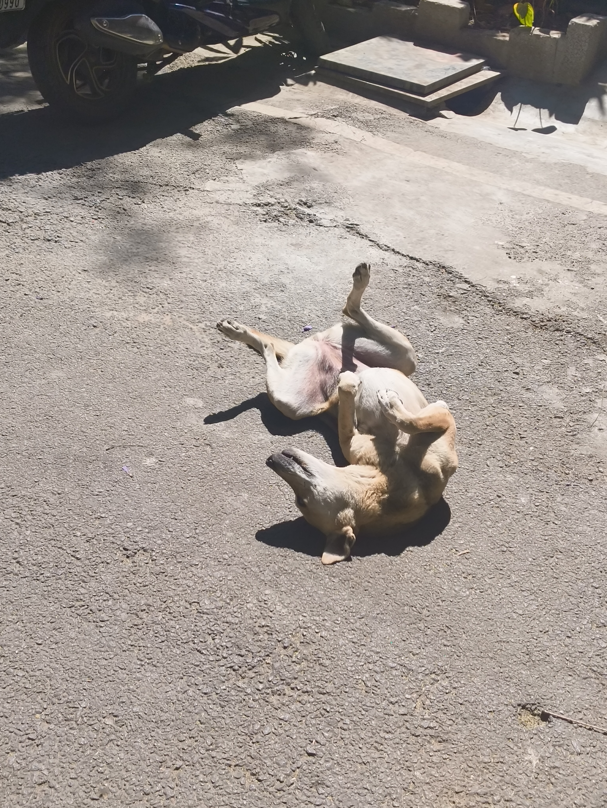
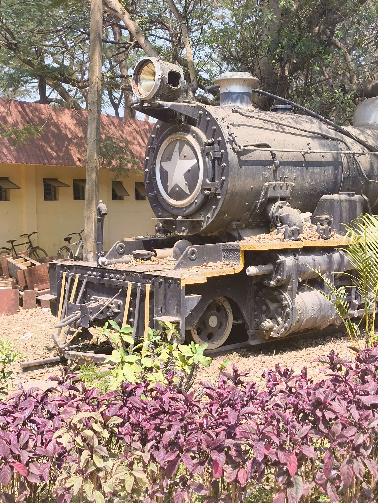

Here is an image of a cute dog. This is me providing myself a reminder that dogs are cute, loyal, and make people happy. All of that is to distract myself from the fact that one of them bit me this week.

I was strolling around the neighbourhood while on call with a friend -- we were discussing the chaos of mid-sem lab exams and celebrating how we were past it. Walking back and forth on the road, I kept noticing this one stray dog that looked quite sad (?). I'm no expert in dog psychology. But a dog that doesn't even lift its head when neighbours walk by with their dogs must be somehow lonely, right?

After I ended my call and visited a nearby café, I told myself that I would go check up on the dog and pet him to somehow help. Walking back, I stop near the dog and say, "Hey buddy! How are you?", in the usual tone you speak to dogs in (I don't need to explain any further). He starts wagging his tail. This is great! He seems happier!

I reach out my hand, and suddenly find myself pulling back out of reflex. I look down at my hand, and it appears to be bleeding.

I won't go over the details of how I rushed to the hospital (if you meet me IRL, I can probably expand on that part over some chai). But about two hours later, I found myself coming out with a prescription and a vaccination schedule for Rabies.

I am probably a little scared of dogs now. I'm definitely not petting one anytime soon, but I'm not going to make changes to how I walk or interact around them. My dad would tell me stories about how in the Army, when they got news of an airplane crash, all the aircrafts in the unit would fly out as soon as possible. This was done so that the fear of flying would not sit and grow within the pilots. While this dog bite isn't anything as grand as that, I still have that value ingrained in my memory.

Speaking of aircrafts, I learned a very tiny bit about [Solar Radiation Management (SRM)](https://en.wikipedia.org/wiki/Solar_radiation_modification) this week, through Instagram Reels. That very quickly turned into my feed being filled with posts about [chemtrails](https://en.wikipedia.org/wiki/Chemtrail_conspiracy_theory) and how it is being tested in India.

I'll be honest, I know very little about this. I definitely know about [contrails](https://en.wikipedia.org/wiki/Contrail) and have been taking "pretty sky pictures" with them for a long time. But suddenly seeing people on my feed, franctically talking about how "heavy metals are being released in the air" and how "they've not been tested thoroughly" and how "India is being used as a testing ground for an incomplete technology", I was definitely paranoid. These are all in double-quotes because again, I don't know how much of all this is true.

What I'm interested in, though, is how Instagram handled this sudden interest of mine. I share one reel to my story, as a prompt/question, and my feed instantly starts showing more posts about chemtrails. There are clips of people showing foggy skies, planes passing by, dust on their roof, and interviews with Bill Gates (one of the dudes supporting SRM). The more I interact, the more I keep seeing sky pictures with white lines running across them.

Sensing the sudden depth of the rabbit-hole, I had to step back. I had just experienced a very real example that Instagram doesn't really care about what I interact with -- or the truthfulness of what I interact with -- as long as I engage. That realization really didn't strike me until this one incident.

So yeah, I'm back to only using that platform as a backup time capsule. And as I close this weeknote, I once again realize that I've written a complete post instead of a weekly update. What a weird but freeing journey of being in control of the structure of my writing.

Thank you for reading, and I hope to see you again soon!
