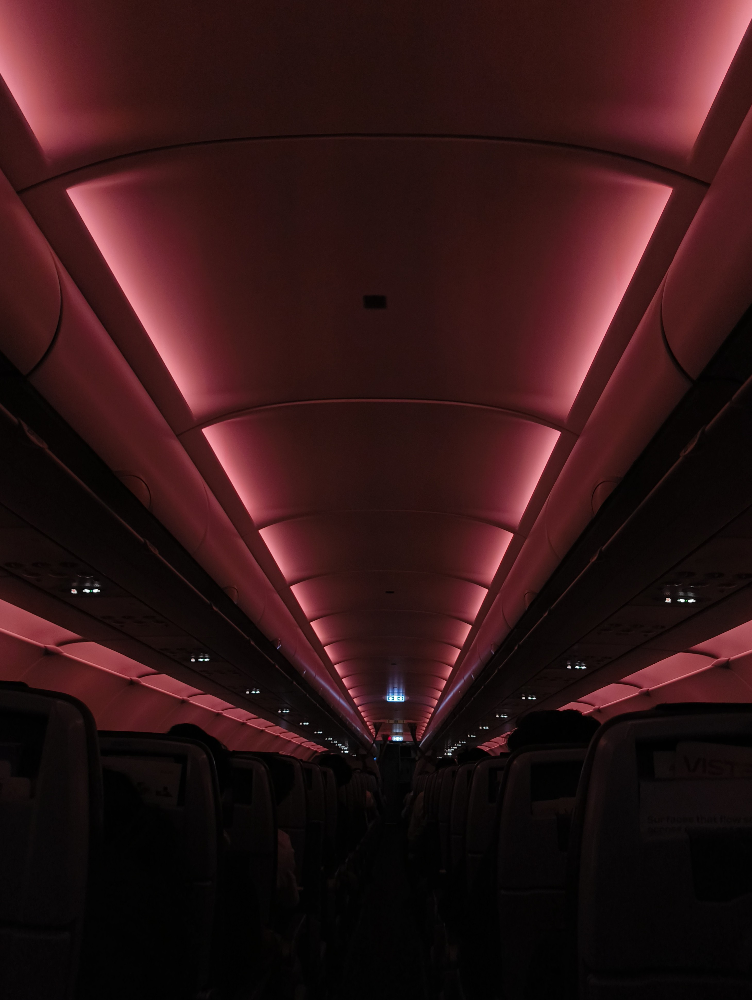

HELLO! This week, I went to Bombay to visit family after quite a long time. I wish I had more pictures to show here, but it was mostly me sitting at home and rotting on the couch -- _not_ doomscrolling, rather reading this really cool book called [Elantris](https://en.wikipedia.org/wiki/Elantris). It feels good to get back into somewhat of a reading habit again.

I've lived in Bombay before; long enough to start calling it **Bombay** instead of **Mumbai** like a true _Mumbaikar_. But this time I was living on a different side of it, to the point that it felt less like the nostalgia of coming back home and more like being in a brand new city. What a weird experience.

I got to experience the new [Aqua Line Metro](<https://en.wikipedia.org/wiki/Aqua_Line_(Mumbai_Metro)>) that runs almost completely underground. This was my first time using the Metro in Mumbai, and I was pretty impressed with the modernity of the stations in contrast to the old, ingrained existence of the local trains throughout the city. You can tell the concept is still new to the people, because it's still fairly easy to find a free seat to sit down. But you can also tell it's incomplete, since you can almost never get network while travelling underground.

Delhi Metro covered this issue by having network repeaters throughout underground patches, which worked decently; I could message people about my <abbr title="Estimated Time of Arrival">ETA</abbr> and travel time and surf online. But considering the number of stations [named after companies](<https://en.wikipedia.org/wiki/Aqua_Line_(Mumbai_Metro)#Non-fare_revenue>) and the [funding they're working with](<https://en.wikipedia.org/wiki/Aqua_Line_(Mumbai_Metro)#Funding>), I'm surprised mobile network infrastructure is yet to be implemented.

All in all, I was happy about not spending multiple hours in traffic to reach where I wanted. And the air conditioning in this weather is bliss.

The other part of the title just refers to me having [_Poha_](https://www.cookwithmanali.com/potato-peas-poha/) every day for breakfast, one way or another. There's not much to expand on, but it felt like a discrepancy worth documenting. :)

All this talk about Bombay reminds me: a friend of mine has a really cool web-series she starred in and co-produced, called -- _\*drum-roll\*_ -- [Bombay](https://www.youtube.com/playlist?list=PLvZYJgs9raJPLiac9Kv0mPqRONSkKDpYj)! I won't give too much of the plot away, but it's a story where student politics mean everything. The context that this was all filmed by college students, without a production budget, _while also juggling_ all the things college students have to do, leaves me in awe of what they pulled off.

I might have no understanding of art as a computer science kid, but this is one of the few times I felt like I was a part of the story instead of just staring at a screen. Go watch it.

With that, I'll take your leave this week(note). Peace!
