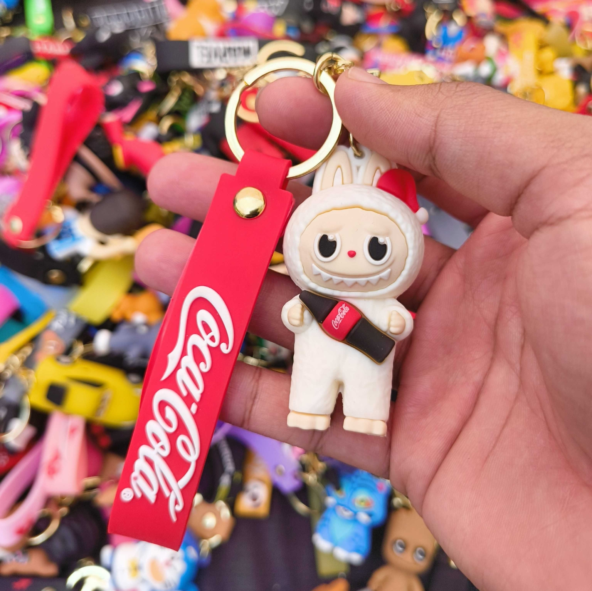
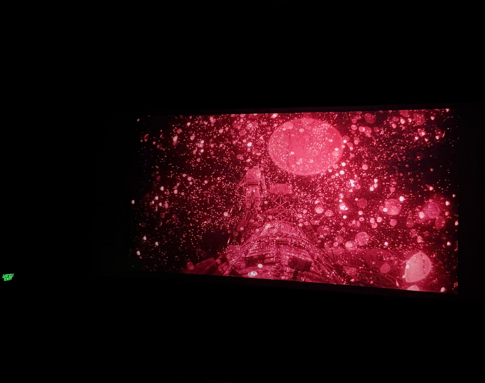

India seems to have an amazing ability to procure copies of any merch that's considered rare or expensive. It hasn't even been a year since [Labubus](https://en.wikipedia.org/wiki/Labubu) first entered Delhi's Khan Market, and we already have keychains of their Coca-Cola collaboration -- made with that weird rubber-plastic combination all these keychains use.

I would like to clarify here that I only think of these as a gag item -- I'd only get this keychain as an ironic gift for someone who mentions that they hate Labubus. I've already done that before to a friend, actually. But I made up for it with other mini-gifts they liked. :)

I also tricked a co-worker into trying one of those car keychains that shocks you. They were shocked (haha see what I did the-) but also found it funny (I hope). Since you know who you are, please take this as a public apology!

I watched [**Project Hail Mary**](https://www.imdb.com/title/tt12042730/) this weekend, and absolutely loved it. The storytelling, the back-and-forth between the flashbacks and the present, the sound effects for Rocky (the alien, not the boxer), everything merged into a beautiful story.

I've always loved [Christopher Nolan's](https://en.wikipedia.org/wiki/Christopher_Nolan) dedication to figuring out special effects without the use of <abbr title="Computer-Generated Imagery">CGI</abbr>, and this was no exception in terms of beauty. I also spotted a girl in the theatre holding [the original book](https://en.wikipedia.org/wiki/Project_Hail_Mary) by [Andy Weir](https://en.wikipedia.org/wiki/Andy_Weir); at the end of the film, I overheard her excitedly explain to her friend how accurately the film had represented the book. I was happy the movie did justice as an adaptation.

As I head into April, I'm starting new projects that I can't talk about yet. This website is undergoing changes too; I'm introducing the [`/ai`](/ai) page, removing `/reviews` because I don't think they would currently have a separate page, and trying to add cool people from my life to [`/people`](/people). My mom has told me she wants to be at the top of the `/people` list, so I'll make sure of that too.

There's much to work on, and much to look forward to. ONWARDS!
