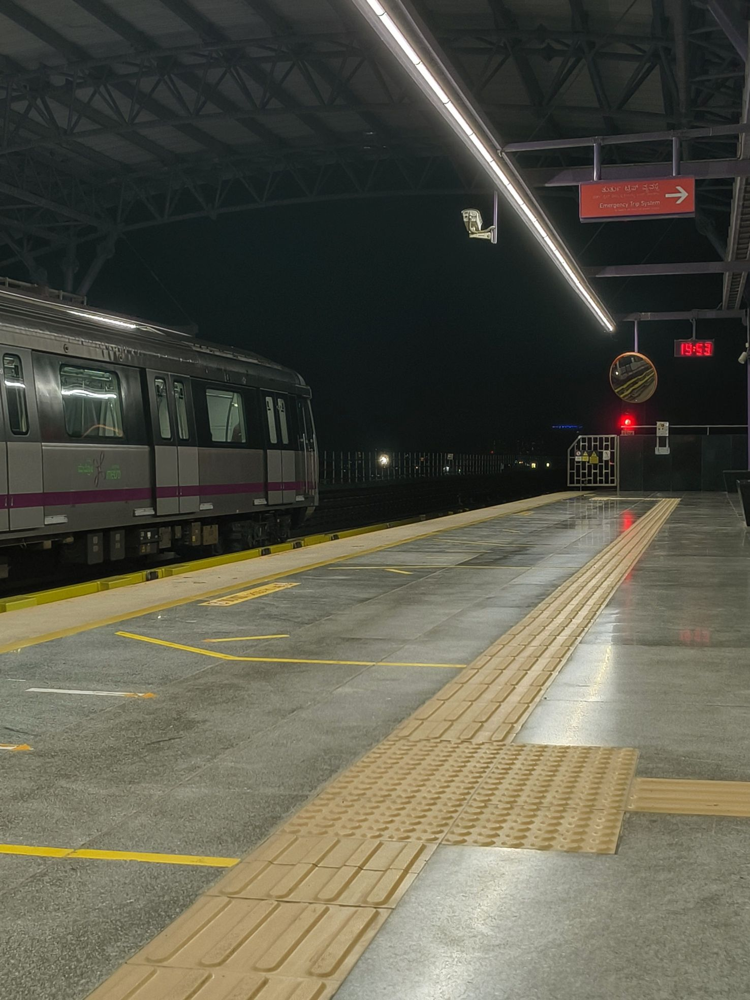
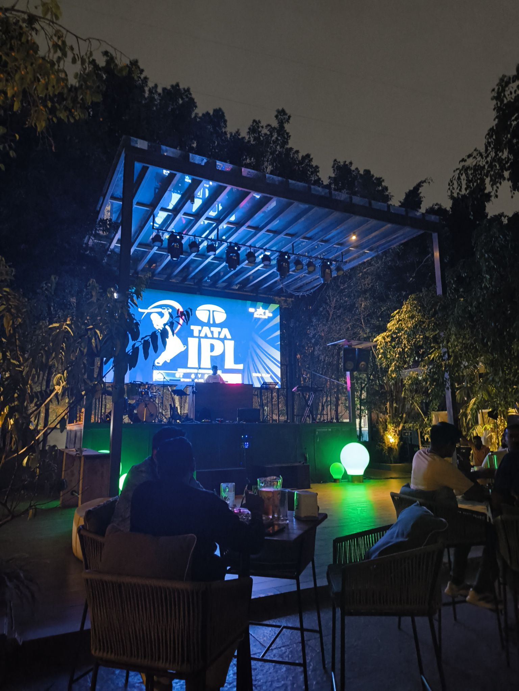

The first time I took a metro, I went the opposite way of where I was meant to go.

A friend told me to get onto Delhi Metro to reach his house. I bought the ticket through WhatsApp (technology is cool), then casually got into the station and sat in a train. While it was cruising over the high-traffic Delhi roads, I thought to myself, "Damn, metros are really cool. It's a shame that they only run in one direction at a time --".

At this exact moment, a train passed us in the opposite direction. You see, I believed that the metro runs to one end of the line, then takes a U-turn and reaches the other end. Technically, I wasn't wrong. But that meant the metros could be going in the other direction simultaneously. That's how I learned I was going the wrong way, and had to switch platforms on a random station.

This was the start of my confused relationship with public transport.

My friends love to repeat this story and I've lost hope in them forgetting about it. But yeah, I'm a grown man now. As I travel in Bengaluru Metro, whenever I go in the wrong direction, I just calmly get off and go to the opposite platform. My friends will not get any information on my lack of metro-navigation anytime soon.

That anecdote aside, this has been a fun week! I helped planning out a friend's midnight surprise, though I only attended the actual celebration over a video call. We later went out for dinner, and met other mutual friends.

I also went to a brewery! This picture is from [Ironhill Bengaluru](https://ironhillindia.com/bengaluru/). The large setups these breweries have amaze me -- the huge projector screens, the fountains and artificial "ponds" and seating structures on top of them -- it's all very grand. It reminds me of the huge Officers' Messes in the Army where they have gatherings and farewells. I might be exaggerating the actual size of the mess, but as a kid it all felt very grand.

Maybe I'll leave this weeknote as a short one, then. See you next week!
