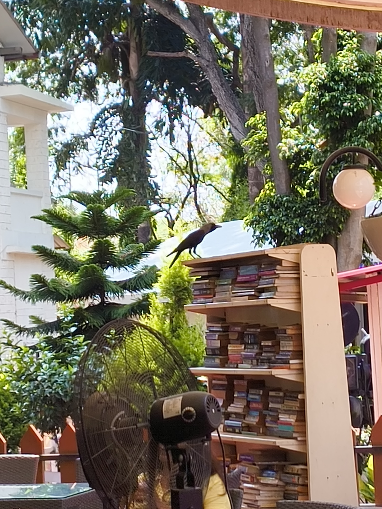
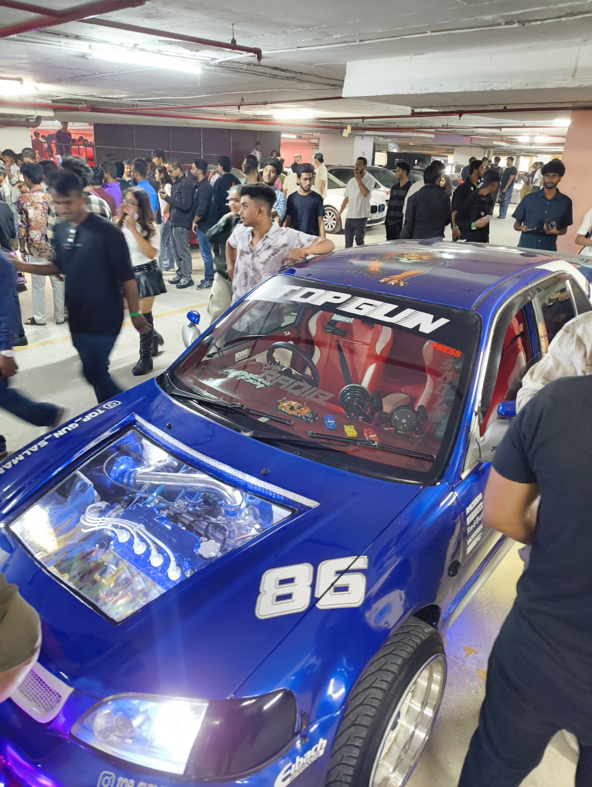

Dear reader, I hope the title of this note got your attention. I'm please to inform you that I found a crow sitting on top of a bookshelf. It's true that I'm assuming a crow sitting on a bookshelf is smart, but just trust me. Also it does look kinda smart, doesn't it?

This was my view when visiting an Army Officers' Institute this week. I always love the amount of greenery you can find pocketed in a cantonment in the middle of a city. The air suddenly clears up, and life feels a little calm again.

You know what's not calm, though? Car shows.

I went to the [Revv Culture Car Show](https://www.instagram.com/revv.revolution/) that happened in Nexus Whitefield, with no idea of what usually happens at car shows. The one piece of foresight I managed was wearing my ANC earbuds before going in, and that saved me quite a bit of hearing loss.

This show was probably the loudest event I've ever witnessed. Large crowds aside, the entire thing was happening in a parking lot -- y'know, those places that have a lot of reverberation and can make anything even louder.

People were screaming at supercars. Vehicles were backfiring everywhere; one of them backfired so loud, my earbud thought I'd tapped it and started playing music. It was all insane to me, and I probably left within 20 minutes of arriving there.

It would have still been a nice day if I could just explore the mall in peace. But, you see, Nexus Whitefield has its parking space connected to the rest of the mall. So whatever noise occurred in the parking lot, followed you throughout the building wherever you went. With parents covering their kids' ears and people feeling anxious from the loudness overall, it wasn't that great a place to be.

One of the people I went with later commented, "What did you expect from the show? It's literally called 'REVV', they will obviously have loud cars." I'm still not convinced, but I have definitely formed an opinion about car enthusiasts.

I made it up to myself by having ice-cream later. So I'd say it was a great week overall. :)

Peace.
