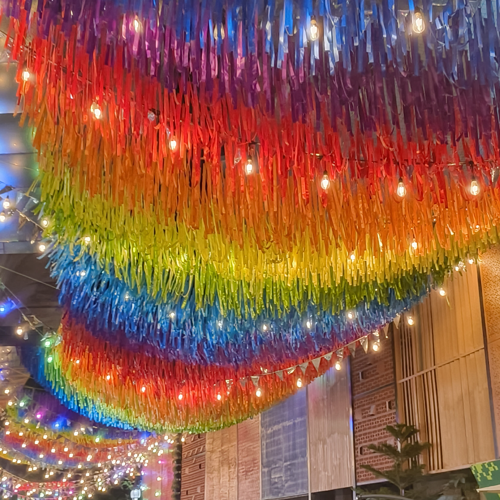
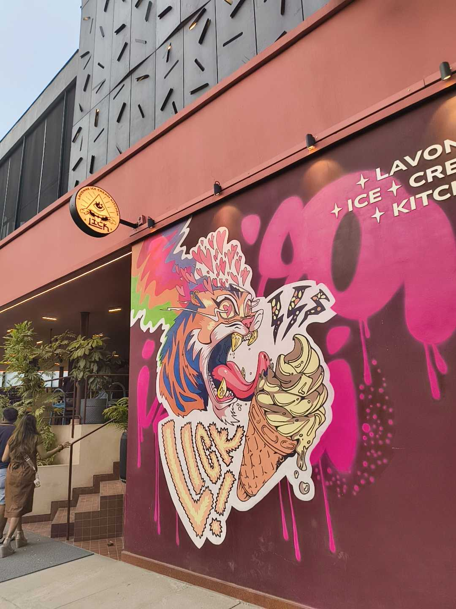
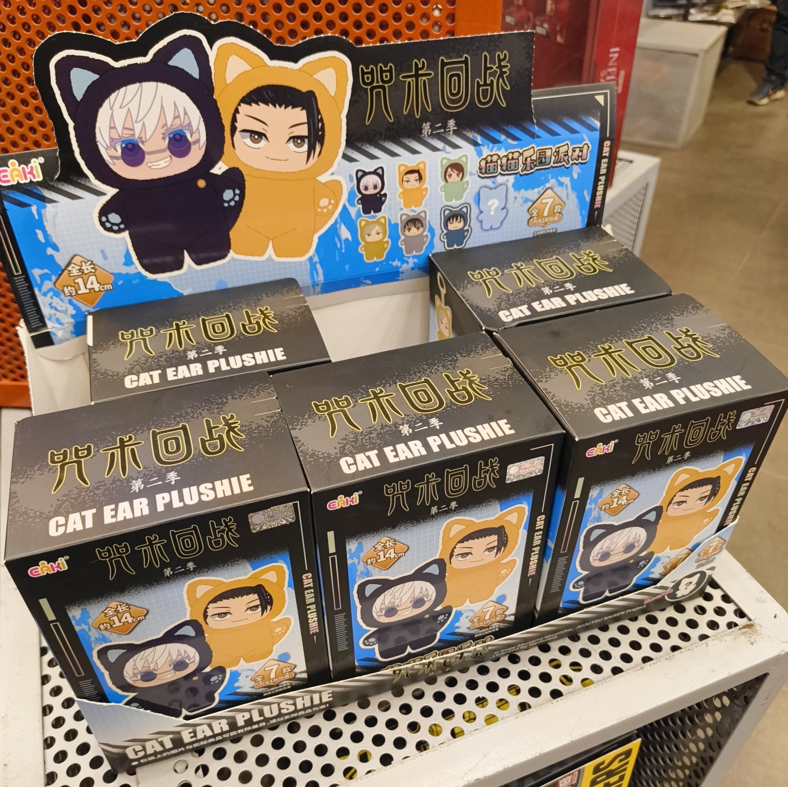

I saw a lot of colorful areas this week and the vibrancy was refreshing. Also stumbled across some old college friends while just walking around Indiranagar, which made me really happy about how BLR ends up being expansive but also a small world.

I visited some home decor stores this week and looked at shiny brass things, colorful ceramic things, and tiny tiny plants neatly placed all across the shelves. We also looked at the price tags and decided we won't be getting anything from there -- only because we didn't like anything that much, trust.

I have been walking by this place for weeks while going back home from [IndieWebClub](https://blr.indiewebclub.org), and finally visited this week. I didn't spend any time tasting any of the flavors, and instead picked the shiniest-looking ice-cream -- the "High-Protein Dark Chocolate". I can safely say I might've picked the wrong flavor. And I think I can curb my protein obsession to not affect my ice-cream choices. But I'm definitely going to come back and try to do LICK justice.

And that's all for this week! I'll leave you with this cursed image from the Entertainment Store, and see you around. :)

