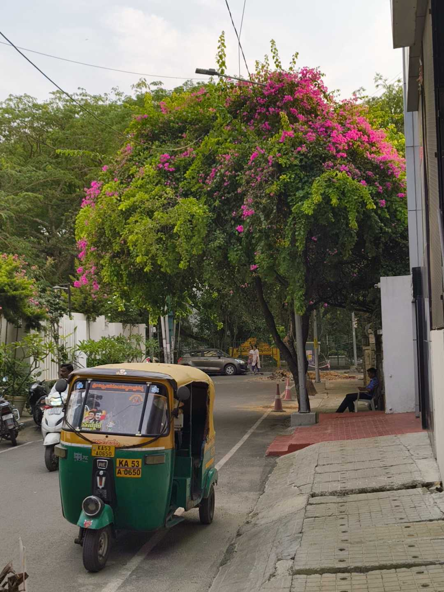
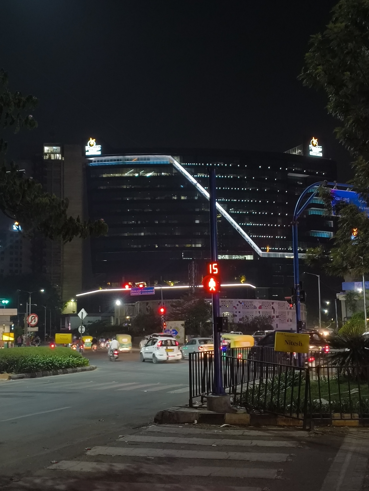

This week, I spent **a lot** of time with my head down focused on work. With some deadlines suddenly descending on me, I was conscious about not letting the stress get to me. A very \*aware\* (yet exhausting) experience, which made me all the more enthusiastic to get to the weekend.

On Saturday, I attended the [Margins of Fire](https://underline.center/t/margins-of-fire-a-workshop-on-writing-dissent-poetry/755) workshop by [Shruti Sunderraman](https://www.shrutisunderraman.com/). I have barely written poetry before, and I wasn't sure what I'd be able to contribute to a gathering like that. But I found the courage in some pocket of my heart, and once again ended up in front of the [Underline Center](https://underline.center) on a Saturday afternoon.

I was relieved when Shruti once again confirmed that you _didn't_ need to be a poet by profession to attend the workshop. We went around doing our introductions, and each of us mentioned "something we can't remain quiet about". The feeling from that moment is hard to describe.

There was an air of melancholy; an empathetic sadness when someone voiced their sorrow, or rage. When an intro was finished, there was a moment of comforting silence -- like a wireless hug everyone gave to each person -- followed by Shruti gracefully acknowledging the thought and the feelings around it. I knew some of the attendees from other meetups, and I felt like I got to see a new side to them. I feel very content when thinking about that moment.

And yeah, I wrote a poem in the workshop that I've published as a blogpost [here](/blog/husk-of-a-rainbow).

I don't get out for night walks that often anymore, ever since [I was bitten by a dog](/weeknotes/2026/11). I've shown some moments of great courage -- walking past a huddle of sleeping dogs without showing any outward sign of fear. After which, I'd promptly call my mom and tell her about my epic feat.

I romanticize night walks due to the sheer amount of songs that seem to be made just for them. Walking down an empty street with crickets chirping, listening to [Saved by Labi Siffre](https://www.youtube.com/watch?v=uMSDbFpNMcU), thinking about the day gone past and the future I seek... it's an emotion.

I don't fully know where I was going with that thought, but I miss the night walks sometimes. I've found other ways to hang around a little late (safely), which is when I'm out with friends and having dinner or ice-cream hunting. I really like those outings, and I wish they could last longer too.

That's all from me this week. The song of the week seems to be [La Belle Fleur Sauvage by Lord Huron](https://www.youtube.com/watch?v=R5PYkp3CYnE) -- another great night walk song. It might be cool to have a song widget thingy next time :)

Peace.
