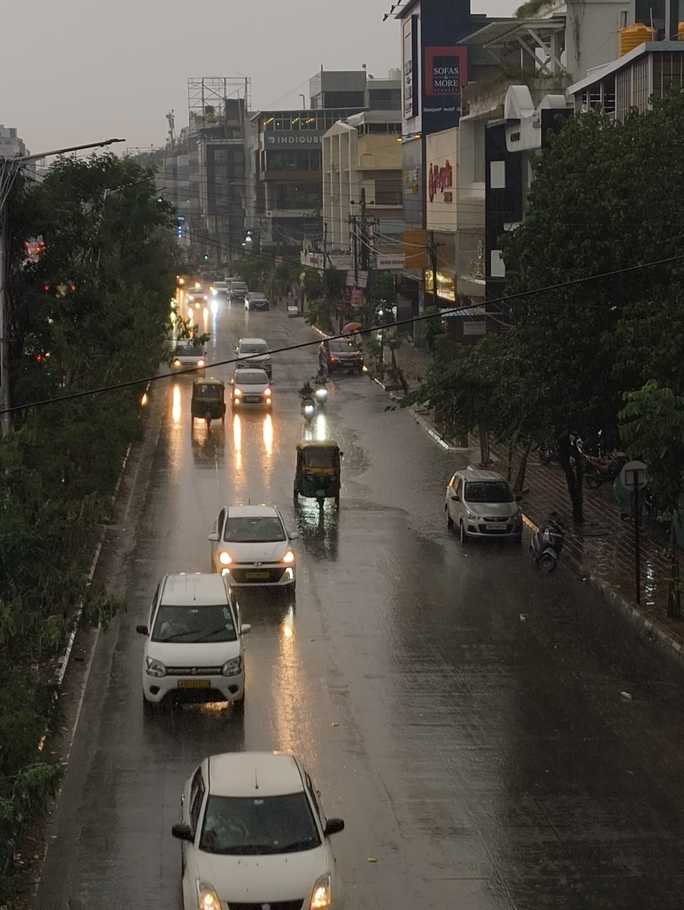
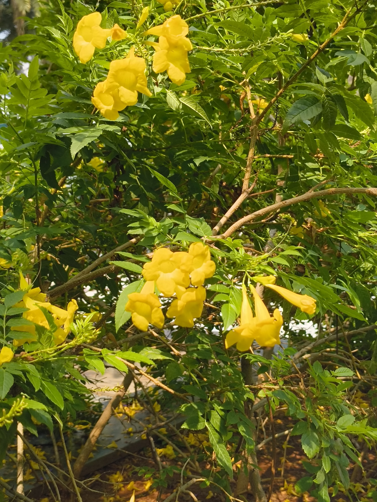
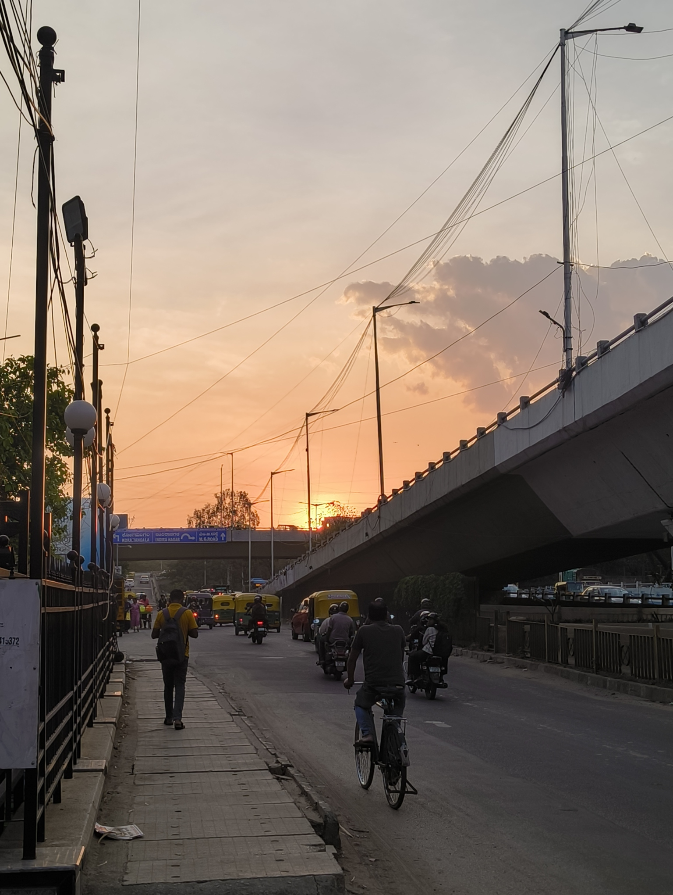

The title of this note is brought to you by ["Dekho Baarish Ho Rahi Hai"](https://music.youtube.com/watch?v=GcdMzSlLzAY), the song. I was introduced to it by my best friend in 10th Grade, and it is one of the few Bollywood songs that I am fully aware of. The competition is between this and ["Sooraj Ki Bahoon Mein"](https://music.youtube.com/watch?v=Isb7WV4d17I&si=XIbF6Y_hYFcxhL3G) from [ZNMD](https://www.imdb.com/title/tt1562872/).

All of that to say, it rained a lot this week. There was a lot of thunder too. I got to use my bag's rain cover for the first time while walking back from office, and reached back to my room with only the lower half of my pants drenched in water and leaves.

There were a lot of power cuts as well; the room got stuffy, which gave me a chance to stand outside and enjoy the cool atmosphere that _baarish_ brings. That said, I was still relieved whenever I heard the hum of the generator cut through the white noise of the rain. If there's anyone that didn't enjoy the rain, it's probably the clothes that were doing their best to dry on the rooftop -- the weather threw water over their efforts multiple times (and the pun is very much intended).

The weather clearing up brings a new appreciation for _dhoop_. The flowers look more colorful and for once I don't mind the sweat from walking under the Sun.

This week, I also finished up my tasks on a major work project! I'm acknowledging it here because I've observed I don't celebrate finishing up work that often; it just keeps on being one thing after another until I look up one day and realize I feel _very_ tired. So here's a mini-celebration paragraph.

The week ended with me attending the staple [IndieWebClub Meetup](https://blr.indiewebclub.org). We had a more general discussion about the [IndieWeb](https://indieweb.org), writing, and the impact the club has had on us as it nears its one-year anniversary.

This website, ofcourse, was propelled by being a part of IWCB and seeing other people create their personal spaces on the Internet. The last thing I remember writing before this website is [YCN.club's README](https://github.com/YCN-club), which was **really** long ago. So starting to write was an achievement anyway. But I was also a little in awe of the _permanence_ -- the process of archiving your thoughts in a dedicated public place, that stays there no matter where you are physically.

Being an army brat has made me crave permanence before, but there's not much I can do to establish it as a college kid living away from home. A personal website is a different story, though. And that's what brings you here. :)

I've also incidentally started reading more due to IWCB -- both in terms of books and other people's websites -- and then discussing things with other people. This meetup, for example, I was able to tell [Ankur](https://ankursethi.com) how much I ~~hate~~ love his [chai recipe](https://ankursethi.com/blog/the-only-correct-recipe-for-making-chai/), and talk to [Abhinav](https://abhinavsarkar.net/) about [anime recommendations](https://abhinavsarkar.net/notes/2026-anime-recs/) and watchlists. I've also seen [Tanvi](https://tanvibhakta.in/)'s weeknotes include food places she likes, and wanna have something like that here next time. It feels like a richer social experience in general, and I'm thankful for that.

In other news, I've started properly cooking up the [Projects Page](/projects), so you should be seeing more content on there soon&trade;. I've also started working on the "song card" I was talking about [last weeknote](/weeknotes/2026/17), though that might require a shift to using [MDX](https://mdxjs.com) which I'm still debating.

Alright, that's all this week. See you folks around.
