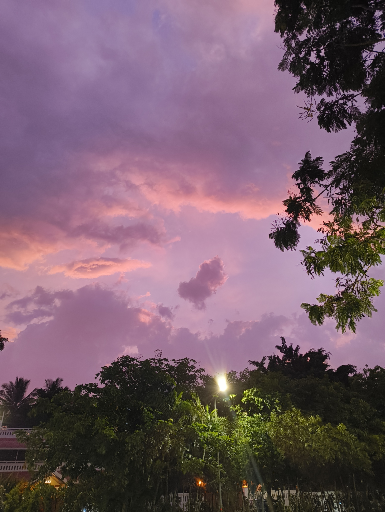
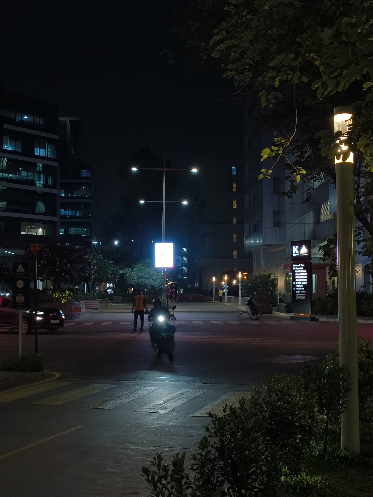

_Baarish_, an uninvited but pleasant guest, now visits less frequently. The sweet smell of petrichor lingers for a bit, while the sky is filled with clouds colored pink and orange from the sunset. The clothes drying outside breathe a sigh of relief and wait patiently to be taken back in.

Internship chugs along while I work on personal projects in my free time. I remind myself not to overwork. My primary task as an intern is to learn, and anything I can contribute is a plus, not an obligation. ~But the conversion is based on my performance and what if I--~ No, Abhigyan. The last thing you want to be right now is burnt out.

Ah, well. Anyway, look at this cool picture.

I'm still wrapping my head around the fact that college is over. The Photos app is hilariously brutal -- picking up highlights from the last few years that feel like they happened just yesterday. I sit with my teammates and eat ice-cream in the tech park, still traveling through college in my mental time machine, when I spot a familiar face and blink.

I FOUND A CLASSMATE IN THE TECH PARK.

Behold, the highlight of the week (and possibly the month). A familiar face that has had the same educational ~trauma~ experiences as you!

So yes, I caught up with this friend. We had met fairly late in college too, so there was much to talk about from our lives. We discussed our internships, project work from college (and bad deadlines), and general shenanigans around our interests and being chronically online.

I was introduced to frozen yogurt. It's _really_ good. Shout-out to this niche place[^1] called [Froyoland](https://myfroyoland.com/), glad to be an early supporter and loved the mix of Chocolate Cake & Custard[^2]. I also learned about Carnatic Fusion music (a prerequisite to which was learning what "Carnatic" means[^3]).

I also learned (through MBTI), that this person is basically an extroverted version of me. And any version of me should always have a website, which is why I've tempted her with a very cool domain that's currently available for her. So, my lovely readers, let's send mental signals to Sarayu to start her very own travel blog[^4]. :)

Speaking of websites...

[IndieWebClub BLR](https://blr.indiewebclub.org/) is going to have its [one-year anniversary](https://blr.indiewebclub.org/2026-se/)! I've met so many cool people here, and I'm glad to be a part of this celebration. The celebratory event is going to include lightning talks from people passionate about the [IndieWeb](https://indieweb.org/). Who knows, I might end up presenting too! So if you're in Bengaluru on 30th May, and have a knack for writing/blogging (or just enjoy cool websites), you should come and join us.

I'll end this note with some music that's been running on loop: [Henna Henna](https://www.youtube.com/watch?v=vgXEcwcyyMI) by [The Bombay Royale](https://www.youtube.com/@thebombayroyale) and [Hanen by Carthago](https://www.youtube.com/watch?v=blCI1musoVM). There's also [Subrahmanyena Rakshitoham](https://www.youtube.com/watch?v=tqMgScNj2vA) by [Agam](https://en.wikipedia.org/wiki/Agam_%28band%29) (recommended by Sarayu), which is a badass song. And ofcourse, you can't enjoy the rain without ghazals from [Jagjit Singh Ji](https://en.wikipedia.org/wiki/Jagjit_Singh).

Alright then. Here's to more unplanned encounters, and I'll see y'all next week.

---

#### Footnotes

[^1]: Please understand this is satire. :sob:

[^2]: They have machines that can dispense both at the same time. Technology has really advanced, eh?

[^3]: A system of music that's primarily associated with South India.

[^4]: Sarayu also reads through these weeknotes, and has ~threatened~ advised me to talk about the froyo here. Hence, the weeknote title.
