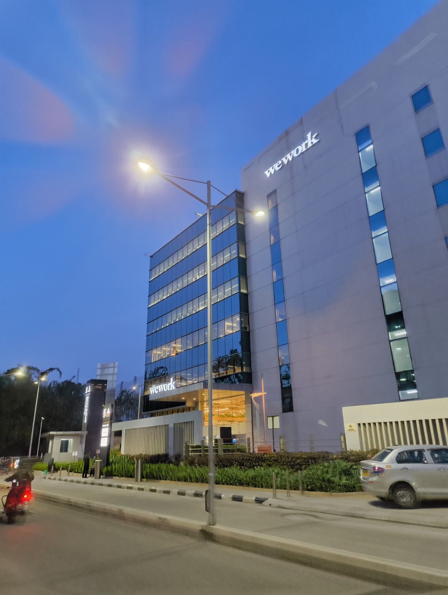
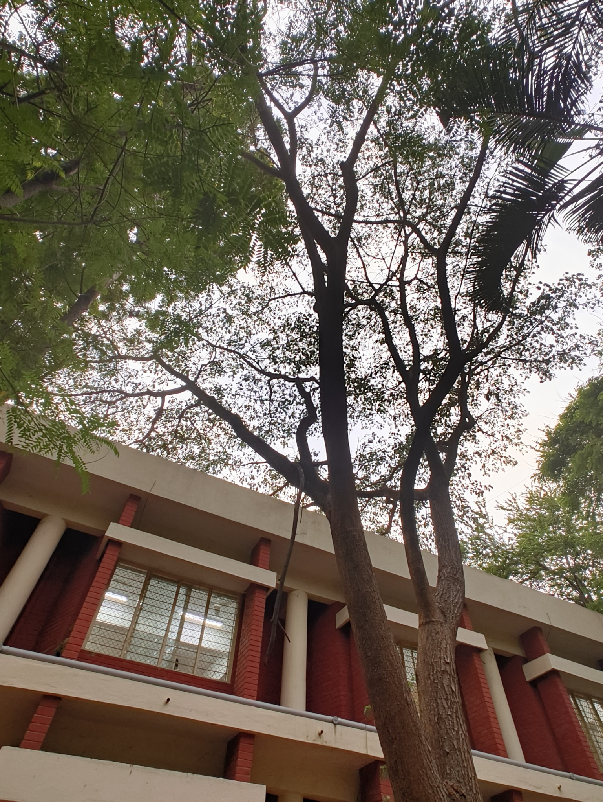

HELLO HELLO! If you're staying up-to-date on the site, you'll know this one is coming a week later than it should. Am I breaking the fourth wall by mentioning that? Do blogs have walls in the first place? Who knows. But to that one reader who reached out about when the weeknote is coming out, here it is! Thank you for checking in. :)

Work was a blur; I just remember spending the day programming, coming back and then programming again. I would call it "coding" but a lot of the "coding" at work is done by [Cursor](https://cursor.com/) through my prompts. It might not be how I want to interact with the projects, but the deadlines command it. Plus, I can't say I don't appreciate the efficiency and the short gaps between idea and result. Behold, my moral crisis.

After the staple [IndieWebClub](https://blr.indiewebclub.org) meet-up this weekend, I found myself roaming around Indiranagar before going to meet a family friend. I saw the India Post office, which was already cool, but also stumbled upon the regional City Library. With an unusual amount of decisiveness, I stepped in through the gate.

Ironically, my words cannot adequately describe the serenity of libraries. It feels like all sound fades away, nothing to be heard except the flipping of pages or the shifting of chairs. The walls are lined with books, the pages having turned a very light shade of brown. I set down my bag amidst a grid of _thelas_ and bike helmets. The register has everything written in Kannada, so I can't tell what it's asking me to fill. No one is looking at me, so I decide to skip the register and just find a seat.

The table is piled up with newspapers. I sit down and take a deep breath; the smell is nostalgia itself. I have nothing to do here, really. I'm not sure if I'm allowed to take out my laptop. I don't know if I can even take out my Kindle, in case its existence is considered blasphemous. So I just pick up a magazine and sit on a chair that seems to be older than me.

Looking around, most of the people in the library that day were very old; senior citizens who were tired of looking at things on their phones and just want some peace while reading their newspaper. It was a curious experience to be sitting in the library and watching them, but it also made me sad that these attendees reflected the age of the library itself.

Outside of libraries in Army Units, this was my first time stepping into a City Library. I'm not sure what percentage of the younger generation visits their regional public library regularly, but I'm assuming it's much lower than it was before. Any comments farther than that would be too presumptuous, but I wonder if the alternative we've found to libraries is actually better. Having the world at your fingertips seems great and all that, but I'd rather focus on one tiny part of the world at a time. And I'd like to have a quiet place to sit down and do so, among other fellow wanderers of stories and information.

After visiting the library, I roamed around and found a very cool crafts place. It was probably the first time I found liquid colours that _weren't_ acrylic. These people had things like "mica-based" or "fabric paint" colours, all with their own unique textures. I also saw a lot of different MDF shapes which was cool; I might end up getting things and messing with them just for fun. I saw some mini square canvases -- the size of a regular sticky note -- and picked them up for my sister.

Though I can't specify how, I ended up meeting someone who has a [Dobermann](https://en.wikipedia.org/wiki/Dobermann) named Ronny (I _think_, I don't remember). My fear of dogs is... I don't know. I don't cower away from them, but I become very aware of where my hands are in-case they feel like biting them[^1].

But anyway, what I learned from Ronny is that Dobermann dogs don't have their ears pointing up naturally; it's an operated procedure that cuts away at most of the ear and shapes them to be like that. That honestly sounds like hell for the dog, and Ronny's owners had decided not to do that process for him. Good for Ronny. Ronny's a good boy.

With that, the week came to an end. The next weeknote would be coming up very soon, so look out for that too. I'll see you guys around!

#### Footnotes

[^1]: Why would I have a fear of dogs, you ask? Well well well, here's a [weeknote](/weeknotes/2026/11) telling you why.
