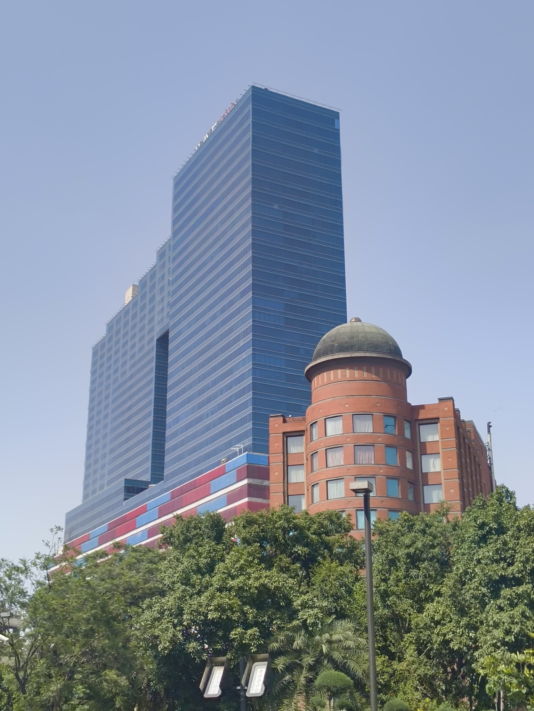
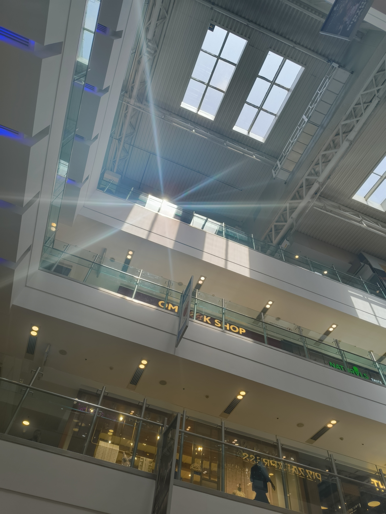
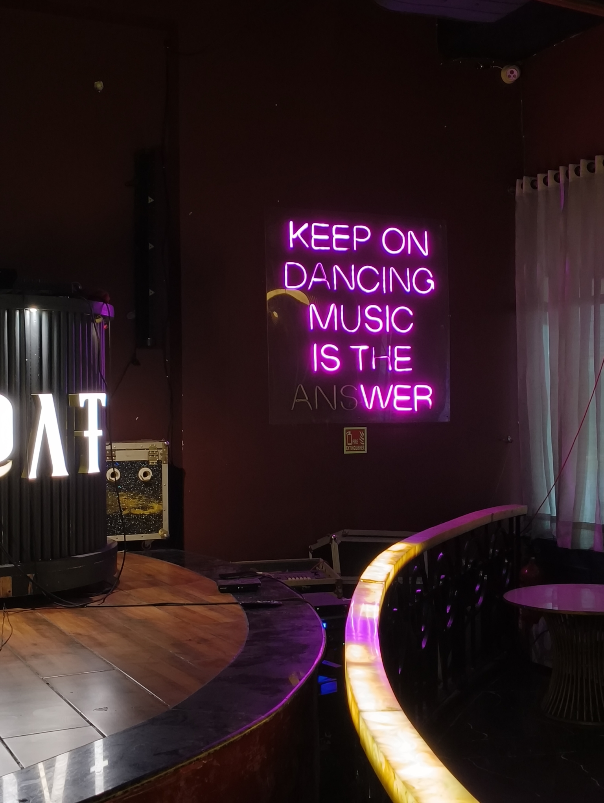

I WENT TO DELHI THIS WEEK!

The city is dangerously hot right now; weather apps say it's around 39&deg;C but "feels like 50&deg;C". When you put a pan on the stove and hover your hand over it, you can usually feel the heat on your palm. Being outside felt like that, except the heat was all over my body. I was worried that if I didn't drink water every 5 minutes, I would evaporate and leave my companions confused about where I went off to.

When I wasn't pondering upon the sorry state we've put the environment in through our actions, I found some time to have fun with my family and loiter around. There were many mall visits and birthday celebrations, so I got to window-shop many tech stores and walk around bookshops.

I really like the thin smartphones that have been coming in lately; I want to get one with a smaller screen size at some point. As I've started using my phone less, the phone itself has started feeling heavier. Sometimes I think, "I really shouldn't have to lug around this thing just to receive calls and use WhatsApp," so it would be nice to have something with a physically lighter presence too.

This is why I'm also excited for the [Clicks Communicator](https://clicksphone.com/) to release! The form factor really appeals to me, and it maintains the ability to still utilize non-communicative apps when needed. It's pitched to also use [Niagara Launcher](https://niagaralauncher.com/) as its default, which is one of my all-time favourites. Getting this thing with a green cover would be so cool.

At the same time, I'm also tempted to just get a keypad phone and replace more complex functions with something like the [Mecha Comet](https://mecha.so/comet/). I stumbled upon the site while going down the rabbit-hole of [cyberdecks](https://www.reddit.com/r/cyberDeck/), and have it bookmarked to stalk from time-to-time. It's projects like this that give me hope for the future of technology; for it to be an enabler rather than a dominant, self-serving presence in our lives.

The highlight of this week was definitely my sister's birthday. She invited all her friends from school, while mom handled inviting family relatives and all the arrangements. We surprised her by filling up her room completely with balloons and setting the speaker to play boppy songs. She was definitely surprised and happy, though I also enjoyed how much the balloons annoyed her while trying to move around the room and work.

The celebration was wonderful too! I got to meet a lot of relatives after a long time, and saw my sister's friends bringing in gifts for her. It made me nostalgic to how grand birthdays felt in school -- receiving so many gifts, and then planning out return gifts to give to friends before the party ended. There would be stationary, art supplies, sometimes build kits with solar panels and other things. It was always a blast, and there would always be _chowmein_, or manchurian of some kind. I'm glad my sister got to experience it.

I'll end this weeknote here, dear reader, but do mentally leave a birthday wish for my beloved sister. She's an extrovert, so she will definitely appreciate it and respond in kind.

Peace and love.
