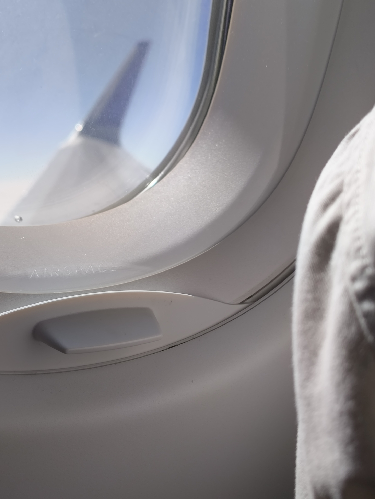
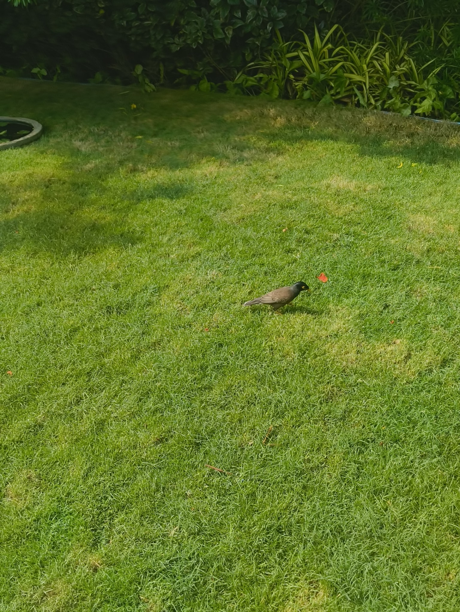
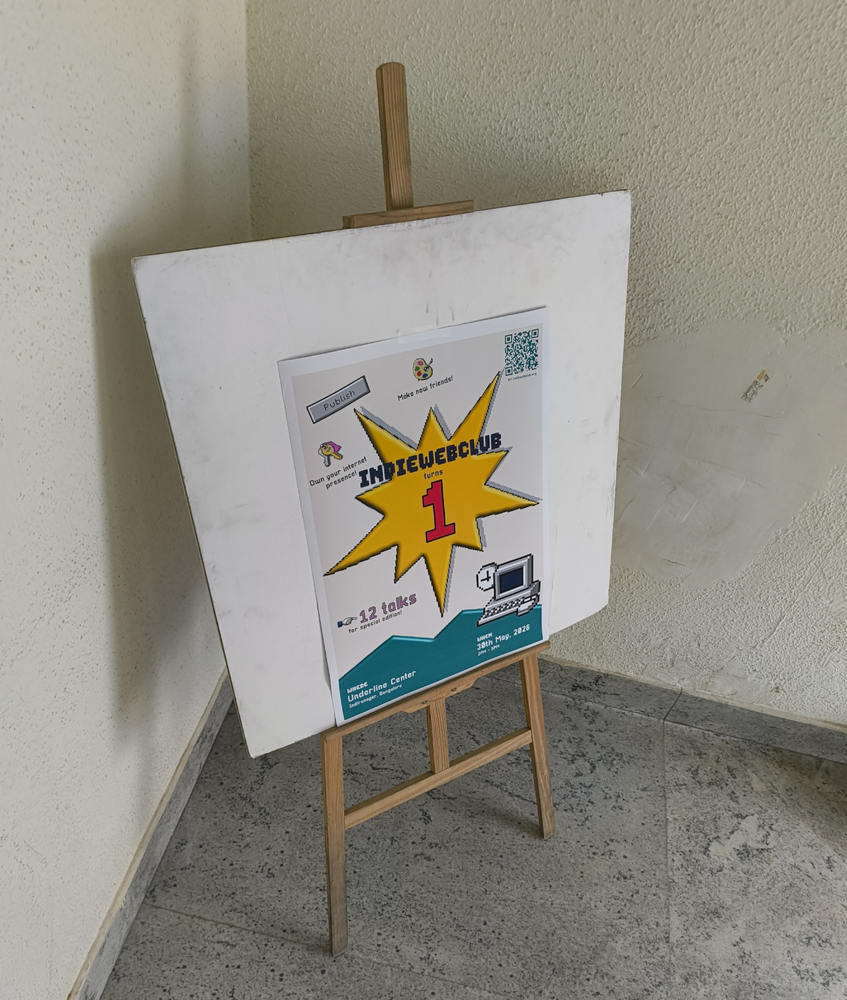
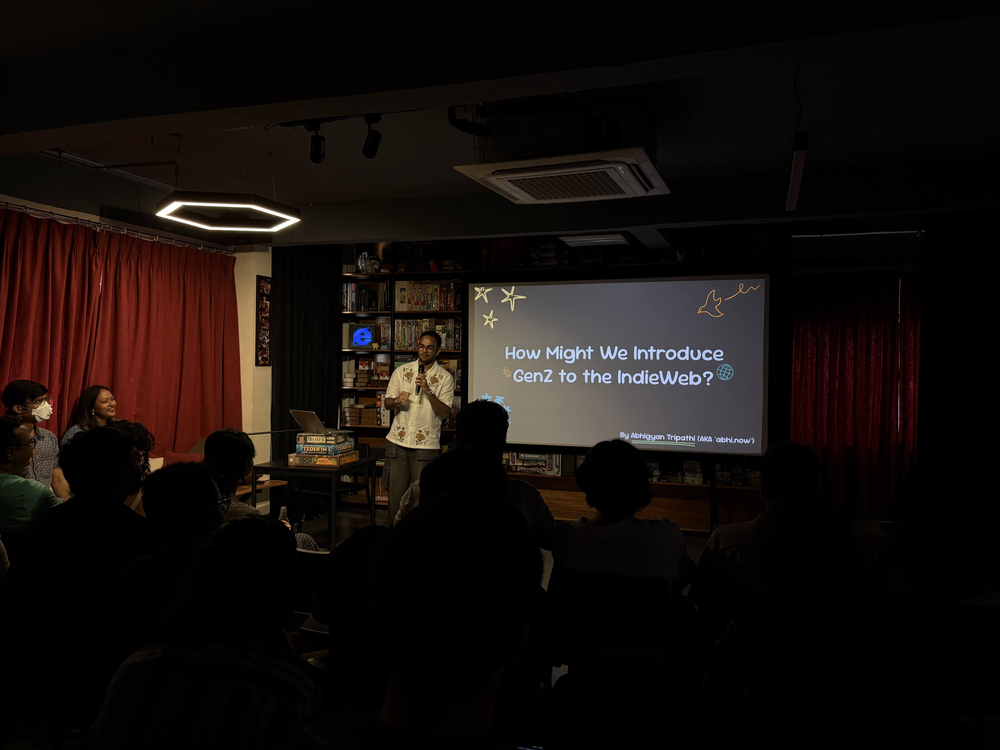

Sunday was spent traveling back from Delhi. I arrived early to the airport, and loitered around scouring bookstores in Terminal 1. Airports are a great place to window-shop; brands are doing their best to be colorful and stand out, so you can get in just anywhere and find something interesting to mull over. My mull-over target this time was books to read.

I was happy to see a lot of books from Indian authors, especially in fiction. I definitely didn't skim through all of them -- there have been some \*_cough_\* advancements in writing tools, as you'd know -- but the covers looked good! I definitely judged them by their covers.

Before going to my gate, I picked up [Sapiens by Yuval Harari](https://en.wikipedia.org/wiki/Sapiens%3A_A_Brief_History_of_Humankind) because I'd heard good things about it. Hopefully I'll finish it instead of having it sit on my bedside table; I also have [Snow Crash by Neal Stephenson](https://en.wikipedia.org/wiki/Snow_Crash) loaded up on my Kindle right now, which is yet to be completed. Oh, what a dilemma to be surrounded by books.

The weekdays were spent catching up on work from the previous week and writing documentation. A lot more manual work this week instead of giving instructions to an agent and sitting back, which felt _good_ -- a lot more intuitive to do something on my own.

Once Friday came around, I switched gears to lock in on my presentation for [IndieWebClub's Special Edition Meetup](https://blr.indiewebclub.org/2026-se). Words cannot express how excited and terrified I was for this. I had a chance to share my thoughts on something very important to me, and yet I'd ended up procrastinating the presentation and script till the last minute.

After a long grind the night before Saturday, I woke up and started practicing. It was meant to be a lightning talk -- no more than 8 minutes long -- which made it more difficult in my head. It was like [speedcubing](https://en.wikipedia.org/wiki/Speedcubing) but for portraying my thoughts fast enough. None of this is shade at the format of the meetup, by the way. I was really glad to have the challenge of making a real-life equivalent of a quick YouTube video.

I arrived at the [Underline Center](https://underline.center) just in time for a quick dry run and a Chicken Lasagna for lunch (yum). As we all sat down, the lights went out and [Ankur](https://ankursethi.com/) started the series with a look back on a year of IWCB. :)

The community wrote over a 1000 posts in the last year, more than 500 of which are within this year itself! We had a lot of happy statistics to look at, but what surprised me was that **The Battle of the Chai Recipes** ended with only four posts. We really are a peaceful bunch.

The lightning talks started off -- "How to Sound More like Yourself When You Write" by [Sagrika](https://sagrika27.wordpress.com/), "What Would IndieWeb-native Music Playlists Look Like?" by [Abhinav Tushar](https://lepisma.xyz/), "The Feedback Loop of Being" by [Gautham](https://promethean.mataroa.blog/), and [so many others](https://blr.indiewebclub.org/2026-se/#schedule). Before I knew it, I was standing in front of the audience with a mic in my hand.

Now, I'm planning to write a complete blogpost about the talk and my experience once the YouTube recording is out (and once I have some prototypes to represent my ideas :P). But speaking in front of an audience after such a long time was definitely a thrill.

My eyes kept going to the timer, and I tried to pace out what I was saying to finish on time. I still took about a minute extra, but man did I enjoy completing the presentation. People even approached me afterward, talking about which ideas they liked and would use. My introvert side was pleasantly queasy and my social side was pleasantly happy.

The day geared down with me playing pool with college friends and catching up. I felt like I'd finished up a really big thing and had a weight off my shoulders.

Once again, I'd like to thank [Ankur](https://ankursethi.com/) and [Tanvi](https://tanvibhakta.in/) for starting this community off, and [Abhinav](https://abhinavsarkar.net/) for giving IWCB the online reach it deserved. I found IndieWebClub right when I was falling out of my relationship with social media, and wanted to find a more permanent community on the Internet. The online space I've been able to build since, and the thoughts I have been able to express through this blog, are things I cannot pay back. Instead, I can probably share the magic of the independent web with other people, and invite them to our friendly online neighborhood.

So folks, welcome to the IndieWeb; where your ideas exist freely, and stay yours completely. Settle in, build your home brick by brick, and take help from your neighbors if you need. I'll bring [webmentions](https://indieweb.org/Webmention) for your housewarming party. :)
