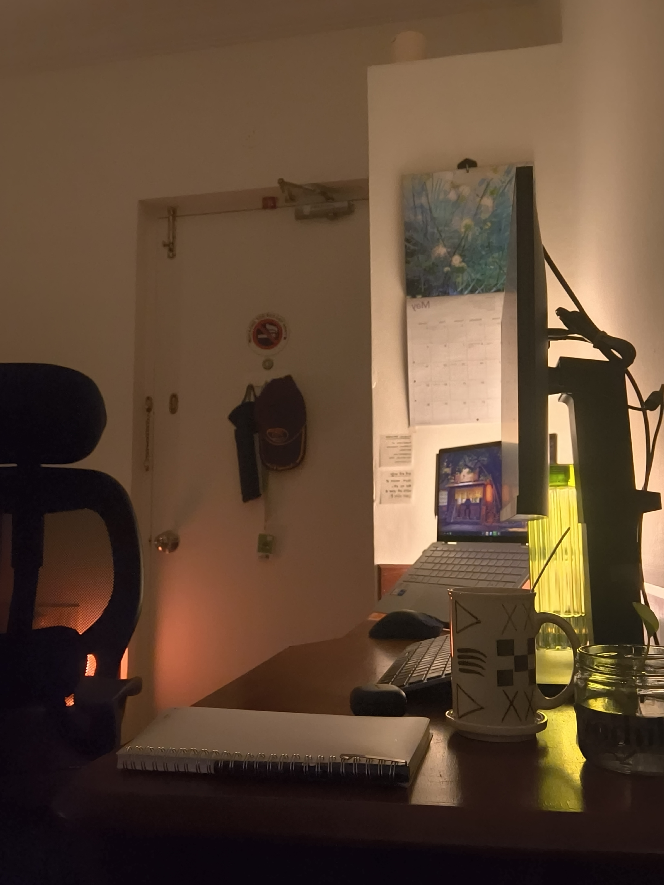
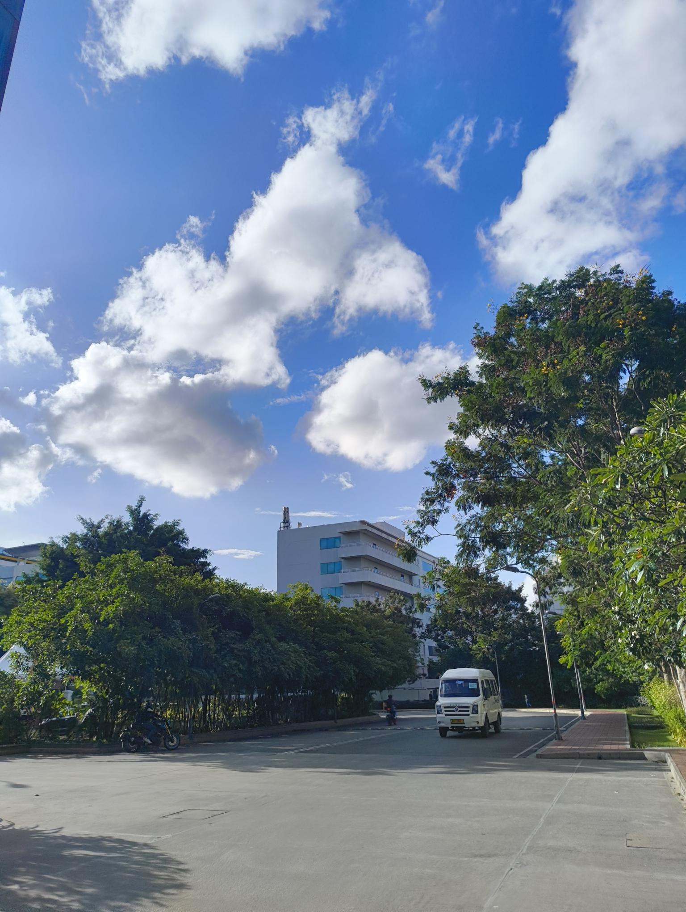
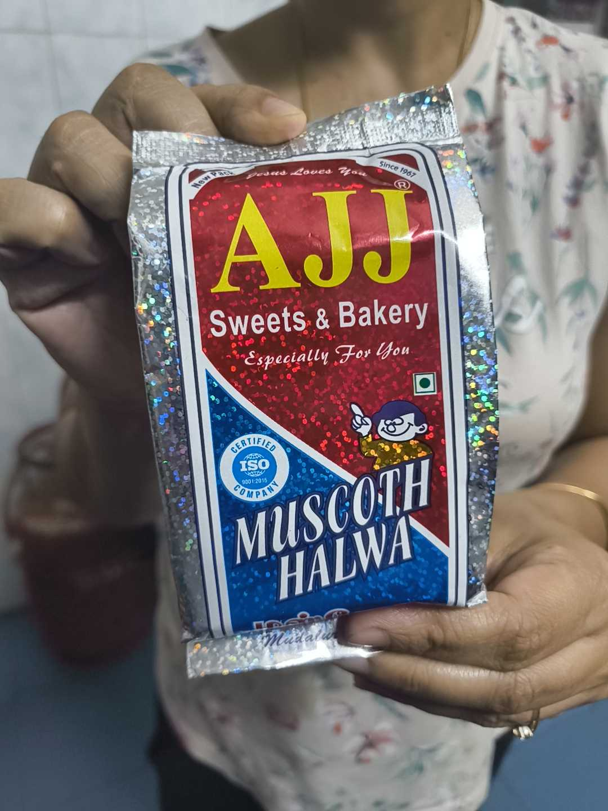

At the beginning of every month, I make a video clip of me changing the calendar to its next page. This little segment is very famous amongst viewers of my Instagram Stories, if I do say so myself. I've upped my game recently, since I start by playing a song that triggers a very cool audio-visualizer on my laptop.

People loved this, but a side-effect is that I now get a lot of people in my DM's asking me how to get the same visualizer. I debate telling them that [OpenMeters](https://github.com/httpsworldview/openmeters) is only for Linux ~and that I use Arch btw~, but end up suggesting [Rainmeter](https://www.rainmeter.net/) with something like the [VisBubble](https://visualskins.com/skin/visbubble-30) extension. I hope the calendar doesn't feel like its thunder has been stolen.

Work went on how it usually goes. I think there was another bout of the flu going around the office, which led to many people working from home and resting for a bit. Sending out a mental get-well-soon to all of them.

I also started mapping out and linking my personal projects during the evenings, which is making a cool-looking [Obsidian](https://obsidian.md/) graph. I'm planning to write a lengthy blogpost about [my talk at IndieWebClub SE 2026](/weeknotes/2026/22), but I also wanted to have some proof-of-concept projects to showcase the ideas.

Those things have now turned into their own project pages and formed little dots on the big graph. Lord knows when I'm actually going to work on the projects themselves.

In other news, I got to try _muscoth halwa_ this week at my relatives'. I don't fully know what it's made of -- I'm deliberately not looking it up, in case I don't like the ingredients -- but I do know that coconuts are involved. I had it both cold and warm. It was kinda sticky and chewy, but still pretty nice. I recommend trying it out.

But that, dear readers, pretty much concludes this week. I will leave you with this image, and ask you to guess where you think I'm flying next. Stay hydrated y'all!
