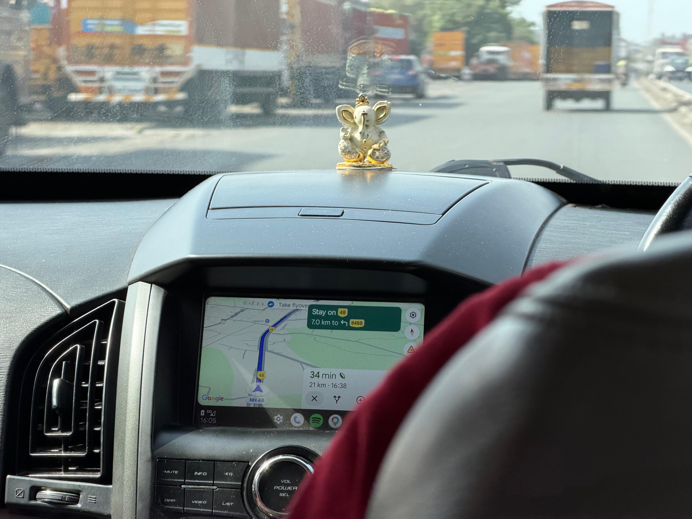
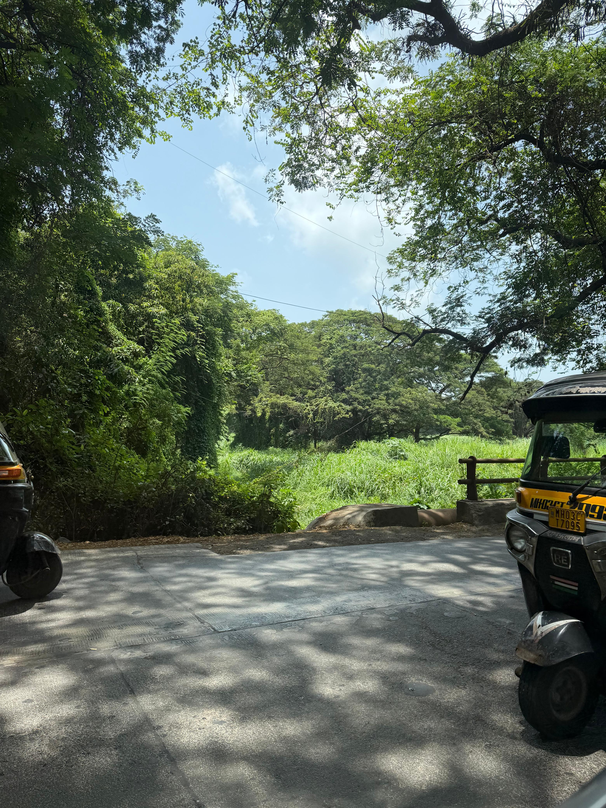
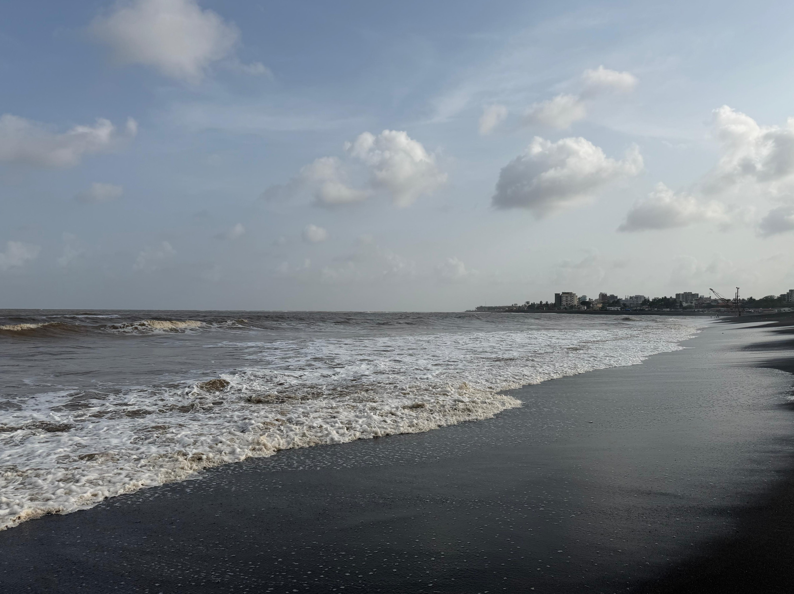
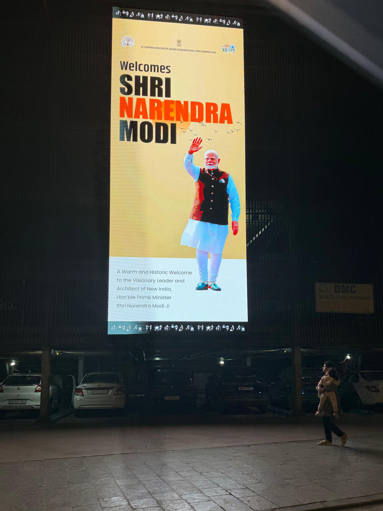
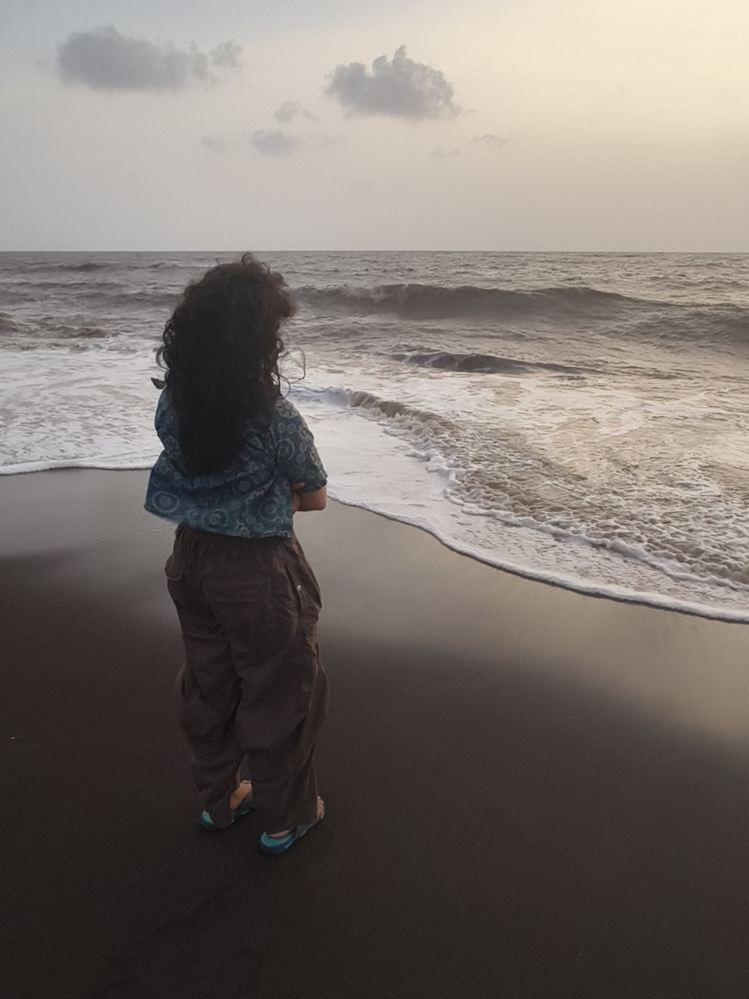

I've never really liked cucumber and tomato sandwiches. I have no idea when it started -- probably when my years of existence was in single digits -- but it was just _bleugh_. The perfect minimal sandwich for me has always been toasted bread with cheese spread and ketchup. That's something I'll write about at some point.

But anyway, I travelled to Bombay this week and ended up on a family road trip to Daman. During this trip, all we had packed for the travel was Aloo Parantha and Cucumber & Tomato Sandwiches. By the time I got hungry, the _parantha_ was gone; I was left with the red and green sandwiches.

I must have been feeling especially daring at the time, because I didn't hesitate to just take a bite. Then I took another. And then I finished the full sandwich. Here are my thoughts:

1. Why did no one tell me that the sandwich also has potato? Like, that completely changes the definition.
2. I still don't like raw tomatoes, the texture is weird.
3. It was not that bad.

Having the sandwich feels like a rite of passage. Does this mean I now have to eat all the things I don't like? I really don't want to eat _lauki_ or _kaddu_. I don't think I will.

The journey continued on as we passed by mountains and _dhabas_. There was this great little hub next to the highway, which had an AC restaurant and an ice-cream place. It also had an antique shop and an aunty outside it selling crocheted accessories she made. I bought a few coasters for my room (which, as I write this, I'm realizing I left at home).

As we got closer to Daman, we started hunting for places to stay that were next to the beach. We ended up finding a place right in front of the [Lighthouse Beach](https://ddd.gov.in/places-centres/lighthouse-beach-moti-daman/), which looked really pretty during both sunrise and sunset.

The temperature was consistently around 40&deg;C, so it was hard to get out of the room until the sun started setting. But once it did, you'd see a place little something like the picture above, bustling with people and street vendors.

The beach looked very new to me, as if the place had just been developed. It had the same tetrapod rocks that they have on [Marine Drive](https://en.wikipedia.org/wiki/Marine_Drive,_Mumbai) to protect the shoreline from large waves, and there were arches all along the border between the beach and the footpath. "The Prime Minister recently visited the place," people said, "so they revamped the area to look better and be cleaner."

"I wish he visits every city in the country, then," I told them with a laugh.

As the sun set, people moved from the beach towards the footpath benches. There were children running around and vendors calling out their wares. There were electric scooters you could rent with bright colourful string lights. We got one and rode it around in turns. I hopped on and struggled for a bit before I learned to balance on it.

We got _bhel_ from a vendor in the usual pouches made from old newspaper. It wasn't until we were done with it that we looked around for a dustbin and couldn't find one.

I repeat, the newly revamped beach did not have a single dustbin along the footpath.

I will not drag this out to be more dramatic, but the beach was seemingly left to fend for itself after the VIP visit; thoroughly covered in plastic bottles and paper wrappers along the border. Surely, they just ran out of time to put in the dustbins. Surely, all the care wasn't just for show.

We drove through the famous Moti Market of Daman after our beach visit. There were shops everywhere, the buildings all in the same three shades of red, orange, and yellow. The signs of the shopfronts were all in the same style of white and blue, with the only difference being their names. It all felt weirdly conformed; almost forced to have consistent styling.

The only cold lighting in the warm market came from a single, giant LED screen.

"The Prime Minister recently visited the place," I heard, "so they revamped the area to look better and be cleaner."

I had no response.

Towards the end of the trip, I was a little relieved to leave Daman. I got to spend some lovely time with my family. I got to greet the ocean. That's all I needed at the time, I think.
