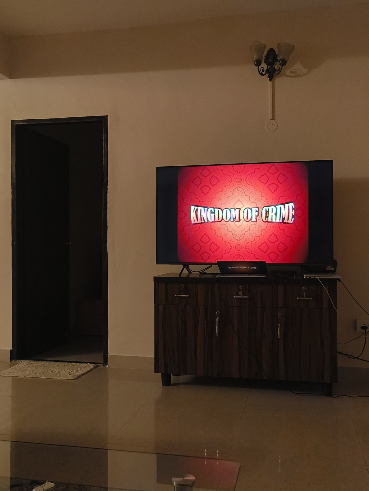
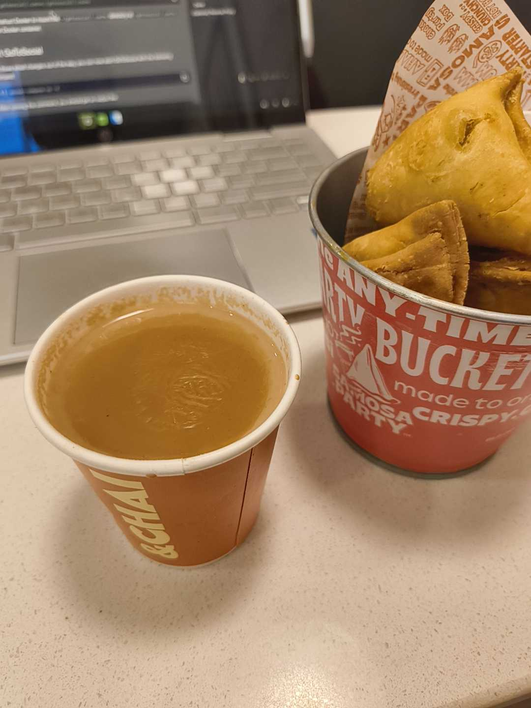

Before I talk (write) about anything at all, you need to watch [Kingdom of Crime](https://www.youtube.com/watch?v=vHGWuFG9AQg).

[Kingdom of Crime](https://www.youtube.com/watch?v=vHGWuFG9AQg) is a no-budget feature film by the same people who are behind [The Bombay Show](https://www.youtube.com/playlist?list=PLvZYJgs9raJPLiac9Kv0mPqRONSkKDpYj). I started watching Bombay a couple years ago because my friend, [Mihika Kulkarni](https://instagram.com/mihiko_ol) was starring in it. I had no idea that I would get completely absorbed into a story of complicated student politics, with actors hiding under the guise of college students and music that knew how to keep me the right amount of spooked.

This film, to me, was a crime/mystery which shows two detectives (and former cops) who investigate the dark side of a politician. They dig deeper than they should, stumble over old relationships, and have the smoothest punchlines. That goes for a lot of characters here. While not spoiling much, I will just say that I love the ukulele.

As my final blow of persuasion, I'll leave you with this quote from the start:

> Crime was rampant.  
> Corruption was common.  
> Children were always crying on airplanes.

> The Police would never help.  
> So we'd call the next best thing...  
> But they also said no.  
> So now we're stuck with these guys.

You can also find them on [Instagram](https://instagram.com/bombay.show), and log the film on [Letterboxd](https://boxd.it/Uyw2).

The weekdays were spent catching up with work after my long holiday/WFH in Mumbai. The internship is nearing its end, and a lot of people have been on edge about getting the conversion email from their college.

I was nervous too, and I decided to while away time by literally starting a separate tech blog at [Abhi.Computer](https://abhi.computer). This stemmed from wanting to write a software-related blog post, looking at my website, and feeling like it didn't belong here.

I started writing as a way to get away from coding; to have atleast one non-technical hobby that I continued with. I like the place I've built for it, and would like to carry forward the spirit of writing into my software shenanigans too. I look forward to what I do with the tech blog, and how I maintain it to act as both a professional portfolio and a useful outlet for other fellow builders on the Web. :)

The weekdays ended as I had dinner with friends at Brigade Road. For some reason, [Raghav](https://alphaspiderman.dev) still believed that I was in Mumbai, so I made a plan with the others and took the chance to give him a surprise. The guy had the audacity to say, "I knew something was up!" when I entered the restaurant.

My week ended with the staple [IndieWebClub](https://blr.indiewebclub.org) meet-up at the [Underline Center](https://underline.center). Our topic this week was led by [Jatan](https://jatan.space), around writing spaces and personal websites for non-technical people.

We had some pleasantly abstract conversations about what makes up a blog -- which elements are essential to one -- and reasons why people deter from having personal online spaces. One of our conclusions, funnily enough, was that Instagram profiles can be considered blogs. But that's probably a takeaway some of us would like to bury. :P

Here are some notes I made during the talk:

> \# Jatan's Talk, "It's Okay to Never Have a Domain Name"
>
> \- One phone ringing reminds everyone to check if their phone is on silent.  
> \- People like the algorithm's ability to passively push connections in the same communities; the idea of "Neighbourhood Discovery"  
> \- "A lot of people's need is to be seen, which social media accommodates."  
> \- How can we handle private posting on personal web spaces? Authenticated RSS Feeds?  
> \- There are still many assumptions that blogging can only be in text form.  
> \- Domains are rented by default, and hence have a shelf life. Where does it go when you die?  
> \- "Do you have a success story where you onboarded someone onto a feed reader without explaining RSS to them?"

As we started the writing session, it started pouring down quite heavily. My stomach started gurgling, almost on cue; it had sensed the rain and craved some _chai_. I left the meet-up early with the very honest excuse that I got hungry. That's how I ended up at Samosa Party. :D

That's where my calmly eventful week ends. I'll leave you with some cool links to explore, and hope to see you next week.

### Cool Videos

- "[Why Should Cockroaches Have all the Fun?](https://www.youtube.com/watch?v=KmoEtxzwmeQ)" by [Samdish & Team](https://www.youtube.com/@UNFILTEREDbySamdish)
- "[Something very weird is happening on Tinder](https://www.youtube.com/watch?v=rjxAYdUe8uU)" by [Christophe](https://www.youtube.com/@christophe)
- "[The Music Industry is Broken](https://www.youtube.com/watch?v=Yx7baJMQuVA)" by [Drew Gooden](https://www.youtube.com/@drewisgooden)
- "[Does Wall Street do drugs anymore?](https://www.youtube.com/watch?v=jMJFTIW8ctU)" by [Good Work](https://www.youtube.com/@GoodWorkMB)
- "[Brittany Broski Defends Her 5 Most Controversial Takes](https://www.youtube.com/watch?v=JhzG679n2RY)" by [Kareem Rahma](https://www.youtube.com/channel/UCqM6o8mD0p0y6JF2xGJN5Mw)
- "[5 years OFF social media [update]](https://www.youtube.com/watch?v=y9aqMt5mOhI)" by [Athena Isabella](https://www.youtube.com/@AthenaIsabella)

### Cool Links

- "[Is every Social Security Number in the digits of pi?](https://vitez.me/ssns-in-pi)" by [Mitchell Vitez](https://vitez.me)
