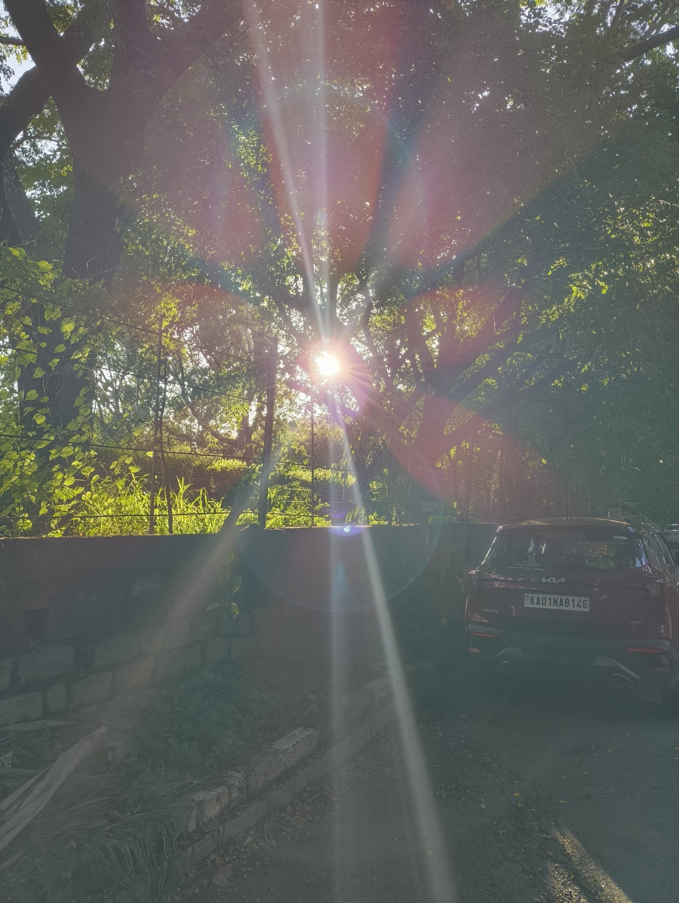
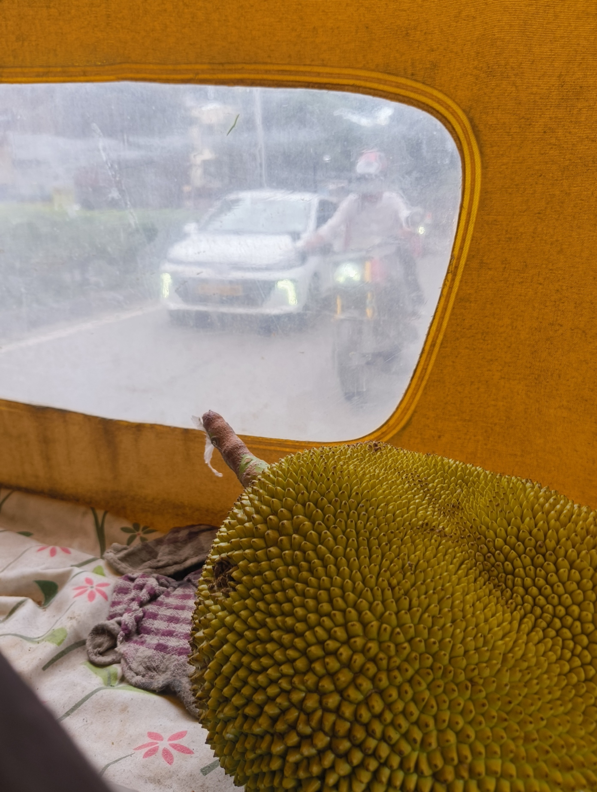
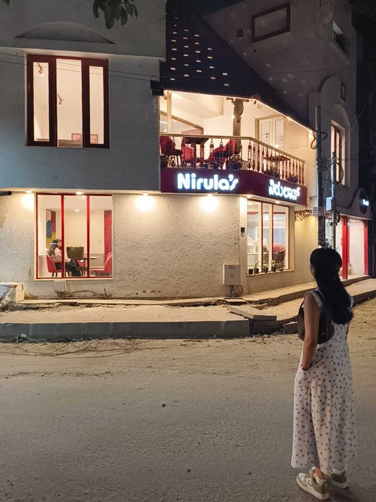
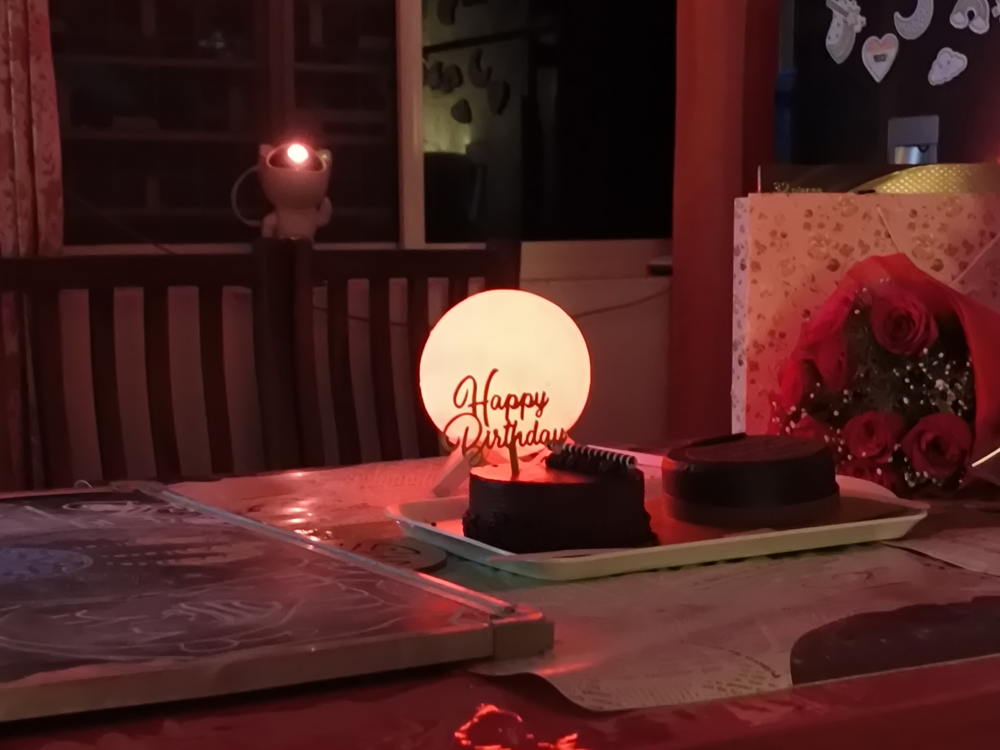

Sincere greetings, residents of our lovely planet. It's moments like the picture above that remind me how insanely lucky and weird it is to exist. And to know the thing we call _dhoop_ is light from a ball of gas existing really far away.

It also reminds me of those clips where astronauts talk about cherishing life, because "nothing else exists out there for many, many miles." After that, I promptly follow up the thought with, "humankind looked at this and created [Agile Software Development](https://en.wikipedia.org/wiki/Agile_software_development)." So... it all balances out.

I had many family birthday celebrations this week, which meant I took a lot of auto-rickshaws from place to place. A cousin of mine was also visiting, so I took her cafe/food-hopping around Indiranagar.

I remember explaining to a new Bangalorean how you use different apps based on type of vehicle, trip distance and area you're in inside Bangalore. They found it sad but hilarious that no single app could fulfill every need. I recalled that memory as my cousin gaped at how much the fare was for a short auto ride we'd taken. It made me miss the metered autos from Mumbai.

I had a Hot Chocolate Fudge at Nirula's, which felt as if the "Death by Chocolate" from Corner House had been put into a mug with quadruple the chocolate sauce (and I mean that in the best possible way). The vanilla ice cream was slightly yellow, which usually means it's good.

We went there right after Koreyaki, which was so good that we forgot to take pictures. But yeah, we had quite a few of these hops around food places over the week.

The week ended with my younger cousins celebrating their birthday. Many of their friends came over, and they were allowed to stay up past their bedtime -- an opportunity they were very excited about.

They got to open lots of gifts; boxes full of doll get-ups and LEGO sets. The birthday dinner had _vada pav_, _samosas_ and chowmein, with juiceboxes and more McCain Smileys than you could count.

I got to co-host some games for them to play and... it was a wonderful experience. I saw their grins and winced at their enthusiastic screams. I remembered this atmosphere, and I could tell they're going to look back on the birthday as a fond memory. It was hella fun.

I'll leave you with a throwback to my high-school days: [Tune Kaha](https://www.last.fm/music/Prateek+Kuhad/_/Tune+Kaha) by [Prateek Kuhad](https://www.last.fm/music/Prateek+Kuhad). This was one of the first few songs I saved on Spotify, and I vividly remember how the acoustic guitar tugged at my heart. Here's to more nostalgia.

### Cool Videos

- "[We can't invent a robot better than these ferrets](https://youtube.com/watch?v=Mi_fYfpycT0)" by [Tom Scott](https://youtube.com/@TomScottGo)
- "[i asked lesbians how to tell if a girl is gay](https://youtube.com/watch?v=orjJNe7lAbs)" by [Makingemi](https://youtube.com/@Makingemi)
- "[It All Goes Back To Beyblade](https://youtube.com/watch?v=8Ya1ISvJEFA)" by [mocha](https://youtube.com/@mocha13)
- "[The machine dream was never real.](https://youtube.com/watch?v=dG5pEiGhB_c)" by [Van Neistat](https://youtube.com/@vanneistat)
- "[I did RFK's carnivore diet for a month](https://youtube.com/watch?v=dG5pEiGhB_c)" by [Eddy Burback](https://youtube.com/@EddyBurback)

### Cool Links

- "[How technology helps Feeding India track every meal](https://www.feedingindia.org/blog/how-technology-helps-feeding-india-track-every-meal/)" by Manish Sharma @ [Feeding India](https://www.feedingindia.org/)
- "[Legibility of Effort](https://eieio.games/blog/legibility-of-effort/)" by Nolen Royalty @ [eieio.games](https://eieio.games)
