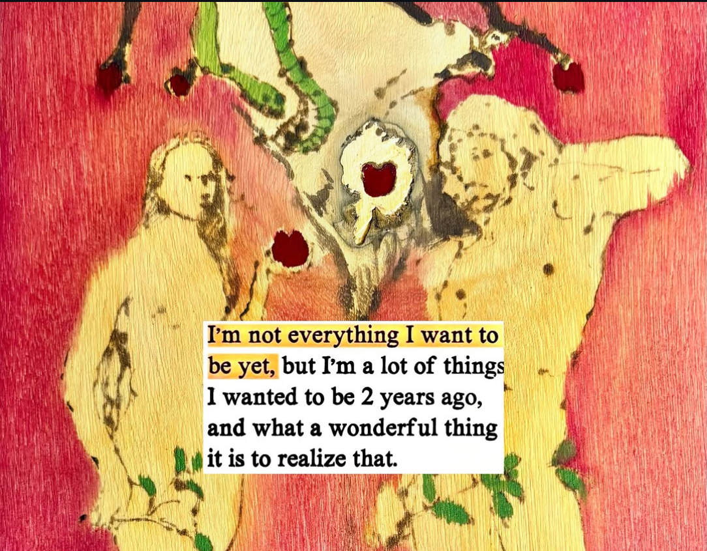
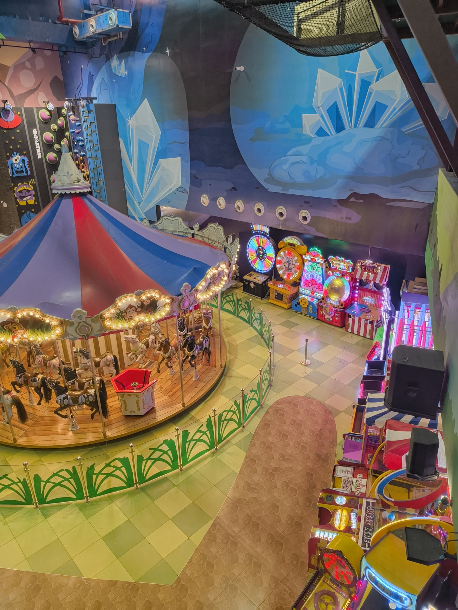
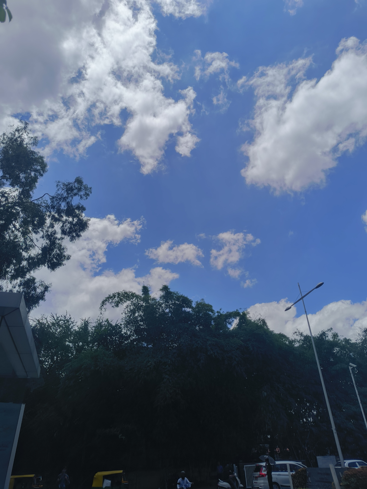
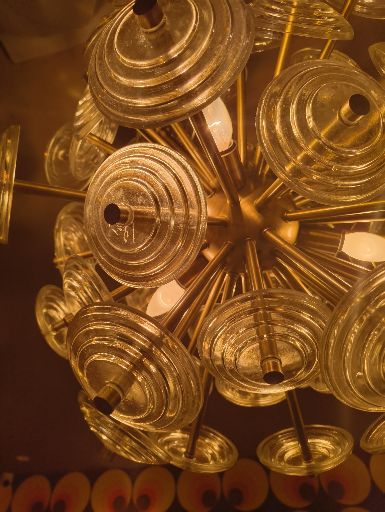
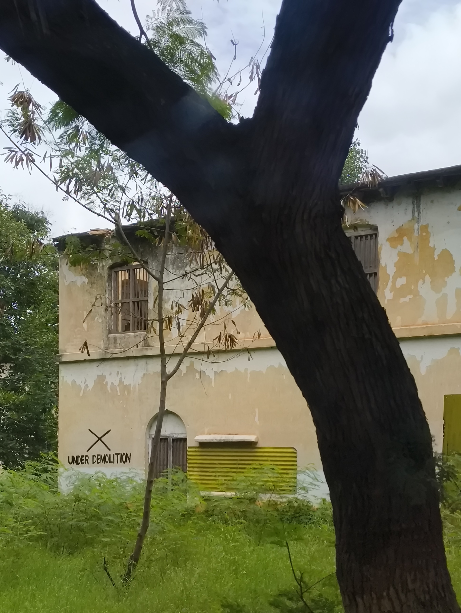

This week felt longer than a week.

It started with me visiting [LuLu Mall](https://www.bengaluru.lulumall.in) with family once they realized I'd not gone to [Funtura](https://funtura.in/blr/) yet. For those unaware, that's a multi-story indoor mix of an amusement park and an arcade; it's like TimeZone on steroids. I've been in Bengaluru for four years and I'd never heard of this place. What in the world.

My little cousins were more than happy to spend their birthday here. They went on a lot of rides where my height was beyond the upper limit and had good fun. My similar-age cousin and I went on bumper cars and I targeted her car the whole five minutes. I'm laughing just thinking back to it.

I also went on one of those rides that has a bunch of swings hanging from it, which elevates and just starts spinning. I didn't scream, but I could feel my anxiety for the swing's cables being strong enough, or for my legs hitting something below me. When the ride ended, I wondered if it would've been better to just scream from the thrill.

The last and most fun thing I went on was what my aunt called, "The Washing Machine". It's the boxy room that spins so fast that it pins you to the wall through sheer centrifugal force. It's also the ride in Stranger Things (Season 3) where Joyce and Hopper hold hands, if that helps you find an image. Still can't believe how much fun it was; it was like a mix of flying and letting go of... the weight of standing on my feet? Yeah, that's as far as I can put it into words.

The week dredged on as I prepared for my internship to end. A lot of planning, final touches, and documentation to leave for the team. The last six months has been an era in itself; I started working a 9-5, lived independently without a curfew (hence [getting bitten by a dog](/weeknotes/2026/11)), and spent more deliberate outings with my friends as our free time got sparse.

I had a lot of new experiences and felt a lot of feelings during this time -- _mostly_ good ones, from what I remember. With the internship ending next week, I can look back with a smile on my face and look forward with the resolve to grow.

The weekend greeted me with a spontaneous invitation by friends to go out on a Friday. I quickly finished the mug of _chai_ in my hand to change and meet them at the heart of Indiranagar. After a long journey of being declined at pubs for being a group of stags, we ended up at Social and had a respectable feast. Many food pics and dance videos were recorded.

The next morning I was once again woken up by friends to join them for a swim. It's been quite long since I last went for swimming, so I groggily packed my things and took a long _auto-rickshaw_ to somewhere near Koramangala. We messed around and sometimes seriously swam for around three whole hours. My arms were (pleasantly) too tired to push water by the end of it.

We travelled over to Orion Mall to have lunch together and roam around some stores. I found something cute in the LEGO Store that I'm going to gift to my little cousins -- but it's a surprise for them, so shh.

On the way back in the metro, I spontaneously met an old friend from school I hadn't seen in over four years. I'd known he was in Bengaluru, but we hadn't found the time to get-together. Seeing him enter the same metro as me was a very welcome coincidence/surprise. We got off at Indiranagar and sat down in a cafe to catch up on our lives. It was a lovely end to the week, and I hope to meet him again soon.

This website has been going through a lot of tiny changes, here and there. I've finalized the layout of [my about page](/whoami), so I know what it's going to look like; I just need to write the individual content for each of the facets that constitute me. I also polished the layout of the blog, and added reading time as a general indicator.

I recently started working on [Abhi.Computer](https://abhi.computer) as my tech blog, and the site-building continues on. I have three posts lined up in my drafts that I'm going to post there soon&trade;, so I'm looking forward to that.

I felt inconsistent as I looked back at my older posts, and made a promise to myself to write more during July. Maybe not a blog post every day, but _some_ written piece that I put out there. That's what led me to writing [Paneer Cheese Sandwich](/blog/paneer-cheese-sandwich) and [Death of the Plants](/blog/death-of-the-plants).

I also implemented (anonymous!) analytics on my site through [Umami](https://umami.is/), as an experiment to observe how many visits I get on an average. I was selfishly disheartened at first, I'll be honest; the number didn't go up as fast as I thought it would. I was going to remove them before I learned I can see which sites people came _from_, and saw my site being referred by [people from IndieWebClub](https://ankit.earth/blog/indiewebclub-28/) and [some cool dude in the Netherlands](https://huecreate.nl/en/about-me).

I also started receiving personal messages of appreciation because [IWCB cross-posted for me on indieweb.social](https://indieweb.social/@blr/116851662385480557), and I referenced my posts on WhatsApp and Instagram. I'm still a little in awe at how bright the connections were after the loneliness I felt just recently. And a little guilty for being ungrateful before. So this is me leaving a warm hug and a thank you for these people.

This is a really long weeknote already, so I will abruptly end it here. Peace and love.

---

For you, the lovely reader who has made it this far, I would like your answers on a few questions that decide where my journey goes from here.

1. I'm in the process of writing a blog about calm technologies that I find cool. My question is, should I start including the current year in posts which might become recurring? For example, "Calm Tech That Excites Me, 2026" vs. "Calm Technologies That Excite Me".
2. What do my blog posts and weeknotes make you feel? Do they remind you of something from your own life? If you've heard me speak and read stuff on here, how would you compare my physical and digital voice?
3. I have recently had an urge to write about the news, specifically around IT laws and regulations in India. The speed with which content is being taken down on social media scares me, which makes independent posting even more appealing. My question is, would you like to read something along those lines? Would you like it to exist here, or a separate space for some "opinionated journalism"?

**PS:** The title mentions "dunes" because I binge-watched Dune 1 and Dune 2 since I promised to a friend I'd catch up on the story. I just forgot to write about it above. :P

### Interesting Videos

- "[I moved to France](https://www.youtube.com/watch?v=nL-Dxrf-gl8)" by [Mumbo Jumbo](https://www.youtube.com/@ThatMumboJumbo)
- "[The Deceptive World of Ghost Kitchens](https://www.youtube.com/watch?v=KkIkymh5Ayg)" by [Eddy Burback](https://www.youtube.com/@EddyBurback)
- "[What If You Are God Pretending to Be Human?](https://www.youtube.com/watch?v=FoN2duPT1gk)" by [Alan Watts](https://en.wikipedia.org/wiki/Alan_Watts) via [Simply Art - Inspire](https://www.youtube.com/@SimplyArt-Inspire)

### Lovely Reads

- "[The Key Art Edition](https://whyisthisinteresting.substack.com/p/the-key-art-edition)" by [Rex Sorgatz](https://twitter.com/fimoculous) on [_Why Is This Interesting?_](https://whyisthisinteresting.substack.com/)
- "[Giving baby tanvi what she wants](https://tanvibhakta.in/blog/giving-baby-tanvi-what-she-wants/)" by [Tanvi Bhakta](https://tanvibhakta.in/)
- "[Secret language of Bangalore kids in the 1970s](https://couragetotremble.blog/2007/08/09/p-language/)" by [Courage to Tremble](https://couragetotremble.blog/)
- "[Tasting and comparing 17 different Mango varieties to find the best one](https://aakritwrites.com/best-mango-variety/)" by [Aakrit Patel](https://aakritwrites.com/)
