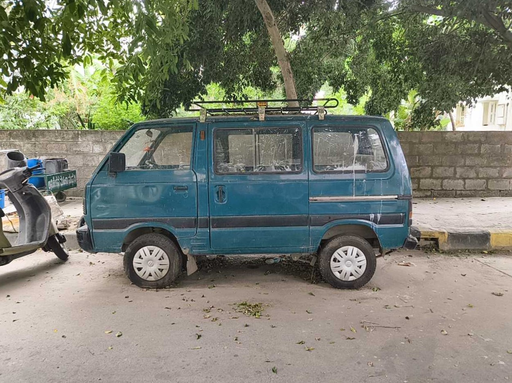
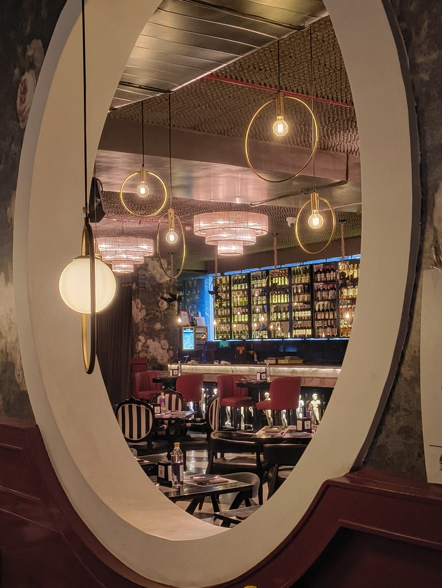
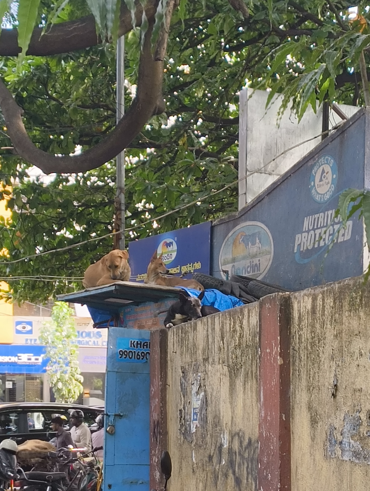

The week started off with a team dinner at this place called Daddy's. They had a lovely atmosphere and I got to try out Prawn Tempura Sushi. We got to sit in their outdoor area, and I half-expected it to start pouring down on our dinner. But it didn't. I enjoyed it and went back home in an _auto-rickshaw_.

More of the week went by contemplating the end of the internship and fleshing out my leftover tasks. The nostalgic worm in my brain would look at spots in the office and think back to how I saw them when I started here. Then I'd snap out of it and get back to my [Paneer Cheese Sandwich](/blog/paneer-cheese-sandwich).

On Friday, individual teams started giving farewell parties to the interns who weren't converted. There were a lot of cakes cut and samosas/pizza pockets had. We had one for a co-intern on our team too. Each teammate said one thing they liked about the intern. In turn, he told every person one thing he liked about them. For me, he said that I helped him out a lot.

After the farewell, we all saw him off before he punched out and left the office. He had a train to catch back home. I started cleaning up my laptop and filling out the forms that HR had sent in for conversion onboarding. The preparation ate into the weekend as I ironed my formals to wear on Monday.

The weekend went into swimming once more. I seemed more out of breath this time, but still did the usual amount of laps. We then went off to have proper North Indian food at Amritsari, Koramangala. The portions were huge and everything used butter or _ghee_. The "Sweet Lassi" wasn't overly sweet, just like it's supposed to be. I came back to the room and slept like a baby.

Coding-wise, I added my nannoo's (my mom's dad's) website to [the "People" section](/people) of this website. He was the highlight of [an IndieWebClub meet-up](https://blr.indiewebclub.org/) a few weeks ago, and I wanted to give his blog a place in my humble hall of fame. I also had a long call with [Shashaank](https://www.linkedin.com/in/shashaank-singh/) where he gave me a rundown about what [Exokernels](https://wiki.osdev.org/Exokernel) and [Unikernels](http://unikernel.org/) are and how he's trying to use them to create his own performant web-server. It's a difficult rabbit-hole to go down, but one that also seems to pay off.

Peace and love. And a lotta code. Ideas keep jumping around in my head.

### Interesting Videos

- **[IMPORTANT] [TW]** "[Instagram running ads promoting child abuse material in India](https://www.youtube.com/watch?v=6-y726qvZ6Q)" by [BBC World Service](https://www.youtube.com/bbcworldservice) et al.
- "[Containers and Wings in MBTI Types](https://www.youtube.com/watch?v=sOf1_-pL5ho)" by [INFJinxed](https://www.youtube.com/@INFJinxed)
- "[Vinyl vs CD vs Spotify](https://www.youtube.com/watch?v=dcU2idUSRAA)" by [Speeed](https://www.youtube.com/@SpeeedCo)
- "[How I made a 60fps Eink Monitor, the Modos Flow](https://www.youtube.com/watch?v=nHbA2-_qzH4)" by [Wenting Channel](https://www.youtube.com/@nbzwt)
- "[Wall Street wants to stop hiring teenagers, but can't](https://www.youtube.com/watch?v=vv3mT70YFeg)" by [Morning Brew](https://www.youtube.com/@morning-brew)
- "[Katy Perry went to space? i guess?](https://www.youtube.com/watch?v=YfkEDyQK5zk)" by [Chad Chad Chad](https://www.youtube.com/@chadchadchad)

### Lovely Reads

- [How Bangalore Uses The Metro](https://diagramchasing.fun/2025/how-bangalore-uses-the-metro) by Vivek Matthew and [Aman Bhargava](https://aman.bh/), at [Diagram Chasing](https://diagramchasing.fun/)

- [LiveBlogging 2: Privacy Boogaloo](https://aeish-world.neocities.org/blog_pages/blog-04-07-26) by [Aeish](https://aeish-world.neocities.org)

### Cool Links

- [Aman Bhargava's Personal Website](https://aman.bh)
