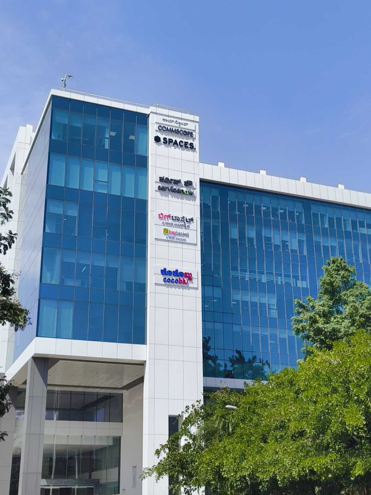
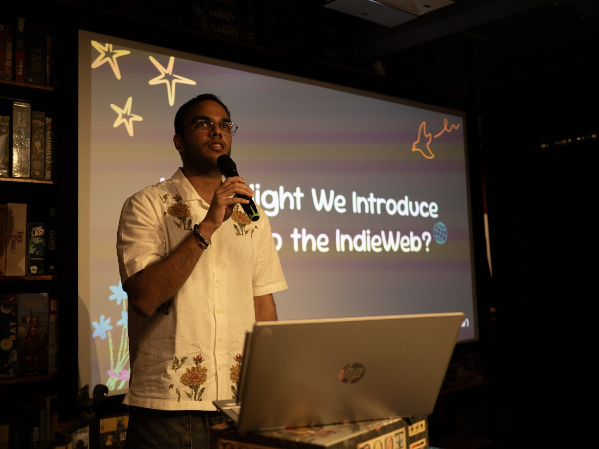
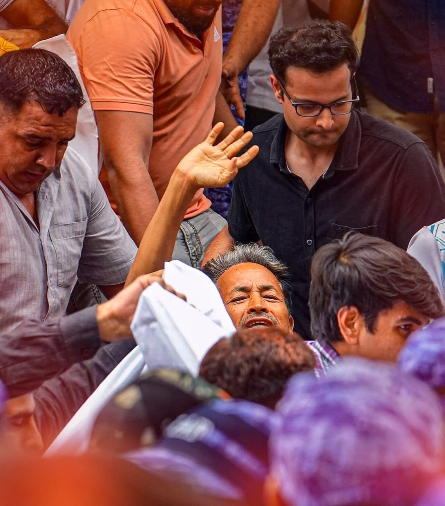

I started off the week with my onboarding at work as a converted intern. All the 6-month interns came together to attend extensive cultural briefs and leadership meets, before receiving a very nice hamper and some company apparel.

We moved to the entrance of the building to take group photographs. We were going through the different poses when a Jeep Rubicon rolled into the driveway. Out of it came Mr. Hari Menon (the CEO), who looked up from his phone to see the new hires making victory signs at the camera.

He asked the group a bit about the roles they were converted to and how they were finding the place. He then asked if he could join the picture, to which he received an enthusiastic 'yes' from the interns. The pictures that followed became the highlight of our day, and have probably already been posted on BigBasket's LinkedIn page.

The video recordings of the [IndieWebClub SE](https://blr.indiewebclub.org/2026-se/) talks came out this week too ([here's mine](https://www.youtube.com/watch?v=JlCDc3zV1cc) if you'd like to watch!). I cross-posted about it to my friends on Instagram, and then (out of curiosity) put out a poll to ask if people found the cross-posting intruding.

As I waited for the results to pool in, I decided to scroll around a bit and see how the Reels algorithm was doing. It started with the usual disastrous news sandwiched between cute cat videos, then slowly turned to the [Cockroach Janta Party](https://cockroachjantaparty.org) protest and journalists interviewing protesters.

The protest had been going on for quite long at this time; long enough that mainstream media had moved on while independent journalists covered a crowd slowly losing hope. [Wangchuk Ji](https://en.wikipedia.org/wiki/Sonam_Wangchuk) had been on his hunger strike for over two weeks. The protesters were preparing for the _Sansad_ on 20th July, but the counter-preparation from the police made the atmosphere bleak. I interacted with posts and shared artwork on Stories that I thought would reach people.

It was Saturday morning when I opened up Instagram and found the protest stage being stormed by undercover police officers, using _lathi charge_ on anyone who tried to stop them from carrying away a defenseless Sonam Wangchuk to the hospital.

There was a feeling of disbelief. Out of all the misinformation I'd experienced on Instagram the past few days, this was the one thing I wished was untrue. But it wasn't, and it filled me with a quiet rage.

I did the best I could while not being in Delhi -- reposting all the right posts and mentioning all the reasons that made the action wrong. But the thoughts needed their space and I needed some space away from them. So I wrote a post titled "[A Prayer for the Cockroaches](/blog/a-prayer-for-the-cockroaches)" and closed my portal to all news attention-seeking.

This is a weeknote written in retrospect (on 28th July, 2026) so there is much I might be forgetting about the end of the week. I also now know how the protest ends, which makes me feel a little bit better. But the short timeline in which the events overturned is something I'll remember.

_Inquilab Zindabad_.

### Interesting Videos

- **[IMPORTANT]** "[18th July : Angrez Chale Gaye, Inhe Chhodh Gaye : Scenes From India's New Protest](https://www.youtube.com/watch?v=y2raUW-14VQ)" by [Samdish & Team](https://www.youtube.com/@UNFILTEREDbySamdish)
- "[Dating sucks in San Francisco](https://www.youtube.com/watch?v=KtACIFEddhM)" by [Good Work](https://www.youtube.com/@GoodWorkMB)
- "[I bought the shoes that make you walk faster](https://www.youtube.com/watch?v=_9Z05Ik5r2U)" by [Drew Gooden](https://www.youtube.com/@drewisgooden)
- "[Mamdani wins with NYC's click to cancel rule: this is awesome](https://www.youtube.com/watch?v=DacdCK9vUAs)" by [Louis Rossmann](https://www.youtube.com/@rossmanngroup)
- "[I hate my phone so I got rid of it](https://www.youtube.com/watch?v=nnsyGSTKlw0)" by [Eddy Burback](https://www.youtube.com/@EddyBurback)

### Cool Links

- [Ch.ai](https://ch.ai), a blog about chai
- [Live Wallpaper Wiki](https://live-wallpaper.fandom.com/wiki/Water), which includes a copy of old Android live wallpapers
- [Stefan Ludlow's Beverage Log](https://stefanludlow.com/beverages/)

### Lovely Reads

- "[I have a favorite band](https://nihalsahu.net/rks/)" by [Nihal Sahu](https://nihalsahu.net/)
