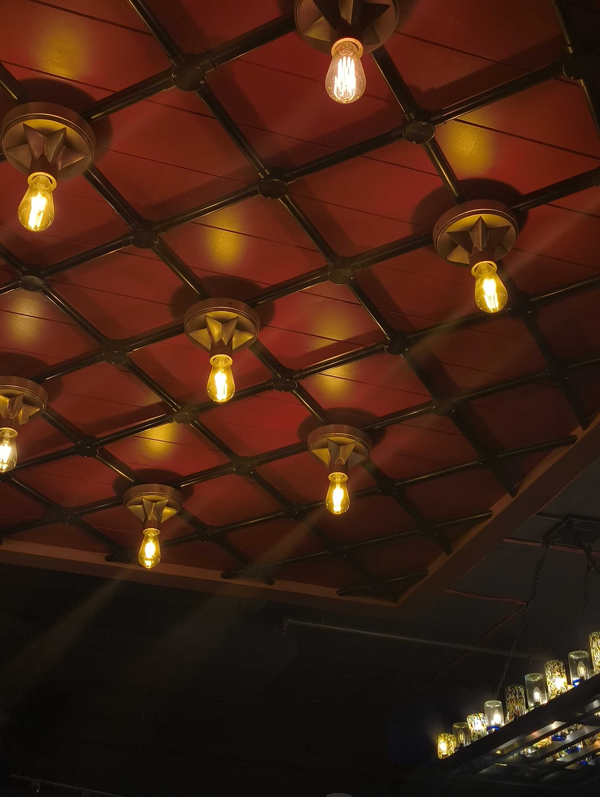
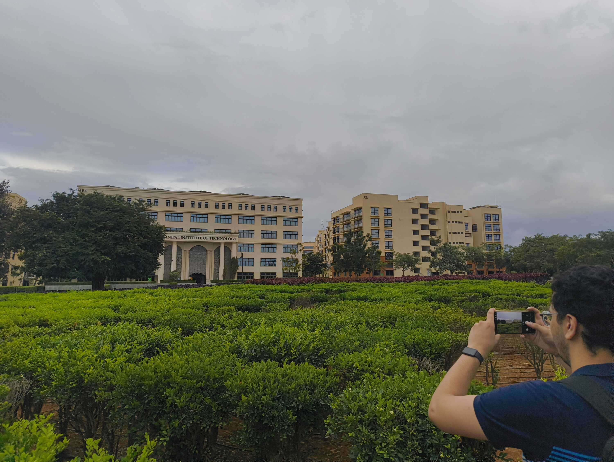
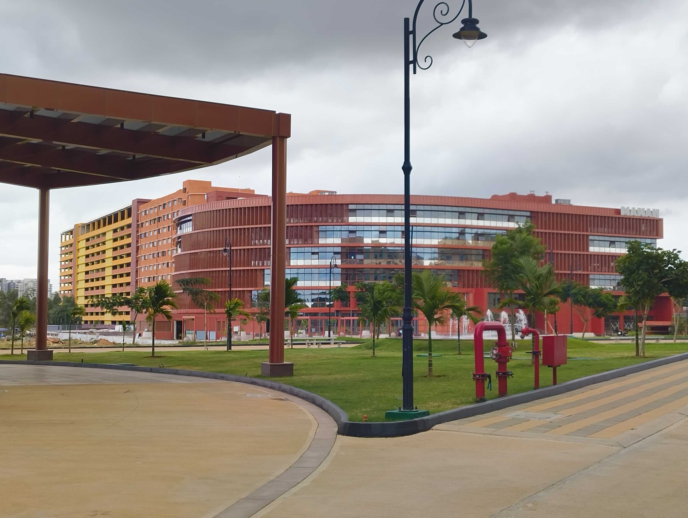
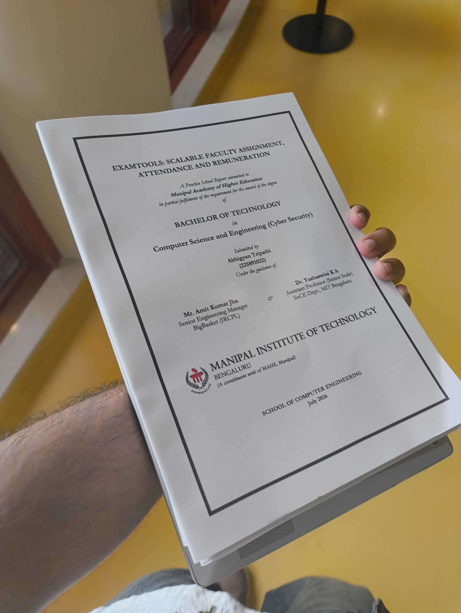
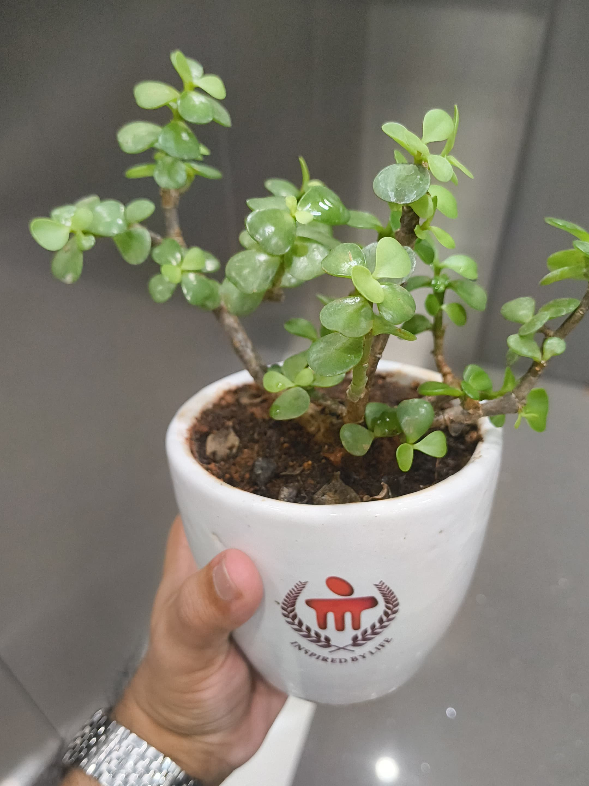
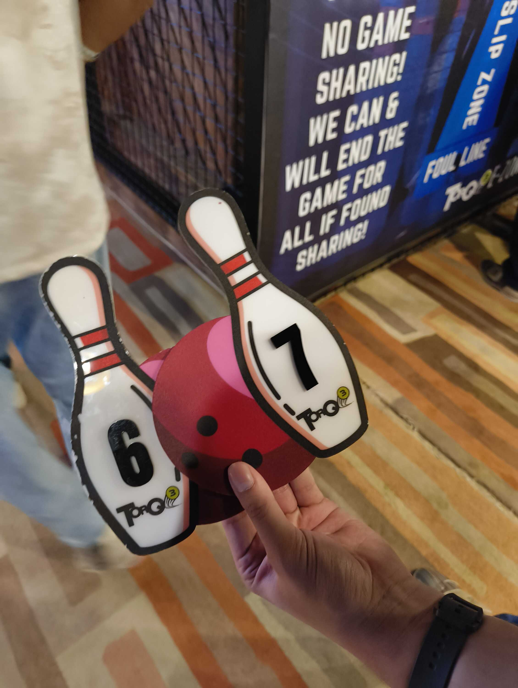

The start of the week was a quiet preparation while mulling over the flood of content that had come since Sonam Wangchuk's forced capture.

Following the protest online left me with a chronic turmoil throughout the week, which would be better off outlined in a separate blog post to not steal the limelight from my final college presentation. I'll hence cover the feelings, the observations on journalism and censorship and other things in [The Victory (?) of the Cockroaches](/blog/victory-of-the-cockroaches).

But anyway yeah, I started my long break from work with a visit to the college for my final presentation.

After a couple days of intense lying around all gloomy, I rushed to finish up my work for my project presentation and print it out on time. Some well-timed impromptu decisions and long cab rides later, I stood in front of the hostel gate I'd passed through so many times before.

I'd assumed I'd feel nostalgic on seeing all the old buildings again, but that wasn't my first impression at all. Seeing students bustle around and talking felt right at home. In fact, I'd even say I was jealous because I saw some cool new buildings pop up. Some _very big_ buildings, might I add.

What we called a "library" before was a reading room on the ground floor of one of our academic blocks. And yet it was most likely our tuition fees that went into constructing this building for the future batches.

Seeing the new library should have caused some amount of frustration, but it was actually just a continuation of us eating in a tarp tent before getting a food court, and doing push-ups in our hostel rooms before receiving a proper gym. We were used to the campus growing with us rather than before us.

Plus, I'd learned that the tuition fee had drastically increased. So I trudged along to the academic block with a fresh feeling of purpose.

As a part of the presentation process, I had to go to multiple departments and offices to get "No Dues" signatures. There were final year students walking around everywhere, and I met a lot of good friends after a long time.

The presentation itself went smoothly, with the panel being (thankfully) actually interested in the project. I'm glad I had a demo to show them too.

I visited all my old faculty, greeting them and informing them of all the adventures I'd had since I left (mostly corporate work). I was meeting one of these faculty when I saw a giant collection of Jade plants by their window, probably to give to event guests. As I was about to leave, in all my mostly-introvert glory, I asked him if I could take one.

With our work finished and our cabs booked, me and the friends I'd carpooled with in the morning started moving towards the main gate of the college.

As we took the long path through the colorful hedges to reach the gate, we all looked back at the first academic block we'd started with. It said "MANIPAL INSTITUTE OF TECHNOLOGY" in all capital letters. I somehow found myself saying, "It wasn't a bad place after all."

The week ended with a long day out of go-karting, bowling and arcade games. This was hilariously well-timed for me, because I was doing both go-karting (the official-seeming one) and bowling for the first time.

Kind of an unintentional reminder to myself that there's still many firsts for me to experience, even with college completing. But I won't be getting any more soppy in this weeknote; I'll probably write a whole thing looking back at my college life.

And yeah, it was at the end of this day that I opened up Instagram again to find that the protest had declared its victory. I put up some Stories sharing the news with all my followers (they already knew) and thanking them for witnessing my post sharing spree and all that.

It was an eventful set of weeks for sure, but I'll leave it to [the blog post](/blog/victory-of-the-cockroaches) to dive into that. For now, here's some content that I consumed during my gloomy lying around.

### Interesting Videos

- **[IMPORTANT]** "[Ye Hua Tha 20 July 2026 Ko](https://www.youtube.com/watch?v=6MTXCAaOy3o)" by [Samdish & Team](https://www.youtube.com/@UNFILTEREDbySamdish)
- **[IMPORTANT]** "[Vo Bheed Chahti Kya Thi? Sun Lo](https://www.youtube.com/watch?v=DEsAc_NP1DM)" by [Samdish & Team](https://www.youtube.com/@UNFILTEREDbySamdish)
- "[The Feminine Nature of Computers](https://www.youtube.com/watch?v=upGKj7Fdi9s)" by [Final Digital Girl](https://www.youtube.com/@FinalGirlDigital)
- "[We found a website you can't leave](https://www.youtube.com/watch?v=VbCwWdVrduc)" by [Christophe](https://www.youtube.com/@christophe)
- "[Hermitcraft 11: Episode 22 - Making Art](https://www.youtube.com/watch?v=8Oiy9VVAoiY)" by [Mumbo Jumbo](https://www.youtube.com/@ThatMumboJumbo)
- "[Delivery Apps Screw Over Everyone](https://www.youtube.com/watch?v=hsMujJYPagQ)" by [Drew Gooden](https://www.youtube.com/@drewisgooden)

### Lovely Reads

- "[A Braindump on Being Chronically Online](https://open.substack.com/pub/abysstrips/p/a-braindump-on-being-chronically)" by [my sister](https://substack.com/@abysstrips)
- "[The SPECTRUM of Standing Up](https://www.tarshi.net/inplainspeak/the-spectrum-of-standing-up/)" by [my sister](https://substack.com/@abysstrips) and Aradhana Phadke Sardesai on [_In Plainspeak_](https://www.tarshi.net/inplainspeak/)

### Cool Links

- [Internet Freedom Foundation's Website](https://internetfreedom.in/)
