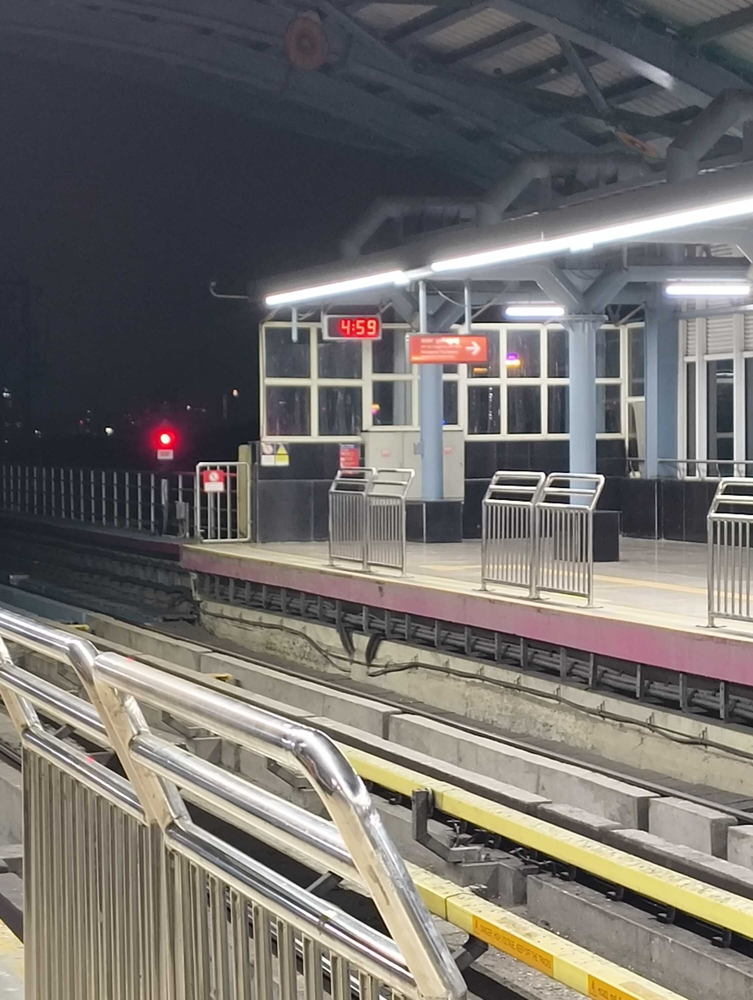
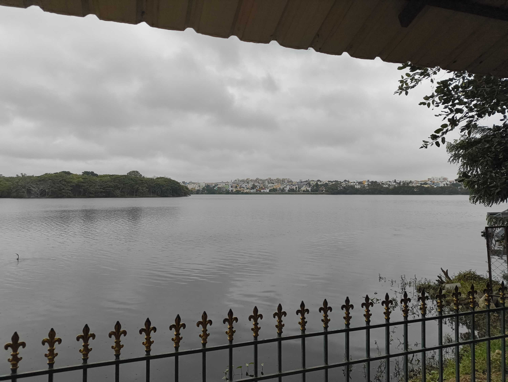
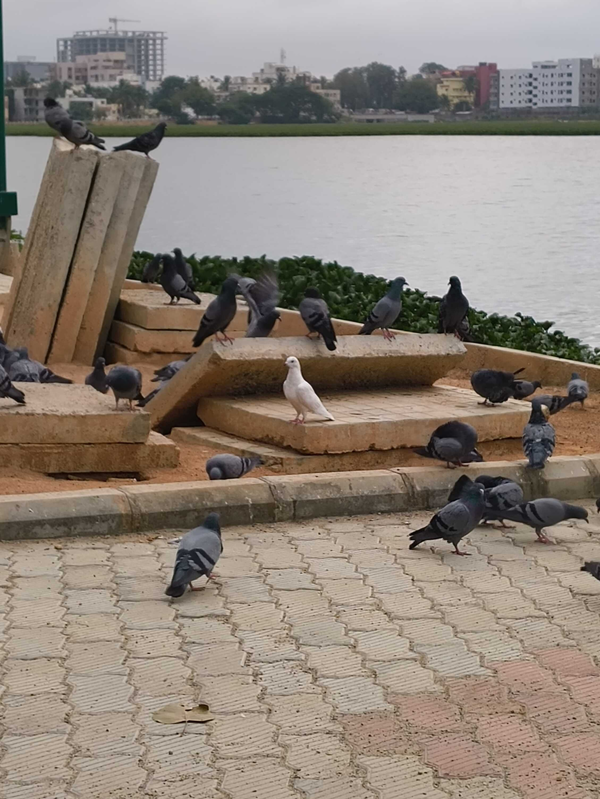
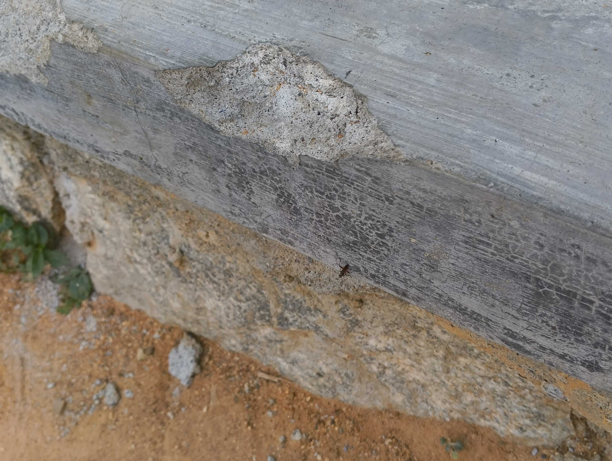
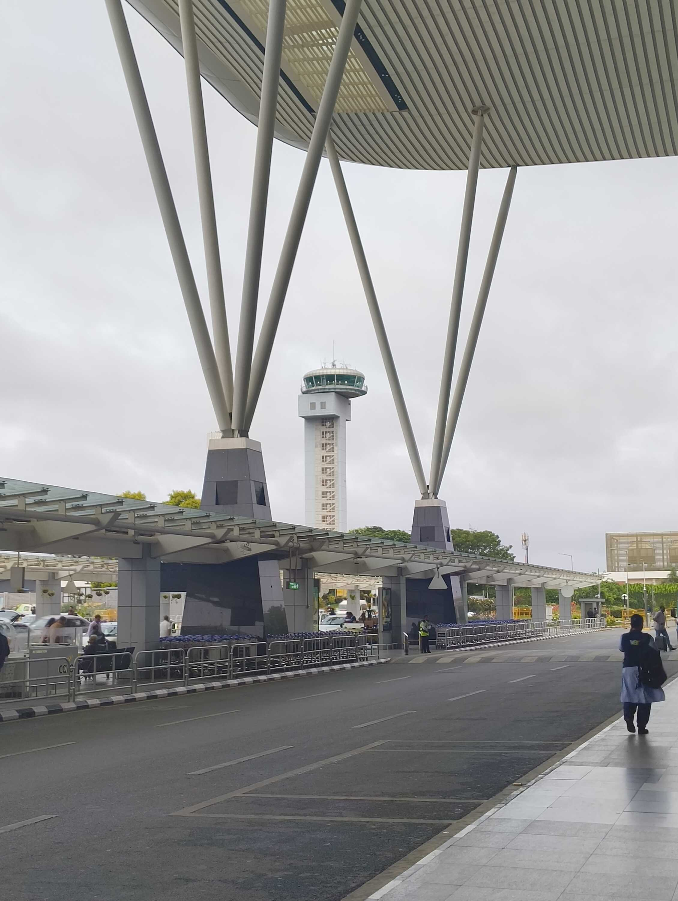

Sooo I was planning to go back home right after I finished up my college work, but I forgot I'd booked a ticket for a stand-up show at the end of the week. So now I had a full week of just... more lying around?

Nah, I couldn't do that to myself. So I reached out to [Shashaank](https://www.linkedin.com/in/shashaank-singh/) to join in on one of the lake expeditions (visit + walk) that he does from time to time.

This man enthusiastically informed me how Bengaluru Metro starts earlier than normal on Mondays, and how we'd be taking it from Indiranagar all the way to BTM Layout; two line switches and everything. We coordinated our times to get on the same train and started out on our long journey.

It's surprising how many people use the metro at 5AM. Bengaluru wakes up a lot earlier than I'd imagined. By the time we reached BTM Layout, people were already walking shoulder-to-shoulder on the way to their workplaces.

We arrived at the lake before sunrise and took in the beautiful view. The ocean is (much) bigger, but something about being able to see the other side of the lake really lets you appreciate how big it is.

I'd known Shashaank to go on these "lake expeditions" for a few months now. I excitedly asked him what we were going to do next. His answer... was "walk". And walk we did.

This is the day I learned that this guy just likes to walk around lakes. And my sedentary ass was soon melting with exhaustion from just putting one foot in front of the other.

We probably left the lake sooner than Shashaank would have, but we still couldn't grab breakfast because _none of the shops had opened up yet_. We spent our time walking between metro stations and appreciating the pedestrian pathways, because this guy genuinely loves public infrastructure.

The positive to all this is that time goes by quicker when you're walking to places. We had some good _masala dosa_ at a place that I can't currently remember. But it was really crisp and perfectly portioned.

We went on to walk in more parks and take pictures of really pale trees to send to [Raghav](https://alphaspiderman.dev). We were planning to go to a really nice mall once it opened at 11AM, but I had some work come up and had to leave early.

That was the most active day I had this week, and possibly this month too. But I forgot to wear my step tracker so Google Fit remains hilariously oblivious of my day.

Oh I should explain what _vellapanti_ is.

> **Vellapanti** is a verb derived from the adjective "vella", which is a (primarily) North Indian slang for "being idle or unproductive". "Vellapanti" refers to the actions/shenanigans you might undergo while you are "vella".

So yeah, a lot of idling and looking back at pictures during this week. Anyway, this was the first stand-up show I've been to (outside of one I vaguely remember attending in college).

I realized that laughing for two hours straight might be too much for me, but I really enjoyed the comedian's storytelling route and bringing the arc back to a few core points. We had a good time and ended the day with a lovely dinner out.

But that ends my long _vella_ week in Bengaluru. I'll see y'all next week. Peace and love.

### Interesting Videos

- "[The REAL Reason Miracle Houses Don't Burn Down](https://www.youtube.com/watch?v=mBcp3bIljK8)" by [DamiLee](https://www.youtube.com/@DamiLeeArch)
- "[Cars are getting dumber](https://www.youtube.com/watch?v=_S7GU9lDpq8)" by [Drew Gooden](https://www.youtube.com/@drewisgooden)
- "[The Gen Alpha Melody](https://www.youtube.com/watch?v=DW0XUsyBBuY)" by [Carl E. Martin](https://www.youtube.com/@Carl.e.martin)
- "[I took Charlie Puth's AI music class so you don't have to](https://www.youtube.com/watch?v=URmcSu-L7ew)" by [gabi belle](https://www.youtube.com/@itsgabibelle)
- "[We aren't ready for Meta glasses](https://www.youtube.com/watch?v=It4mt2uzhpY)" by [Christophe](https://www.youtube.com/@christophe)
- "[The Last Honest Movie Star](https://www.youtube.com/watch?v=1leVuo5M6w4)" by [Dodford](https://www.youtube.com/@DodfordYT)
- "[Fast & Furious is just Twilight for Men](https://www.youtube.com/watch?v=dgrosVK9QSA)" by [gabi belle](https://www.youtube.com/@itsgabibelle)

### Lovely Reads

- "[Code was our medium for thought](https://wattenberger.com/thoughts/code-is-a-medium-for-thought/)" by [Amelia Wattenberger](https://wattenberger.com/)
- "[Cursed knowledge we have learned that we wish we never knew.](https://unsung.aresluna.org/cursed-knowledge-we-have-learned-that-we-wish-we-never-knew/)" by [Marcin Wichary](https://aresluna.org/) at [Unsung](https://unsung.aresluna.org/)
