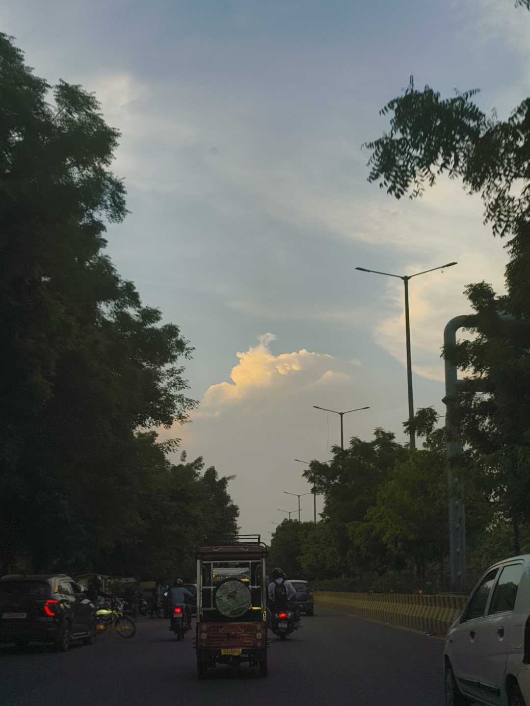
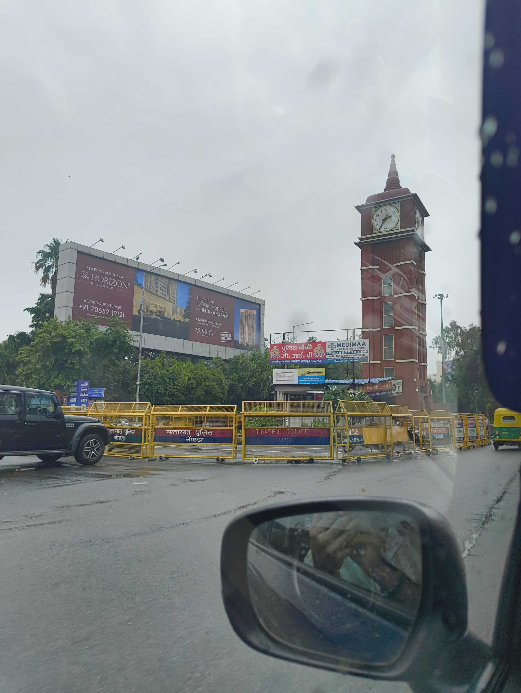
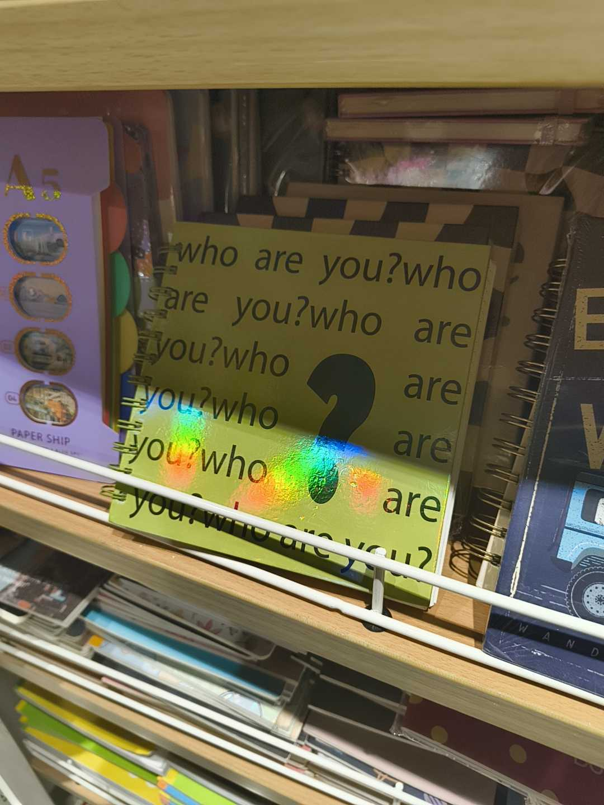
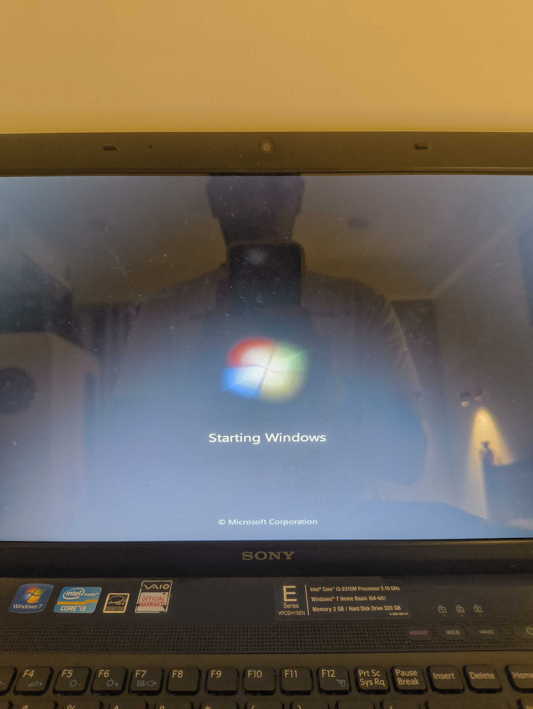

> **Translation:** Home-cooked food and peace of mind/heart.

The time back home was like a warm hug. Probably because of the actual warm hugs I received. I got to experience the weirdness of Delhi weather again, as the rain practically ding-dong ditched us repeatedly. Heat waves and _baarish_ worked together in shifts. Warm humid air really is _ugh_.

There had been mini-PSA's on Instagram about how the [Bajrang Dal](https://en.wikipedia.org/wiki/Bajrang_Dal) had really amped up their presence and <abbr title="The act of fighting or assaulting someone in vain.">_gundagiri_</abbr> since the end of the CJP Protest. I witnessed a bit of it while travelling home, seeing the roads lined with bright orange flags here and there. It can be quite scary to witness the tunnel-visioned mentality.

I went to the mall a few times and hung around with family. Also watched **Spider-Man: Brand New Day**. For some reason, the movie felt much more "grounded" or "connected to me" compared to its prequels. It could be because of how Peter Parker's loneliness is given the space to breathe and grow into something new.

You may need to watch/rewatch quite a few things to gain relevant context, but I'd recommend watching it still. It's also been really fun to see Sadie Sink's spoiler-protecting skills being compared to Tom Holland's natural spoiler-exposing talent.

I've been trying to improve [my Nannoo's blog](https://prembrij.in) so that it's easier for him to maintain. This included automatically getting songs from Smule so he doesn't have to upload links manually, but the content system for the website ([Sanity](https://sanity.io/)) still doesn't have a great interface on mobile. So I'm working on a more focused and friendly alternative for him, and being at home let me ask some questions about his requirements directly.

I'm also infamous in my family for taking apart tech things to see what's inside, so mummy-nannoo had kept aside some stuff they found in storage for me to do just that. I got to look inside our old Sony [DVD Player](https://en.wikipedia.org/wiki/DVD_player); turns out it still had a CD inside it from my first birthday.

There was also an old unused [VAIO](https://en.wikipedia.org/wiki/Vaio) laptop that was repaired to keep as a backup. It runs [Windows 7](https://en.wikipedia.org/wiki/Windows_7), probably the best operating system to ever be made. So I booted it up and played [Purble Palace](https://en.wikipedia.org/wiki/Purble_Place) for the first time in ages.

A few more days in Delhi before I fly again. Being at home has been really homely, and I got to be a kid again. This is probably the rest I needed.

Peace and love.

### Interesting Videos

- "[When the actor is NOTHING like the character](https://www.youtube.com/watch?v=KptHmne0fkw)" by [ScreenPuff](https://www.youtube.com/@ScreenPuff)
- "[We need to talk about the Hank Green situation](https://www.youtube.com/watch?v=cVT7MbRBiLY)" by [Colin and Samir](https://www.youtube.com/@ColinandSamir)
- "[Just Trying to Figure Out My Job](https://www.youtube.com/watch?v=ssE1rmt3EpE)", a response by Hank Green via [vlogbrothers](https://www.youtube.com/@vlogbrothers)
- "[Sexualised Innocence](https://www.youtube.com/watch?v=tDE9dUcbk8Q)", a video essay by [Tejaswinee yadav](https://www.youtube.com/@Tejaswineeeyadav)
- "[The Land that God Forgot](https://www.youtube.com/watch?v=CLfwdjvt85U)" by [Horses.Land](https://www.youtube.com/@HorsesOnYT)
- "[how I use NFC tags around my apartment (the ones that actually stuck)](https://www.youtube.com/watch?v=NGE8cM7CG94)" by [Caitlin's Corner](https://www.youtube.com/@caitlinmariedasilva)

### Lovely Reads

- "[I'm Scared a Stranger Will Call My Novel AI, So I Built GitHub for Words (Meet VellumProof, Formerly WritHub, Lol)](https://dylan.blog/2026/08/03/im-scared-a-stranger-will.html)" by [Dylan](https://dylan.blog)
- "[The sound of writing](https://jamesg.blog/2026/08/07/the-sound-of-writing)" by [James](https://jamesg.blog)

### Cool Links

- [Fnhipster.Com: "The Chronicles of a Webmaster"](https://fnhipster.com/)
- [I Love the 90s -- 90s TV, music, games and a chat room](https://ilovethe90s.app/)
- [Daniel Janus's Handwritten Blog](https://handwritten.danieljanus.pl/), formerly [Handwritten.Blog](https://handwritten.blog/)
- [Anhvn.Com: Anh's Personal Website](https://anhvn.com/)
