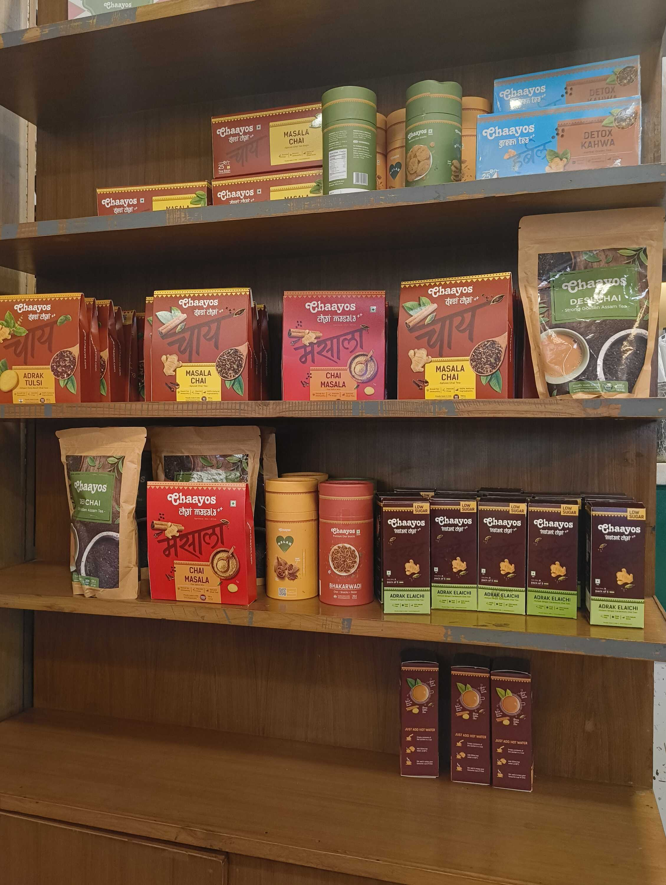
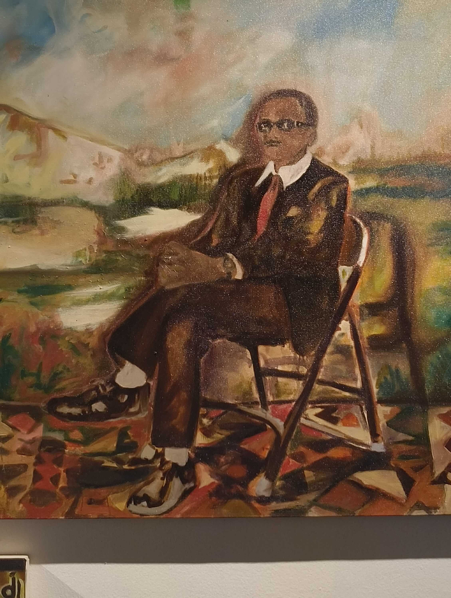
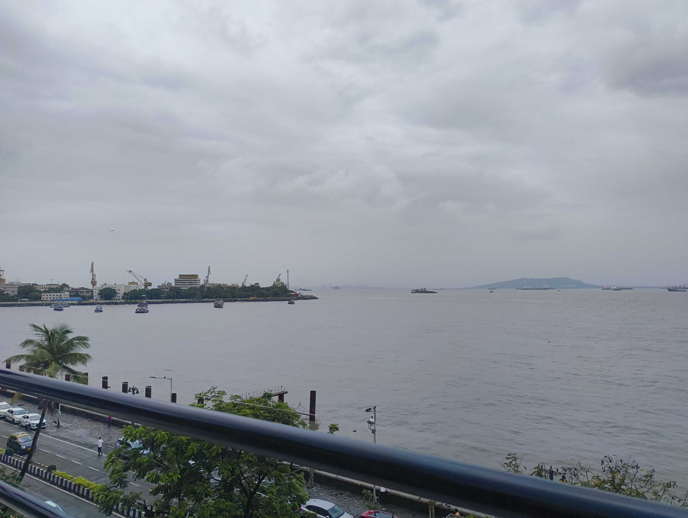
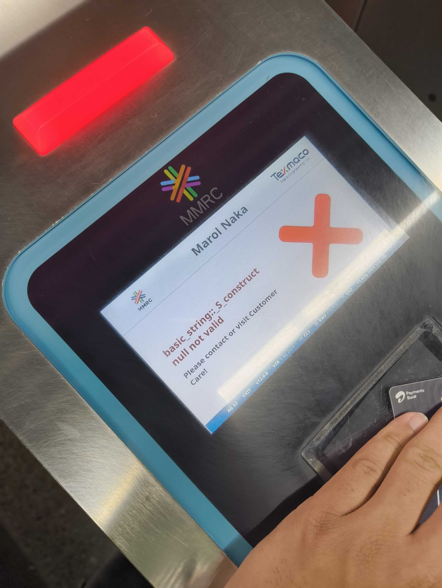
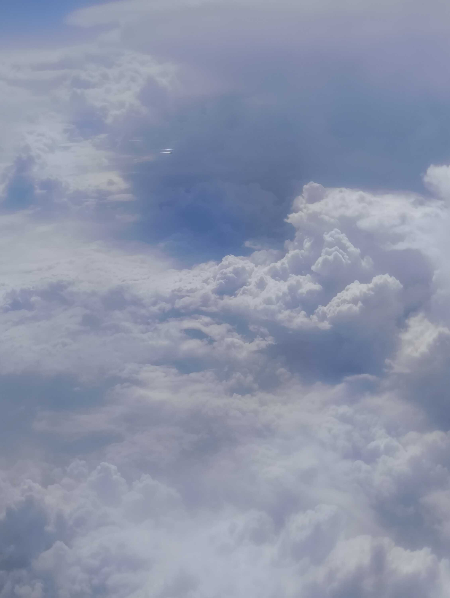

My Delhi shenanigans continued as I lazed around the house and got a lot of rest. I'm known in my family as an inquisitive little kid, because I snoop around in drawers and cupboards to look for something interesting. I decided to live up to my reputation.

There were film cameras, school magazines, and a drawer full of cables collected over time. I found the [CPU](https://en.wikipedia.org/wiki/Central_processing_unit) I kept from my first ever computer (I'm planning to store it in epoxy one day) and most importantly, my old [slam books](https://en.wikipedia.org/wiki/Slam_book).

These specific slam books were bought from [Archies](https://archiesonline.com/), back when I was still in 5th Grade. I collected responses from friends from many different postings; they answered questions about their greatest fears and favourite singers. A surprising amount answered the latter with "[Yo Yo Honey Singh](https://en.wikipedia.org/wiki/Yo_Yo_Honey_Singh)".

If there's ever a museum of me, these would be framed in a glass box.

Later on in the week, I met up with [Mihika](/people#mihika-kulkarni) after a long time and visited [MOOL by Exhibit 320](https://www.instagram.com/p/DaxXZPkzm-o/) (curated by [Shaleen Wadhwana](https://www.instagram.com/shaleenwadhwana/)). The exhibit showcased art across South Asia, recording similarities in culture and people's experiences past the map lines drawn hastily by colonial rulers of yore.

The show was structured through the four strands of Community, Soil, Body, and Script. As a tech dude, I might not have the full vocabulary to describe my experience at the exhibit. But the main feeling I took away was "connection across borders". Similarity in experiences, across the geographic "other".

Also, an immense appreciation for the usage of a vast variety of mediums by the artists, with the materials themselves having a history. Going to a level of intricacy that requires a magnifying glass is something that leaves me in awe.

After the exhibit, Mihika and I navigated the rain to reach Khan Market, where we had a _goood_ pizza and walked the streets as we caught up on our lives. I brought forth the slam books I'd discovered as a surprise, and showed Mihika her entry.

After some immense cringing at our 7th Grade selves, we realized that we had met almost _exactly_ 10 years since the slam book entry. This was a great unexpected achievement, and Mihika put in a new entry into the book to commemorate the affair.

I flew over to Mumbai the next day as the final destination of my self-imposed summer vacation. I spent time with dad and <abbr title="My dad's mom.">_dadi_</abbr>, while mostly (once again) lazing around and consuming content. I did bring myself to plan out a visit to some museums, but the lethargy won over anyway.

One of the few outings I made was to go meet [Satyajit](https://www.linkedin.com/in/satyajitsinh-jhala-634057257/).

As of writing, Jitu has finished his long journey of flights and layovers to reach the US, where he starts his Masters'. As his roommate in college, I've seen this man work very hard; he lived more in the library and less in the room during exams. He gives his all to every commitment he makes, so it definitely makes me proud to see him go to an Ivy League. He's earned it completely.

But soppy shit aside, I got to meet him a few hours before he was taking off and we shared a late lunch in Colaba. We lightly discussed college shenanigans and things we did in the last semester, after which we went our separate ways as I got onto the metro.

With this, I would like to put it on the record that I do not think this is our last meet. The feeling is different from the resignation I would have when constantly shifting schools. I am positive I'll meet this dude again. I'm also positive he's going to do great things.

I play "Danger Zone" from Top Gun whenever I'm flying back to Bengaluru from somewhere. The sun was setting as I landed into the city, taxied home and prepared for work starting on Monday.

Probably a long weeknote, eh? Took me multiple days to think about it and write.

The self-imposed summer vacation came to an end. I slept a lot but still fear that I didn't rest enough before The Great Corporate Life&trade;. Maybe there is never enough rest. Calling the work life "endless" or "a rat race" makes me queasy, so I'll just do what I can and meet friends when it's too much. That seems right.

Peace, love, and an urge to shine.

### Videos I Liked

- "[Overanalyzing The Most Shared TikTok Ever](https://www.youtube.com/watch?v=FjIZWCX9Qeo)" by [Colin and Samir](https://www.youtube.com/@ColinandSamir)
- "[Angela Giarrantana Eats Her Last Meal](https://www.youtube.com/watch?v=1Ag5HiO6TbI)" by [Mythical Kitchen](https://www.youtube.com/@mythicalkitchen)
- "[A Day in the Life of Hank Green](https://www.youtube.com/watch?v=FFlT4QGnn4Q)" by [Wheezy Waiter](https://www.youtube.com/@wheezywaiter)

### Posts I Loved

- "[Blogust #8](https://aeish-world.neocities.org/blog_pages/blog-blogust-8)" and "[Blogust #9](https://aeish-world.neocities.org/blog_pages/blog-blogust-virgil)" by [Aeishna](https://aeish-world.neocities.org)
- "[Turning My Notes Into A Minecraft World](https://vipul.xyz/2026/08/15/minepalace/)" by [Vipul Sharma](https://vipul.xyz/)
- "[Being authentic](https://niya.pink/being-authentic/)" by [Niya](https://niya.pink/)
- "[Making Playpen Sans](https://www.type-together.com/making-playpen-sans)" at [TypeTogether](https://www.type-together.com/)
- "[learning to listen to classical music, and personal micro-sites](https://winnielim.org/notes/learning-to-listen-to-classical-music-and-personal-micro-sites/)" by [Winnie Lim](https://winnielim.org/)

### Links I Found Cool

- [Ordinary Abundance](https://ordinaryabundance.com/) by [Jordan Dworkin](mailto:jordan.dworkin@coefficientgiving.org)
- [Hiran Venugopalan's Website](https://hiran.in/everything/)
