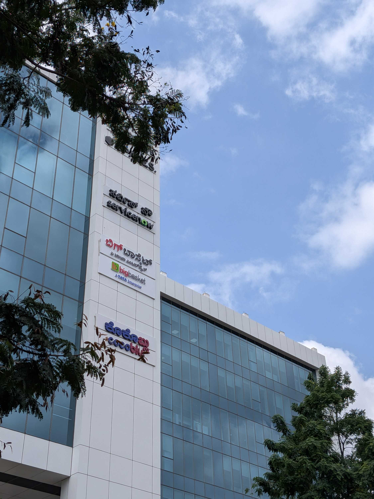
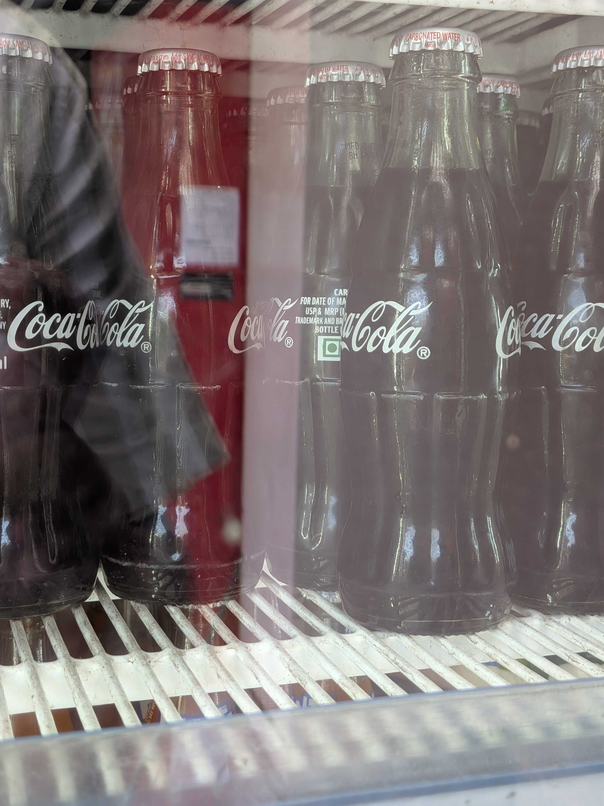
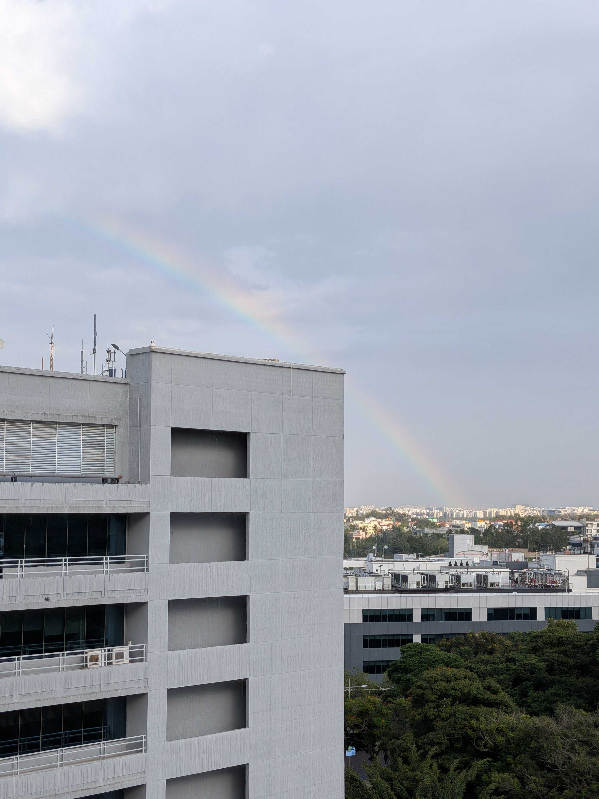
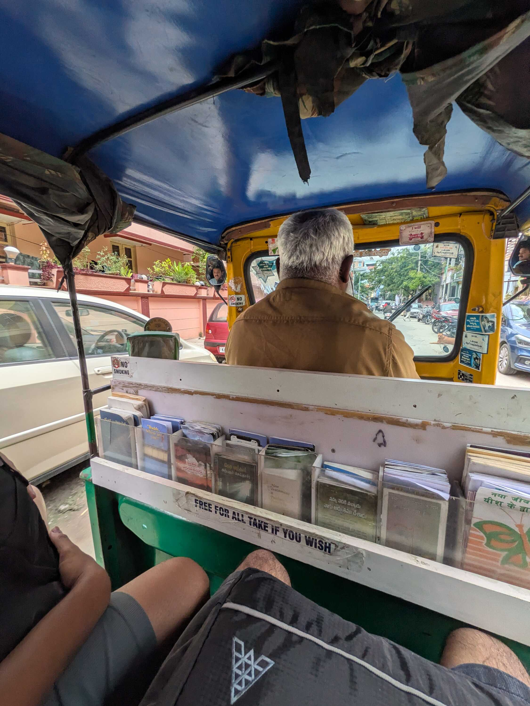
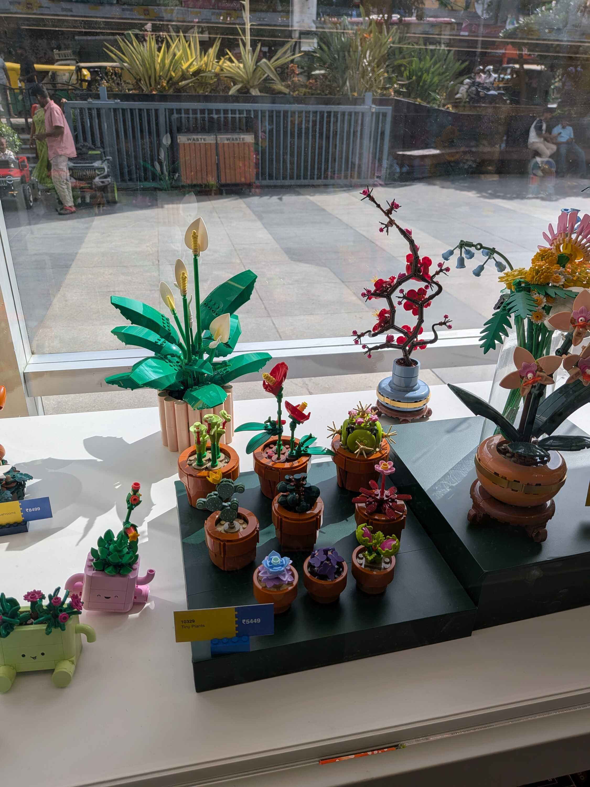

Soo I started working again.

Anything I did would probably seem boring compared to a self-imposed summer vacation, so I understood my own _meh_-ness as I walked to the office. But the familiarity of seeing the same team and the cubicles we sat in was comforting. After meeting everyone, going to the cafeteria and having [my staple sandwich](/blog/paneer-cheese-sandwich), I was right at home.

We had a team lunch and I shared my chronicles of _velapanti_ with my team. I later discussed my responsibilities going forward with my manager, and there are some things I'm quietly excited to work on.

I remember having a conversation in college with [Keshav](https://www.linkedin.com/in/hari-keshav-rajesh-b25945300/), when we were talking about what would happen once we got placed. He told me that I'd enjoy corporate because I would get to build things and see them deployed.

I think he was right, because I've already had that feeling through my internship and working with my team. But I can also see how the exhaustion can quietly build up between deadlines and context switching. I think he's facing it himself too.

I usually come back from work to contribute to my own projects and build my own little fun things, but I did _not_ have that energy this week. I think my body lost the inertia of always doing something (which might be good?) but I'm not worried about it. I just gave in to the exhaustion, consumed a lot of content and slept a lot.

This cycle went on for a while and I quickly (but also very slowly) arrived at the weekend.

I went for swimming with the boys and had another amazing (and heavy) lunch at [Amritsari](https://www.zomato.com/bangalore/amritsari-truly-north-indian-koramangala-5th-block-bangalore).

On the way back, the auto-rickshaw we booked had a bookshelf full of small books and leaflets. The label read, "Free for all if you take to wish." Most of the books were related to Christianity (which makes me wonder if a Church sponsored the bookshelf, which is cool) but I took a small leaflet named, "Are you ready for the day justice arrives?", because I liked the title.

Coming back to the room, I finished up some dusting and unpacking left over from my long absence. I gave water to the new plants, and caught up with some write-ups I'd been working on (including [the previous weeknote](/weeknotes/2026/33) and this one).

I've recently been working on three different posts that require extensive research or "sitting down and thinking". I was kinda annoyed with how long they were taking for me to finish, until I read one of [Aeishna](https://aeish-world.neocities.org)'s [posts](https://aeish-world.neocities.org/blog_pages/blog-blogust-8) where she called such write-ups "deep-dives".

I'd _forgotten_ "deep-dives" was a thing, that there was a term for things that require intense pondering and all that. Coming across that post was probably meant to be, so I'm letting myself relax a little more and do everything steadily. Aeish continued to talk about feeling like your current circumstances are some kind of obstacle, which I resonated with and am trying to work towards too. Man, realizations are cool.

But yeah, you'll notice the list of links is a lot longer this time. I might've binged a lot, but there's also a lot of links from IndieWebClub's group chat that I think more people should see and interact with. So here you go, fellow web surfer.

Peace and love.

### Videos I Liked

- "[The Bashar Guy made a movie (w/ Danny Gonzalez)](https://www.youtube.com/watch?v=ZkOFtDY2js4&pp=0gcJCRMMAYcqIYzv)" by [Drew Gooden](https://www.youtube.com/@drewisgooden)
- "[Angela Giarratana Eats Her Last Meal](https://www.youtube.com/watch?v=1Ag5HiO6TbI)" by [Mythical Kitchen](https://www.youtube.com/@mythicalkitchen)
- "[Total Solar Eclipse Explained: Live!](https://www.youtube.com/watch?v=EDe71YWP1PQ)" by [WVFRM Podcast](https://www.youtube.com/@Waveform)
- "[Why we're so sure our phones are listening](https://www.youtube.com/watch?v=U0-8SrbG0xA)" by [Christophe](https://www.youtube.com/@christophe)
- "[The fight over driverless cars is here](https://www.youtube.com/watch?v=lLaN6pfQSR8)" by [Good Work](https://www.youtube.com/@GoodWorkMB)

### Posts I Loved

- "[I was wrong about weight loss](https://bogas04.fyi/blog/2026/08/i-was-wrong-about-weight-loss/)" by [Divjot](https://bogas04.fyi/)
- "[Forgive me father for I have vibed](https://bogas04.fyi/blog/2026/08/forgive-me-father-for-i-have-vibed/)" by [Divjot](https://bogas04.fyi/)
- "[deluding myself into thinking mac n cheese is the 2nd healthiest food](https://amytrieslife.com/blog/deluding-myself-into-thinking-mac-n-cheese-is-the-2nd-healthiest-food/)" by [Amy](https://amytrieslife.com/)
- "[The price of missed chances](https://harishb95.mataroa.blog/blog/the-price-of-missed-chances/)" by [Harish](https://harishb95.mataroa.blog/)

### Links I Found Cool

- This amazing throwback to penfights, [Penfight.Xyz](https://penfight.xyz)
- [Aeish's Summer Shrine](https://aeish-world.neocities.org/shrines/summer)
- [THE INDIEWEB IS PUNK!](https://indiewebispunk.net/)

### Collections I Revere

- This old Instagram page that collected quotes from backs of auto-rickshaws, '[@poetryauto](https://www.instagram.com/poetryauto/)'
- A collection of people confessing their relationships with AI, [WhatWeTellAI.Com](https://www.whatwetellai.com/)
- [Thejesh's](https://thejeshgn.com/projects/openpostboxindia/) crowdsourced collection of postboxes and post offices across India, [OpenPostBoxCollection](https://www.are.na/thejesh-gn/openpostboxindia)
- [Thejesh's](https://thejeshgn.com) other collection of [Unidentified Urban Objects](https://www.are.na/thejesh-gn/unidentified-urban-objects) :o
- [Jatan's](https://web.jatan.space/) collection of [Signs in Public Washrooms](https://web.jatan.space/gallery-of-signs-in-public-washrooms)
- [Marciot's](https://www.marciot.com) visual catalog of [Retro Macintosh Software](https://www.marciot.com/mac68k-visual-catalog/)
