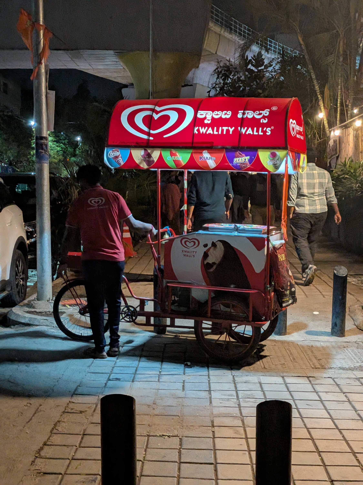
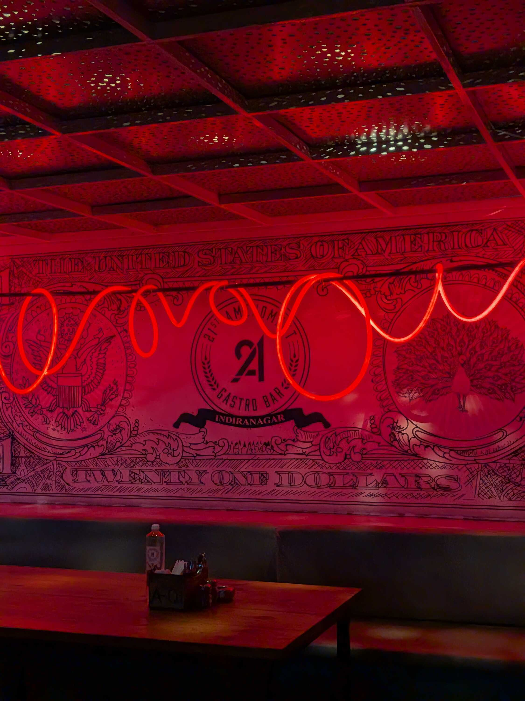
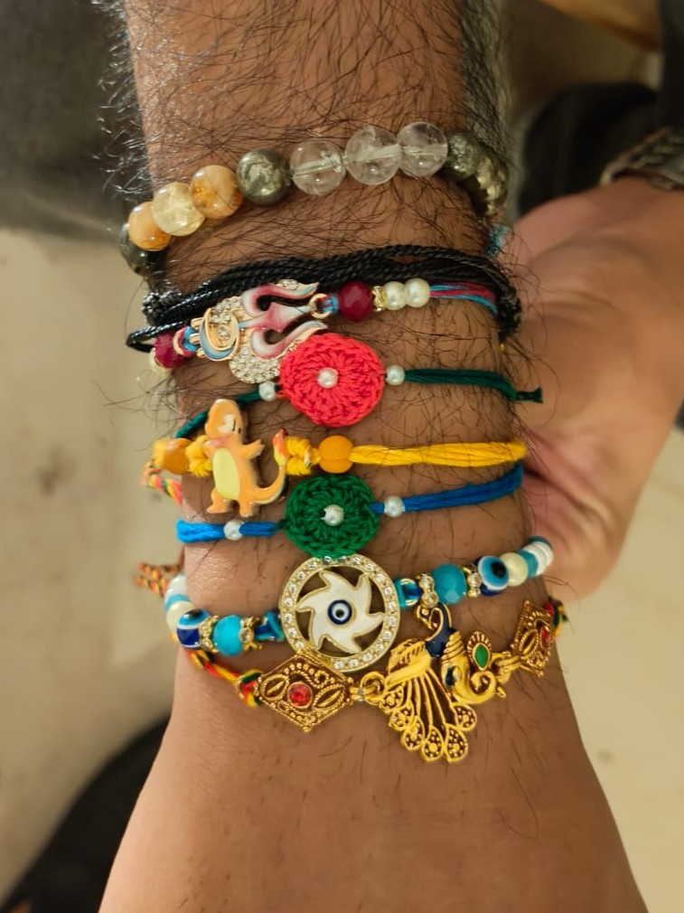

Ah, this was a wonderful week. Work has started picking up and I'm getting like a corporate rite of passage. I got to sit down and plan my OKR's this week (and through that, learn what OKR's mean).

I'm kinda glad that we were treated as full-time employees even when we were interns, because the exposure to all the tools and communication shenanigans has made me comfy with the work environment (touchwood). Now it's more of just planning ahead and executing based on what I've learnt.

I had my first team dinner as an official new hire at 21st Amendment, where we caught up on how everyone in the team was doing. There were many plans for Rakshabandhan, with people visiting home or planning out online _pooja_.

On a different note, I also learned that there was some Amendment in the United States that banned the consumption of alcohol, and it was through the "21st Amendment" that consumption was once again allowed. The restobar we were at was named after this Amendment to "celebrate the right to party" or something like that, according to what they'd written in their menu. Very cool very nice.

I spent the Friday working from home as I prepared for Rakshabandhan later in the evening.

_Rakshabandhan_ -- the festival celebrating the sibling bond of love and protection -- has had its own ups and downs for me (mostly because I've had ups and downs with my sister).

I remember my teens where we would fight over literally anything, get upset, and then start talking again without some mandatory resolution or apology. I had many Rakhis that went that way too, where we had fought over something but ultimately stood next to each other in a semi-forceful side-hug for photos.

Those photos from back then are quite precious now, and have been since I shifted to college and got to spend less time with her. Every time I go back home now, I feel like she's grown so much more since my last visit. She works hard and cares for people, and I'm extremely proud of her. But she's also still annoying.

Anyway, I got to spend my Rakhi at my <abbr title="my dad's sister's.">_bua's_</abbr>, where my cousin sister tied Rakhis on my wrist on behalf of the entire extended family. I got to give my sisters <abbr title="a gift given in return ">_shagun_</abbr> from my own salary for the first time, which also made me happy. I soon had my arm full of colorful bands that I donned proudly.

As I write this, most of the Rakhis have been kept safely so I can type and work normally. But the _mithai_, the bond, and the memories remain.

Much love, and I hope your crush doesn't tie you a Rakhi. ;)

### Videos I Liked

- "[I made a sweater from scratch (it made me insane)](https://www.youtube.com/watch?v=L7QMgbMlaek)" by [Macy Gilliam](https://www.youtube.com/@macyagilliam)
- "[How I Accidentally Became Famous](https://www.youtube.com/watch?v=D6Rsd-r_Sqw)" by [DiEM ARCHiVE](https://www.youtube.com/@DIEMARCHIVE)
- "[Will Poulter Eats His Last Meal](https://www.youtube.com/watch?v=4Jy_6RGoMao)" by [Mythical Kitchen](https://www.youtube.com/@mythicalkitchen)
- "[Are smart glasses just for dirty sickos?](https://www.youtube.com/watch?v=PuoGqbLbRhc)" by [Good Work](https://www.youtube.com/@GoodWorkMB)

### Posts I Loved

- "[Humanities in the Machine](https://blainsmith.com/essays/humanities-in-the-machine/)" by [Blain Smith](https://blainsmith.com/)
