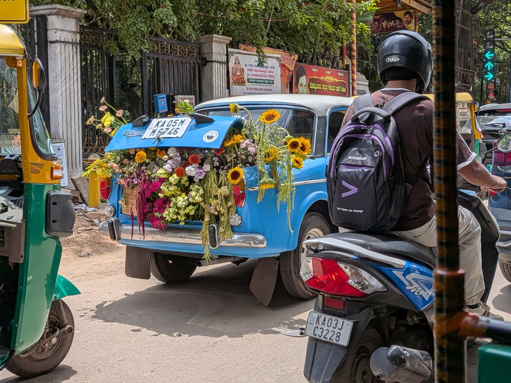
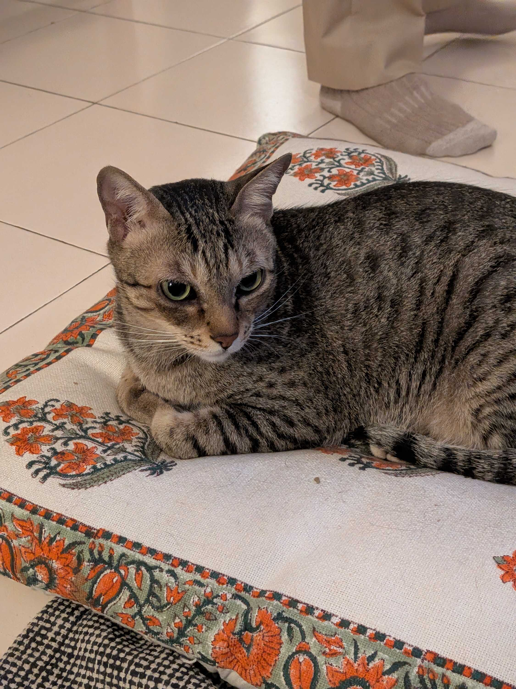
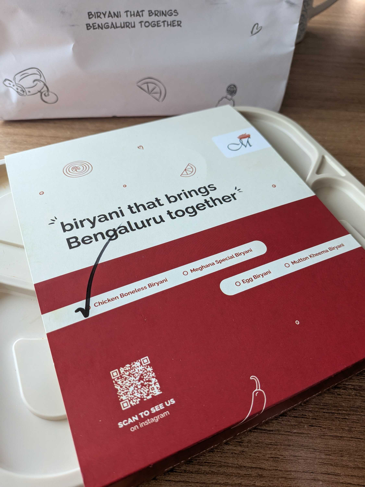
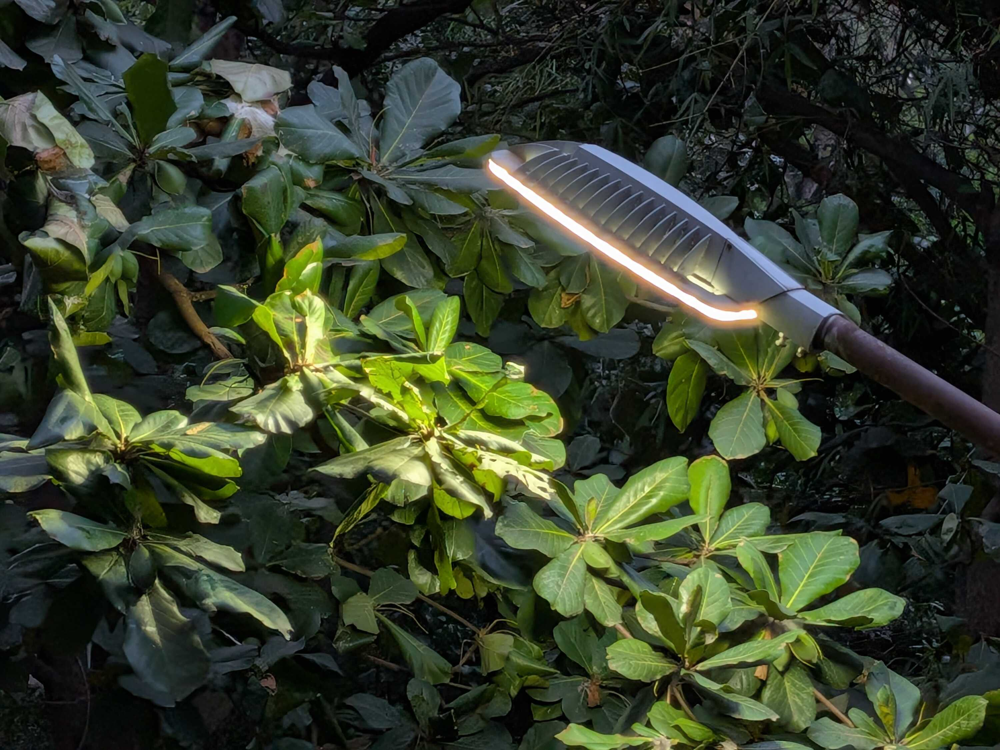

I started this week by going for a swim to Game Theory, Ulsoor. I'd learned just a day before that the pool I had been going to was only 25 meters, not 50. I remember thinking, "No wonder," because doing a full length after so long had felt _way_ too easy.

So I chose a different pool this time, one that was actually 50 meters long _and_ 16 feet deep on District. I assumed the depth was a misinput by the pool people, but once I got into the water and looked down I almost laughed out of surprise. The pool was _really_ deep, deep enough that there were people actually _practicing scuba diving_ in there.

I proceeded to swim along the length and feel really happy about long-distance swimming. As someone who learned to swim really young, the 50-meter pool felt like spreading my wings properly. It was definitely tiring though. I came back home and fell asleep almost right away.

On Wednesday, I joined in on [Azan](https://azan-n.com/)'s Trial Strudel Workshop at [Tanvi](https://tanvibhakta.in)'s. [Strudel](https://strudel.cc) is this "programming language" that lets you compose music by writing code. There's thousands of different sounds and instrument banks, with the ability to even upload your own samples as you like.

Azan took us through the different stages of _studeling_, with even some sample patches from himself and other artists at the end. What I enjoyed the most is that Strudel is basically built on top of JavaScript, so you can just introduce JavaScript functions inside the code and use them too. Azan demo-ed this by adding some cool visual effects and showcasing other artists' custom code.

I love the whole idea and culture around Strudel. It's mixing open-source and code and music in a really fun way which is new to me. This was also my first time visiting someone with cats, by the way. Seeing them jump onto things so effortlessly, prowling around us and meowing was very wholesome.

I've recently been thinking about becoming vegetarian, at least temporarily. You would hope this comes from understanding the animal brutality, but that's not really the full picture for me.

My dad was originally non-veg, and gave both me and my sister the acquired gene. Then he himself became vegetarian and left us to eat chicken ourselves. I continued through school because I liked the taste, and even in college because it would have relatively more protein.

It has recently felt more forced, though. Eating chicken and doing the manual de-boning has always been too much work, so I get boneless dishes when I can. But I recently boiled some eggs for lunch; put them in the machine, waited for them to cool down, removed the shells, ate them, and then had to leave the window open for the smell to dissipate. All the while I was thinking, "This feels like way too much effort just for some protein."

We have every possible good alternative now, really. "High protein" _paneer_ and curd I still don't trust, but there are some good protein powders if you really need (with some being vegan too). I'm thinking I'll try omitting non-veg from my diet for a bit.

The Saturday was spent with friends from [IndieWebClub](https://blr.indiewebclub.org). Our meetup this week revolved around "Drafts" -- what qualifies as a "draft" for us, our experiences with unfinished writing, and what drives us to turn an idea into a working draft. The topic itself manifested from recent conversation in the group chat about writing difficulties and such, so the context was familiar and fun.

After the meetup, we all moved to [Tanjore](https://www.instagram.com/tanjoretiffins/) to continue chatting. There was much for people to say on [Chris Nolan](https://en.wikipedia.org/wiki/Christopher_Nolan)'s "[The Odyssey](https://www.imdb.com/title/tt33764258/)", and I also discovered the [Czarface Meets Frankie Pulitzer](https://genius.com/albums/Czarface-and-frankie-pulitzer/Czarface-meets-frankie-pulitzer) album which I now love.

Some of us ([Jatan](https://jatan.space/), Ananya, [Ankur](https://ankursethi.com/), [Tanvi](https://tanvibhakta.in/), [Aeish](https://aeish-world.neocities.org/) and I) stayed back to complete our writing shenanigans before the day ended. I was glad, because it would be hilariously morbid to spend a day talking about drafts and immediately leaving a writing piece unfinished.

Somehow or the other, I ended up having some very bad _mosambi_ juice[^1] and published my piece right afterwards. It's called "[Decompressing It All](/blog/decompressing-it-all)", and it is me collecting my thoughts from all my recent drafts in one place so I can atleast process them together. It was a lovely exercise, and there might be individual posts sprouting out of it soon&trade;.

### Videos I Liked

- "[I tried to buy a scientific paper](https://www.youtube.com/watch?v=SEwiOykoXXc)" by [Christophe](https://www.youtube.com/@Christophe)
- "[This genre of guy is fascinating](https://www.youtube.com/watch?v=ydExETrHfqE)" by [gabi belle](https://www.youtube.com/@itsgabibelle)
- "[Technoblade](https://www.youtube.com/watch?v=g8pf2jmkRZo)" by [SAD-ist](https://www.youtube.com/@SAD_istfied)
- "[You Might Have a Bad Sense of Humor...](https://www.youtube.com/watch?v=zL5RHc72Um0)" by [Caroline Konstnar](https://www.youtube.com/@CarolineKonstnar)
- "[Gianmarco Soresi Eats His Last Meal](https://www.youtube.com/watch?v=hwuztjYUTZk)" by [Mythical Kitchen](https://www.youtube.com/@mythicalkitchen)

### Posts I Loved

- "[What my hands learn every time I log in](https://tanvibhakta.in/blog/what-my-hands-learn-every-time-i-log-in)" by [Tanvi Bhakta](https://tanvibhakta.in/)
- "[Little Websites Everywhere.](https://michellebarker.co.uk/writing/little-websites-everywhere/)" by [Michelle Barker](https://michellebarker.co.uk/)
- "[Explore our Moon!](https://jatan.space/our-moon/)" by [Jatan Mehta](https://jatan.space/)
- "[Even Death is a Calling](https://himanshikalra.com/even-death-is-a-calling/)" by [Himanshi Kalra](https://himanshikalra.com/)

### Links I Found Cool

- [Keith Cirkel's Wire Loop Game](https://www.keithcirkel.co.uk/wire-loop)

#### Footnotes

[^1]: _And_ some very good hot chocolate, might I add.
