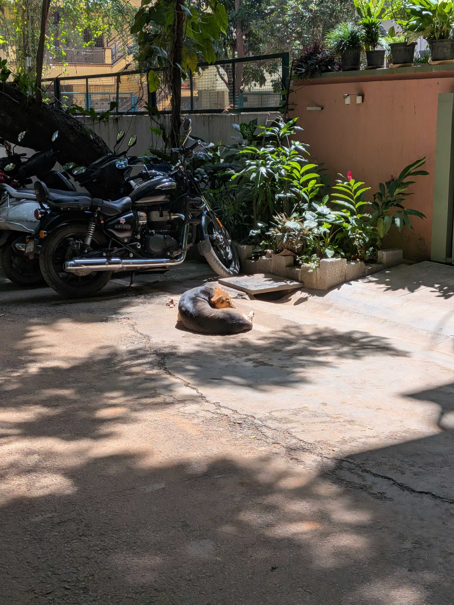
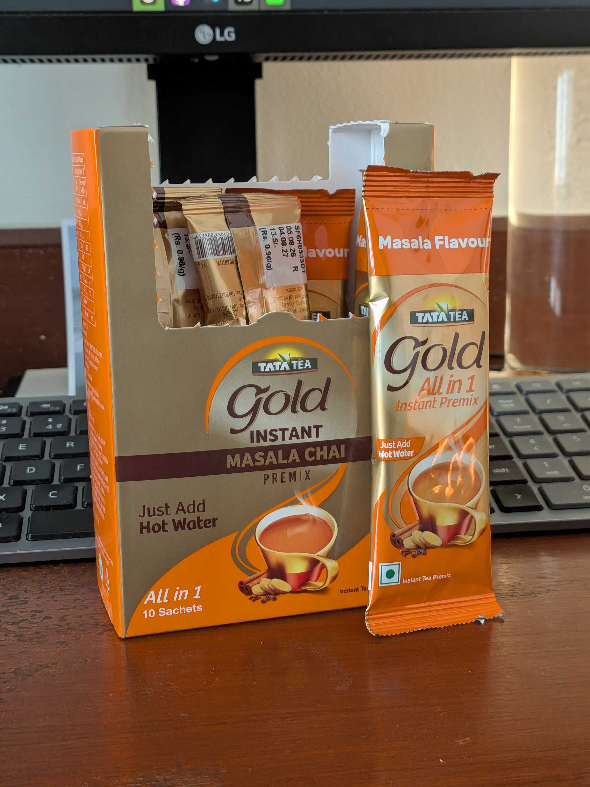
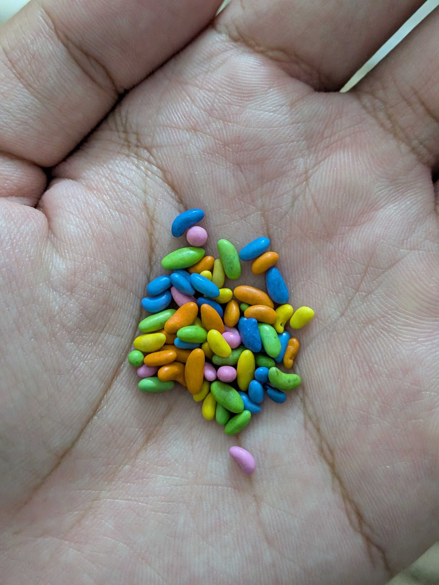

After an eventful week previously, I spent this week chilling and finishing up work tasks. With that out of the way, let me make a tangent.

I recently read [this post by Harsh](https://msfjarvis.dev/posts/you-are-worth-more-than-your-work/), where I was drawn specifically to this quote in reference to Artifical Intelligence:

> Tech has spent decades automating away everyone else’s job, it’s poetic that we eventually do it to ourselves.

And since I read this, I have been noticing the word "automation" being repeated in conference rooms and stand-ups more and more. To a degree the automations are necessary; with the speed of work and the volume of results increasing, there is a need for scripting to handle chunks of the workload. But a lot of that problem is _created_ by the fact that the floodgates of this technology are currently wide open.

I also notice that people use future tense a lot when referring to AI in a sentence. AI _will_ replace complex roles completely. AI _will_ do all the work and we won't need people anymore. AI _will_ replace you, so you need to learn everything as soon as possible to keep up. I wonder if we're just making promises to ourselves and running desperately to achieve them.

Ever since the last [IndieWebClub](https://blr.indiewebclub.org) [meetup](/weeknotes/2026/36/#paragraph-11), I have felt an urge to finish up the rest of my drafts and publish them. The progress has felt great, but I realized most of them were stuck because my own feelings on the topics were unresolved. Figuring that out is tiring. :P

Sooo I've been working on that. I wrote a [continuation on my double thank-yous](/blog/thank-you-welcome), but also [decided to write fiction](/blog/sunsets) in the moment on Saturday. To anyone who's interested in reading that, you might like to learn about ["The Holy Trinity" in Hindu mythology](https://en.wikipedia.org/wiki/Trimurti) for context.

For the technical people who might be interested, I recently started dabbling in [Sätteri](https://satteri.bruits.org/) plugins for [Astro](https://astro.build). I used to use [Remark](https://remark.js.org/)/[Rehype](https://github.com/rehypejs/rehype) for post-processing on my markdown files, but since Astro [shifted their default processor](https://docs.astro.build/en/guides/upgrade-to/v7/#new-default-markdown-processor-s%C3%A4tteri) (and since Sätteri is written in Rust), I decided to port over the plugins I used to Sätteri. I now have one for [processing image captions](https://www.npmjs.com/package/satteri-figure) and one for [auto-linking paragraphs](https://www.npmjs.com/package/satteri-autolink-paragraphs).

I'm also currently working on this app called "[Graycie](https://github.com/abhigyantrips/Graycie)", which is supposed to help me manage grayscale mode (and soon, night light) for each app instead of just a system-wide toggle. I've wanted this for a long time because -- as much as I love keeping the phone in black-and-white -- I still like taking pictures, looking at pictures, and doing video calls in colour.

Manually toggling the mode is cumbersome, so I'm working on developing ([mostly agentically](/ai#programming)) and releasing this on [F-Droid](https://f-droid.org). That itself is taking a long time though, as you can see [in this merge request](https://gitlab.com/fdroid/fdroiddata/-/merge_requests/48903). But this was definitely a productive week programming-wise.

I ended the week with having dinner at my aunt's and spending time with the family. A lot of time spent on VSCode and GitHub/GitLab this week, and staring at screens overall. Maybe I'll try going out more in the next week.

Alright, I'll see you around. Peace and love.
