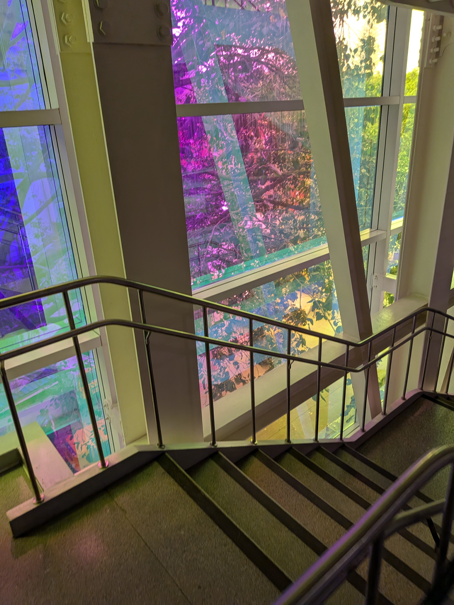
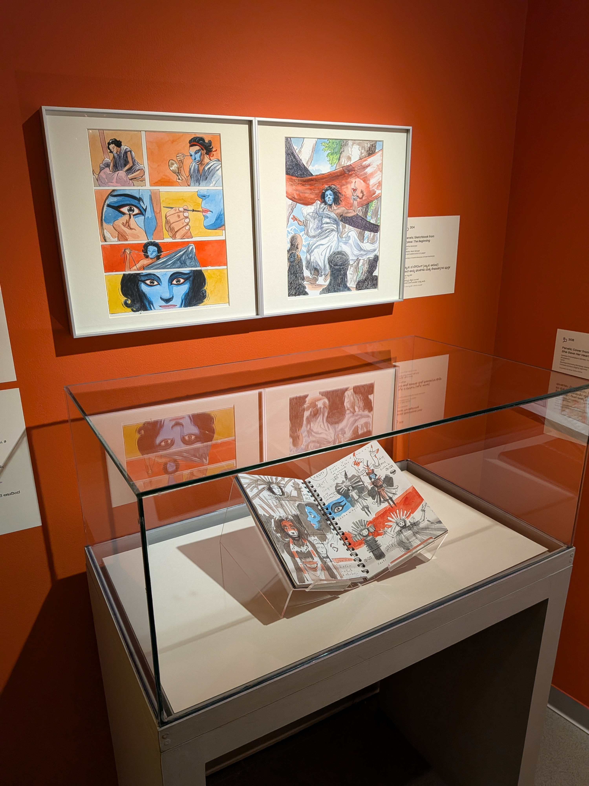
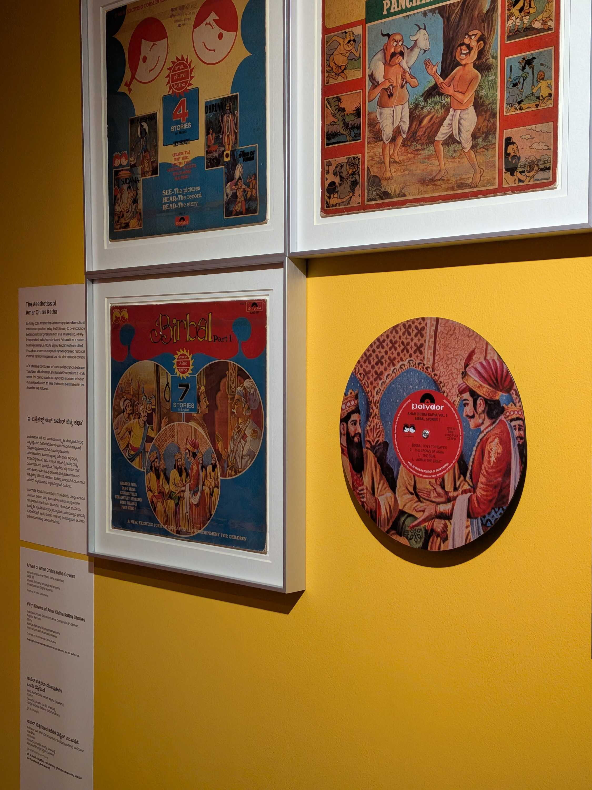
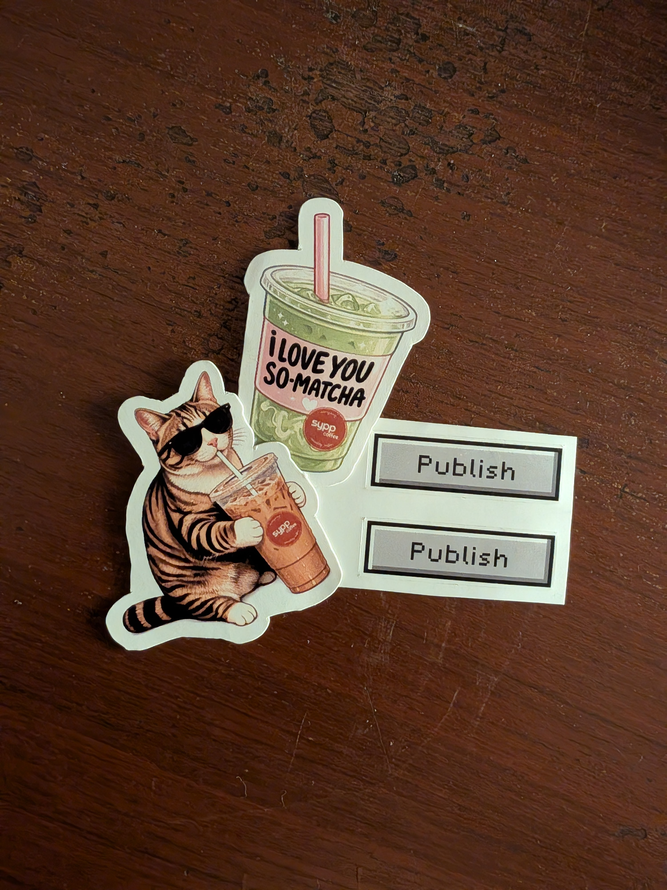

On Sunday, the chronicles of the long weekend continued. I went to the [Museum of Art and Photography](https://map-india.org/) with [Sumnima](https://linkedin.com/in/sumnima-rai-440506287), where we went through the an exhibition called "[A Moving Line: 1500 Years of Indian Visual Storytelling](https://map-india.org/exhibition/a-moving-line-1500-years-of-indian-visual-storytelling/)".

Now, don't kill me, but this was my first time going to MAP after being in Bengaluru for _four years_. I probably have many Reels and links of this place saved, of exhibitions that have long come by and gone. MAP to me is one of those must-go places here, and so I was glad to finally do my MAP _darshan_ with Sumi.

I also want to mention that I really appreciate the accessibility of the whole place. A wheelchair ramp for the entrance, a lift big enough for even a motorized wheelchair to enter comfortably, and self-opening doors with key cards placed at a comfortable height. The staff was really helpful and friendly too. The place is well thought through.

The exhibition itself was wonderful. We were in a quiet room with red walls, surrounded by artwork drawn over multiple decades. Historical prints existed in the same space as modern Indian creators, with even showcases of the adoption of language in visual art across the country.

The part that I loved the most is the inclusion of [Amar Chitra Katha](https://en.wikipedia.org/wiki/Amar_Chitra_Katha). Growing up, I can't remember a single comic I read that wasn't under ACK's umbrella of work --- except maybe [_Chacha Chaudhary_](https://www.chachachaudhary.com/) from [Diamond Comics](https://en.wikipedia.org/wiki/Diamond_Comics), who was a travel partner on every train ride. The cartoons and their stories always lingered in my memory.

But yeah, the exhibition had a complete wall of covers of ACK's comics, including ones of _Mahabharata_, _Lord Krishna's Chronicles_, and _Akbar & Birbal_. Man I love Birbal. Birbal is the coolest. They also had a vinyl of Birbal's stories. Did I tell you I love Birbal?

There was also this little leaflet in the centre of the exhibition, where you could complete a comic strip by drawing your own story. I drew from an epiphany that left me and Sumi laughing for a long time. You can ask me for it if we meet in person. ;)

I don't particularly remember how the Monday went by for me. I remember seeing a lot of my Marathi friends posting Stories from their [_Ganesh Chaturthi_](https://en.wikipedia.org/wiki/Ganesh_Chaturthi) celebrations and I sent a mental prayer to all the pictures of idols too.

I also undertook the surgical process of increasing the storage of my main partition on my laptop. I say "surgical" because I learned that the laptop makes a familiar _beep_ every second when in recovery mode, similar to those patient monitors in hospitals. _Not_ to say that they are the same thing, ofcourse. I feel like I have to disclose that stuff nowadays. The resizing was ultimately a success.

Saturday was spent hanging out with the folks at [IndieWebClub](https://blr.indiewebclub.org). The meetup this week was more development-related and set around digital housekeeping. I started out with the intention to work on [my _Nannoo's_ website](https://prembrij.in), but I quickly got absorbed in talking to many of the other attendees about their set tasks instead.

I've sort of developed an appreciation for the ways in which people have come to use LLM's. The technology itself is still as crude and intellectual theft-y as it has ever been, but these humans have come to utilize it in a way that brings their warmest ideas to life.

[Divjot](https://bogas04.fyi/) recently shifted [his Now page](https://bogas04.fyi/now/) to look more like Orkut, while [Arpit](https://musings.thedataareclean.com/) made a portal for the his wife's [monthly Bengali meal service](https://sundaytable.in/). [Jatan](https://jatan.space), who isn't a programmer by profession, jailbroke his Kindle and fine-tuned [his calm writing setup](https://web.jatan.space/taking-care-of-my-devices-and-myself) with help from LLM's. I have some apps that I am working on myself, with the intention to ultimately spend less time on my devices.

I don't know, we might be able to abstract our way out of our technological pit and get back to our human connections. But there's a lot of fascism to be cleaned up before we get there.

That's all the musing there is this week! I am getting very sleepy now. Sweet dreams, dear reader.

### Videos I Liked

- "[Lec 16 Pedagogy in the Times of AI](https://www.youtube.com/watch?v=N2a1J0UPeL4)" by [NPTEL - Indian Institute of Science, Bengaluru](https://www.youtube.com/@nptel-indianinstituteofsci8064)
- "[Plants for Boys](https://www.youtube.com/watch?v=IBJjyjGq3zI)" by [Speeed](https://www.youtube.com/@SpeeedCo)
- "[Abolish Texting Me Just “Hi” | Macy Gilliam | Full Set](https://www.youtube.com/watch?v=d894-whYfAs)" by [Nebula](https://www.youtube.com/@nebula)
- "[ragebaiting men to see how easy it is](https://www.youtube.com/watch?v=FnIVkxRi0PY)" by [Maya](https://www.youtube.com/@mayahiga)
- "[I asked DanTDM 100 Questions About The KSI Drama, Mental Health And Being A Minecraft Legend](https://www.youtube.com/watch?v=Y2UohQgCYI0)" by [100 Questions](https://www.youtube.com/channel/UC-71I3qt1d35IYL5XC-0LZw) with [Tom Simons](https://www.youtube.com/channel/UC5p_l5ZeB_wGjO_yDXwiqvw)

### Posts I Loved

- "[To Love is to Decay](https://writoryofficial.com/winning-poem/113?from=past)" by [Deelisha Agrawal](https://instagram.com/deelisha_22)
- "[Weeknote September 15 - September 20 2026](https://ascelpius.mataroa.blog/blog/weeknote-september-15-september-20-2026/)" by [Diwakar](https://ascelpius.mataroa.blog/)
- "[Proper English is a Myth: There's No 'Correct' Way to Write](https://brennan.day/proper-english-is-a-myth-theres-no-correct-way-to-write/)" by [Brennan Brown](https://brennan.day/)
