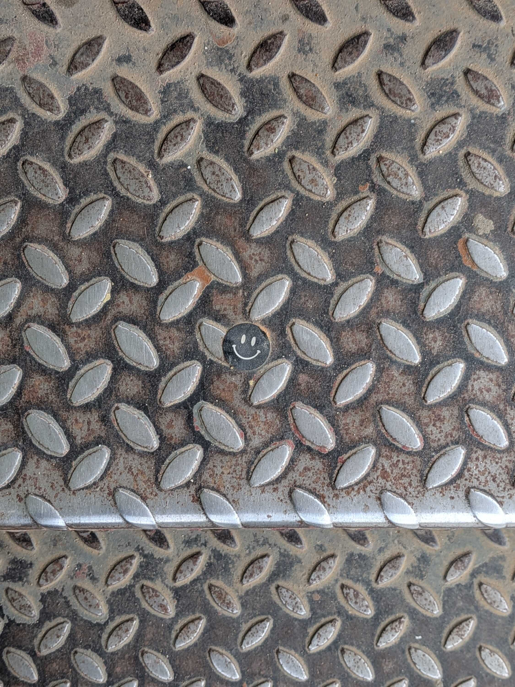
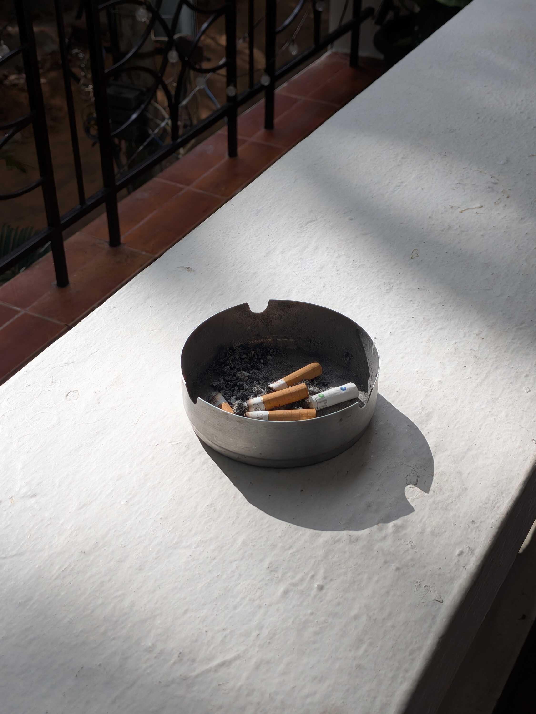
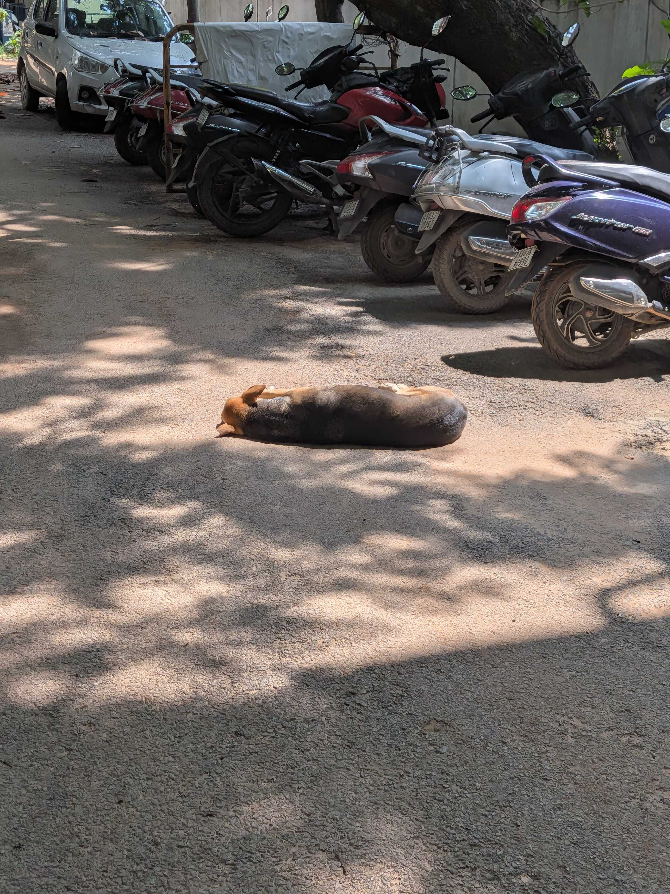

I've felt tired a lot lately.

I was going to write a long (forcefully) morose weeknote about how hard it is to find companionship and how I feel a touch-starved when I'm not home. I still am writing about all this, but I'm not going to be as pitiful about it, because I've realized I feel more irritation in this regard than I feel sadness.

I am clear in the belief that my love language revolves around giving gifts, acts of service and physical touch. I like making other people comfortable or giving them joy; not in a people-pleasing way, but more so "I _want_ to show this person they're loved and make them feel happy, so I will."

I have showcased love in this way; to friends, to family, and (sometimes but not that much) to crushes. I have seen people happy and it has made me happy. But what I'm realizing more and more lately is that I _want_ care and love in return. I want the policy of, "Give the love you want to receive," to be applied completely. My problem is with that receiving part.

Now to be clear, people _do_ reciprocate. My family most of all; there are many hugs and warm dinners and gifts back home. When Kinder-Joy was doing their Batman toys, my sister took her normal Batman and painted it gold to match the rare Batman from that series. She gifted it to me, and it is sitting on my dressing table looking at me as I write this, my superior protector.

The problem though is that I'm _not_ at home right now. I'm in Bangalore. And I've noticed I don't get very many hugs while I'm in Bangalore. There's many hangouts and meetups and talking to friends and new people. But this hugs part has been quite a bother for me this week. I don't know why.

> To my friends, please don't hug me if you don't want to! I'm just blabbering here.

Also, you know those moments where you recall something cringe you did in the past, and suddenly wince? I usually have those when I'm stepping more out of my comfort zone and meeting new people. And I've been having more of those lately.

Maybe that's what it is. I feel like I'm reaching out to a lot of new people and not always receiving the attention I'm putting in. That deficiency of reciprocation might be what's getting on my nerves slowly. I don't think I'm doing too much, but maybe it would be better to cocoon for a bit.

I also think it's because of being on social media more, because I'm seeing a lot more happy lives and people celebrating wins I dream of. I do have a lot, and I have gratitude for it, but seeing sunshine and rainbows so much and then coming back to a quiet, dimly lit room might not be good for me anyway.

Some people have also been telling me in passing that, now that my employment is taken care of, "I just need to find a girlfriend." I really don't like the idea of looking at companionship as a box to tick, but I did feel the yearning for it myself too. I'm wondering now if that yearning wouldn't linger as much if I had more hugs. Is it all hugs in the end?

As I finish writing, I'm sitting in the office cafeteria on my break. When I go back to my accommodation after work, I will lie down for a while before I exercise and work on some code before I sleep. I might video-call home and wish everyone goodnight. But maybe I still wish a little to have someone next to me to say goodnight to, too.

---

Okay the writing is getting cringe now. I'm going to stop right here.

Regularly scheduled programming (and my shenanigans from IndiaFOSS) will be included in the next weeknote. Between IndiaFOSS and all the other things I do in that week, it's going to be a long one. :)

Thank you for reading through, and if you want to force melancholy today I'm going to recommend listening to [Freakin' Out On the Interstate](https://www.youtube.com/watch?v=bnmuCqD7TLg) by Briston Maroney and [Love Me Like There's No Tomorrow](https://www.youtube.com/watch?v=H1Wbu_AF2e4) by Freddie Mercury. Peace.

### Posts (Mostly) Talking About Sucky Things

- [Diwakar](https://ascelpius.mataroa.blog/)'s [two](https://ascelpius.mataroa.blog/blog/weeknote-september-15-september-20-2026/) [weeknotes](https://ascelpius.mataroa.blog/blog/weeknote-september-21-september-27-2026-07972b00/) that started this train of thought in my head
- "[Can I just say that everything sucks?](https://bogas04.fyi/blog/2026/09/can-i-just-say-that-everything-sucks/)" by [Divjot](https://bogas04.fyi/)
- "[Concerning things about my life that concern me](https://santais.online/blogging/blogs/concerning-things)" by [Santrupti](https://santais.online/)
- "[Birthday ~Blues~ Purples](https://tanvibhakta.in/blog/birthday-blues-purples/)" by [Tanvi Bhakta](https://tanvibhakta.in/)

### Links That Are Not Sucky

- [Roadrash Kerela](https://www.inspiredos.com/roadrash) on InspireDOS
- [Websites Websites Websites!](https://websiteswebsiteswebsites.net/)
