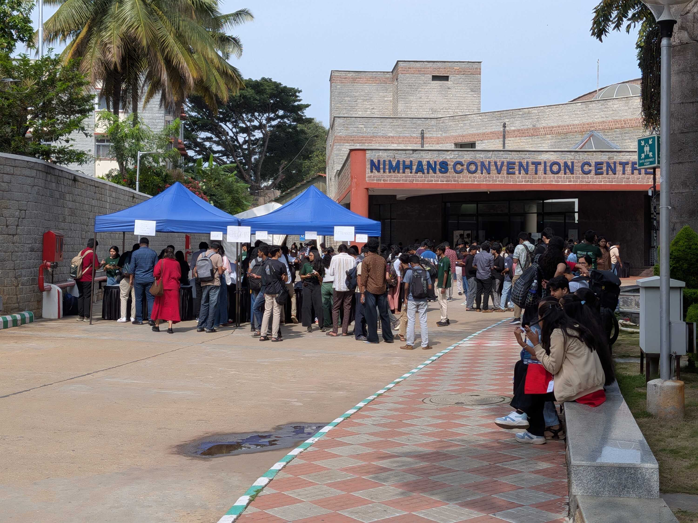
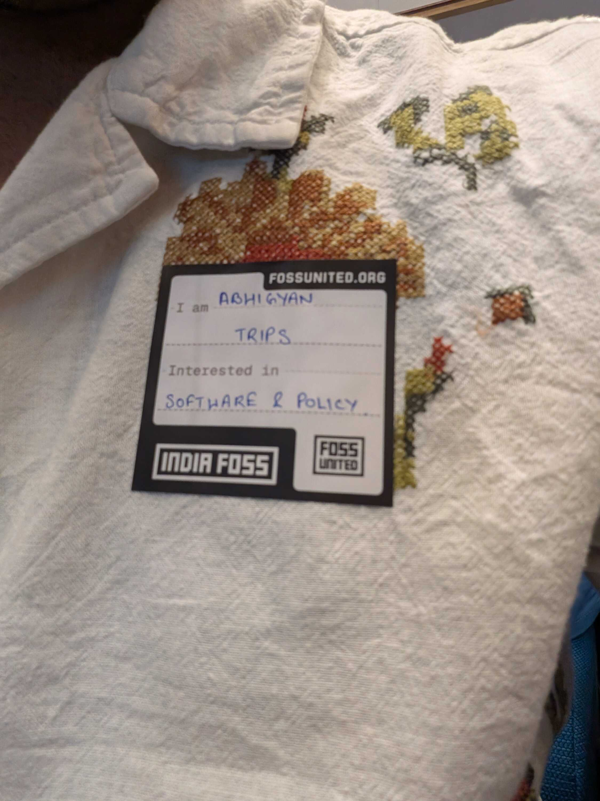
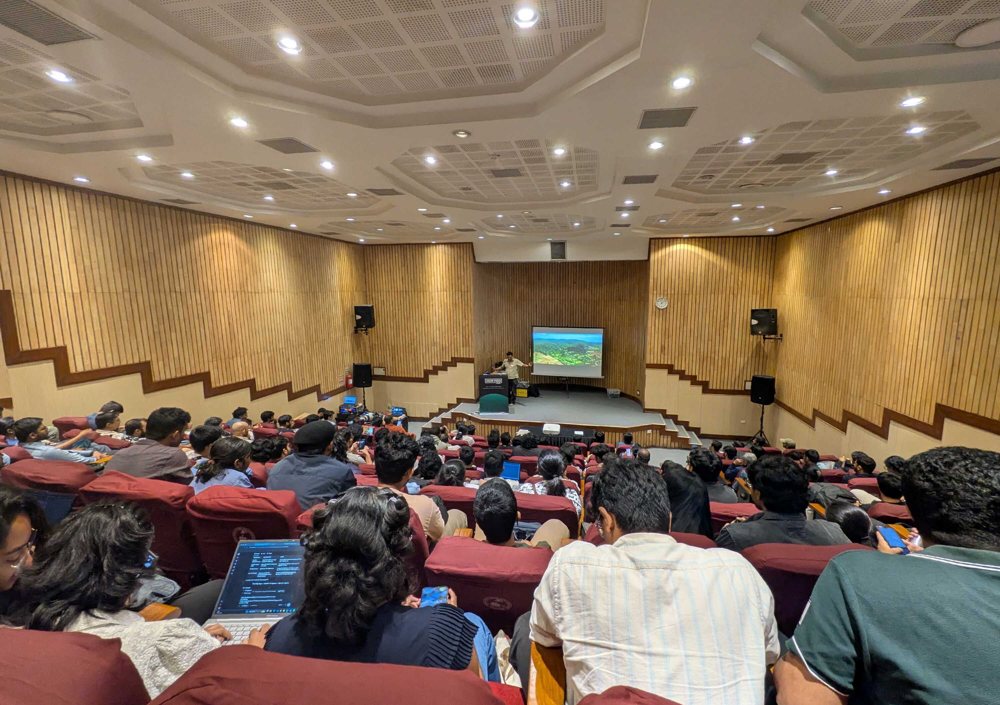
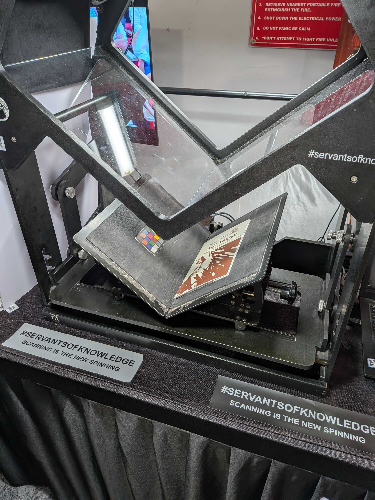
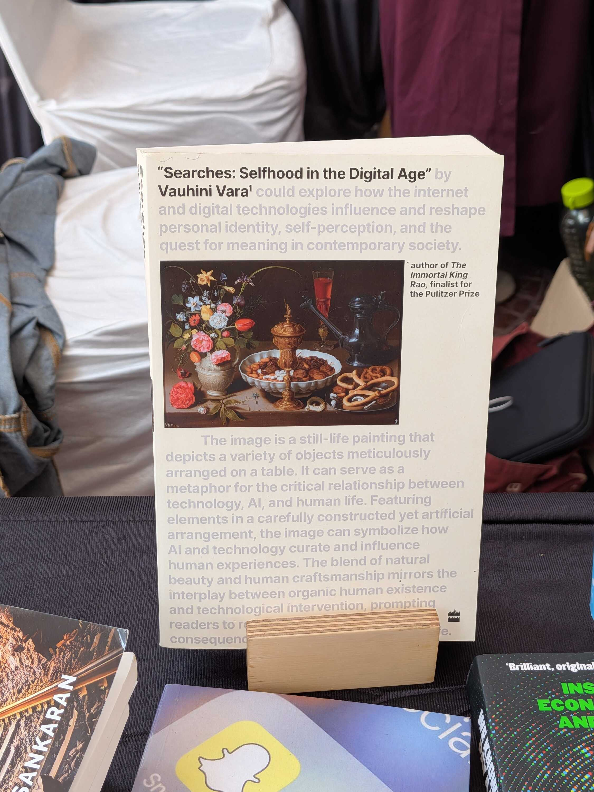
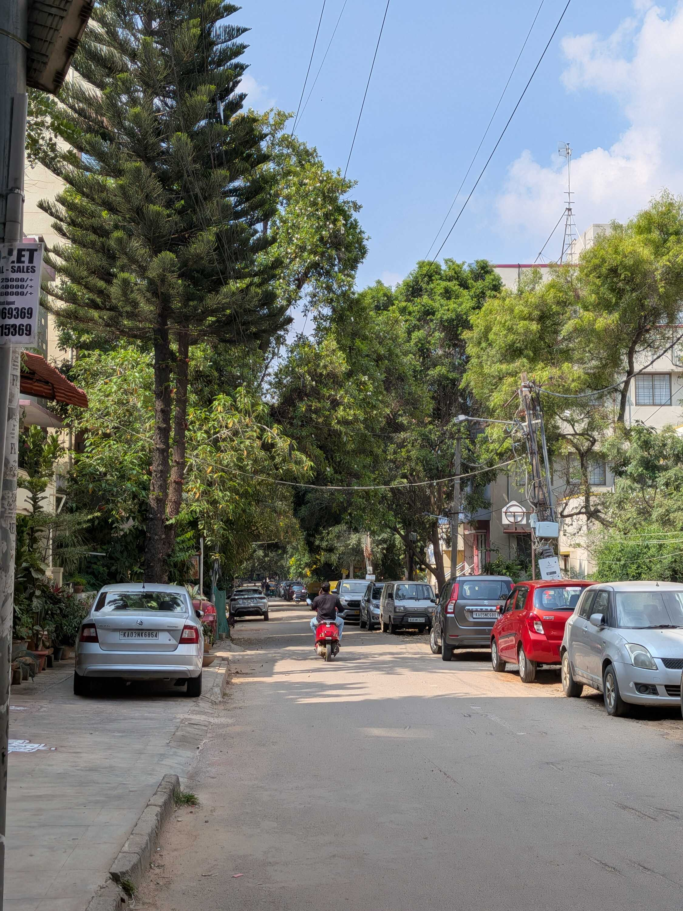
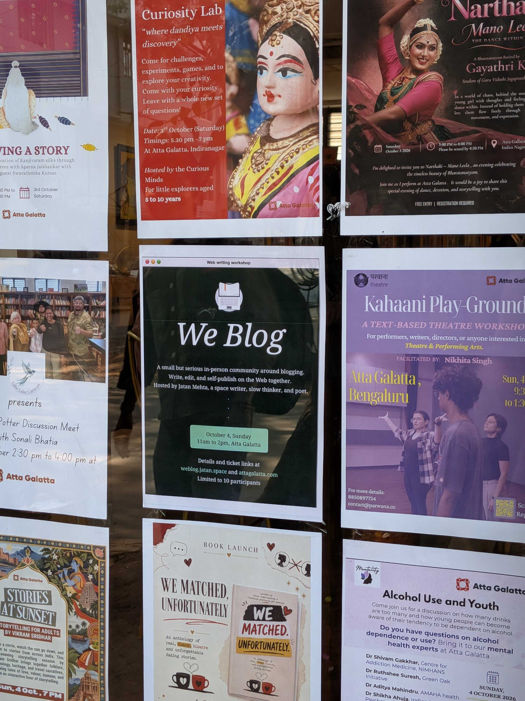

The week started with my first time attending [IndiaFOSS](https://fossunited.org/indiafoss/2026/).

There were so many people everywhere. I'd promised myself that I would wake up early and reach the Centre on time, but I was up till 2AM the night before planning out which talks I would attend. I ended up rushing to the Centre, slapping on an intro sticker on my shirt and reaching Hall 1 just in time for the introduction.

As soon as the introduction finished, people started rushing to their next-scheduled talks. There were multiple discussions happening simultaneously, across different rooms and different topics. My own calendar had multiple overlapping events, and soon I was moving to attend my first proper IndiaFOSS talk.

There were _so many events_. Speakers were talking about hardware, design, security, and God knows what else. People listened intently and laughed at niche references. Some people were wearing LED badges with animated text. There were nerds everywhere, and it was hard to believe that being a nerd was ever considered uncool.

It's crazy how many rabbit holes people have gone through, and how deeply they have studied the smallest parts in tech and become experts. One of the talks I attended was in the Documentation Devroom, titled "[Python Now Speaks Tamil: Getting Official Docs Translated for a Mother Tongue](https://fossunited.org/c/indiafoss/2026/cfp/7dfgb98p8p)". This is how I learned that there's a community around documentation called [Write the Docs](https://www.writethedocs.org/) and, more specifically, a Tamil Python community called PyTamil. What in the world.

There was another talk from the same devroom called "404: Empathy Not Found" which I enjoyed immensely. It talked about understanding where the user is coming from and what they might need from the documentation to fulfil their problem. I was really impressed by the Documentation Devroom overall.

The talk I liked the most though, was "[My zero-to-hero journey deploying a fiber-optic and wireless community mesh](https://fossunited.org/c/indiafoss/2026/cfp/9e9bajmm07)" by [Kiran Jonnalagadda](https://x.com/jackerhack). This was one I wasn't planning to attend, but I ended up in the right Hall at the right time to witness Kiran narrating his chronicles to get Wi-Fi in the middle of nowhere. It was practically a show-and-tell, because he was carrying literally everything he was talking about on-stage -- from a kilometer of fiber optic to an aluminium weatherbox. If you get the time I'd recommend you [watch the recording](https://www.youtube.com/live/GOL_18fGMUI?t=4005).

The corridors outside the auditoriums were their own world. There were booths everywhere, with 3D-printed demonstrations and people enthusiastically talking about their projects. TV's showed a variety of different software demos, and I took pictures of as many as I could to look at later.

One of the booths showed those scanning contraptions used by the Internet Archive to scan books, and I soon learned that it was a more affordable version made by an Indian community (called [Servants of Knowledge](https://archive.org/details/ServantsOfKnowledge)) to archive old Indian literature.

This is one of those things I feel glad technology exists for. Scriptures that were slowly being consumed by time could now be witnessed by many people, for generations to come. It was also relieving to see their work after [the monstrosity that Anthropic is doing](https://www.theguardian.com/commentisfree/2026/aug/05/anthropic-ai-destroying-books) just to gather data from old rare books. The polarity in behaviour towards books is incomprehensible.

On a different note, another booth was from a group of students from a school, coming to present their project to the crowd. From what I can remember, it was an assistive typing test game that would progressively get harder and introduce more characters. I found it fun and they asked me to leave feedback for them in a notebook. Here's [their GitHub repository](https://github.com/TinkerQubits/Typing-Arena) if you want to check it out.

I do wonder if the kids used LLM's to code, though. I would be sad if they did. School is the age for them to stumble and learn. There would be nothing for them to learn if the code is just spit out by a black box. But they were definitely enthusiastic about the project, and had rehearsed their demo very well.

Stepping out from the Centre for _chai_ had me standing in front of a small pop-up bookshop. I scoured around and judged books by their covers. I was impressed by every single one of them; they were all curated to be on-topic for a convention that revolves around public building, shared resources and conscious living. I loved it.

After attending all the talks I had marked out, collecting merch from some of the booths and meeting some people from [IndieWebClub](https://blr.indiewebclub.org/) in passing ([Priyanshu](https://aspiz.uk/), [Tanvi](https://tanvibhakta.in/), [Nithilan](https://nithitsuki.com/) and [Harsh](https://msfjarvis.dev/), all on their own IndiaFOSS journeys), I dipped from the conference and met up with <abbr title="My friends from college, where most of the group is Marathi. I don't really know how we ended up on that term, but that's how we refer to the group now.">Marathi Gang</abbr> for a late lunch.

We caught up on our individual shenanigans and plans, after which I made a visit to my relatives and went out on an evening walk with them. Looking back, I can't believe how long this specific day was. I just remember my legs hurting from the exertion and going into a very peaceful sleep afterwards. It was an amazingly extroverted day.

On Sunday, I woke up feeling completely exhausted. I can't remember how many hours I continued to lie on the bed after waking up. All that to say, I couldn't attend the second day of IndiaFOSS. I instead watched the livestreams of my bookmarked events while I worked on my own projects and chilled.

The weekdays went by in a flash, working and chatting with coworkers during breaks. I remember feeling the workdays were shorter because of the long weekend coming up, and I looked forward to the three-day holiday. Thank you Gandhi Ji.

I also got some writing done this week, and published some long-pending drafts. I wrote [a letter to my college juniors](/blog/to-my-college-juniors) and _finally_ published the results of [my comparison of _chai_ premixes](/blog/battle-of-the-chai-premixes). I'm proud of them both.

The hope was to finish all my pending drafts in October, but then I realized the "Facets" on [my about page](/whoami#facets) and the "Stories" of [my individual projects](/projects) still need to be written. So the new target is to have the website content properly complete by the end of this year. :)

Friday night was a dinner with <abbr title="My friends from college, where most of the group is Marathi. I don't really know how we ended up on that term, but that's how we refer to the group now.">Marathi Gang</abbr>, which later converted into a late-night movie watch ([Shang-Chi](https://www.imdb.com/title/tt9376612/) to be specific, which was a great watch).

I also finished watching [Loki](https://www.imdb.com/title/tt9140554/) this week, and man... what a show. I tend to love shows that revolve around/mess with the concept of time. And this show did it in a really coherent way. I realized I'd never really thought of multiverses and different timelines existing at the same time, but I can see just how complicated it would make... everything. I wonder if we're living in a "Sacred Timeline" of our own, in which case it's even rarer for us to exist.

Saturday was spent at [IndieWebClub](https://blr.indiewebclub.org/) and catching up with IndieFriends afterward. Every meetup makes me even more glad I'm a part of this place. So many ambitious people every single time, always doing something exciting (and are excited to talk about it). I always leave with a fresh plate of thoughts and ideas.

Now, not to scare you, but I'm about to include a Sunday in a weeknote that usually only spans till Saturday. I'm sure you're thinking "No way! That breaks the format!" I know I know, but thankfully it's my website and I make the format. So yeah, phew. We're safe for now.

On Sunday, I went to [Jatan](https://jatan.space)'s [WeBlog Workshop](https://weblog.jatan.space/we-blog-1-event-announcement) at [Atta Galatta](https://attagalatta.com/). The workshop was more writing-focused with an intentionally small crowd, for more tight-knit interactions.

I was happy to receive an invitation from Jatan when I did. I didn't end up writing much during the workshop (I'm realizing my writing process is more so a solo one), but it was still great to meet some old friends and new people on the weekend.

Oh and last thing: I finally tried matcha this weekend. I've sort of been prejudiced to it because I thought I'd be labeled a performative male if I had it. But I thought I should atleast give it a proper chance. So after WeBlog we went to [anāma](https://anama.coffee/), which was right next to Atta Galatta.

Aand... I thought it was okay. I wish I had a less lukewarm take, but I don't. I first told the group that I thought it was bland, to which I was told I can have sugar added to it. So I realized that's not a problem. But I still didn't warm up to it. It wasn't until [Divjot](https://bogas04.fyi/) mentioned that the caffeine from matcha is slower-setting than coffee, which made me realize that my ADHD-ish ass can have it as an alternative to coffee[^1].

So that's my takeaway. I might have it again. Also the color is pretty. I like green a lot.

---

With this, I've now reached 30 completed weeknotes on the site. That's a lot of notes. I recently mentioned in IndieWebClub that I write these now because every week leaves a footprint; there's evidence that the week happened and that I did something during the week. I stand by that completely, and I hope to continue this practice (even if some weeknotes end up being late).

This week left quite the footprint too. Thank you for reading through. I'll leave you with some cool content to consume. Peace and love.

### Videos I Liked

- "[Frozen vs. Fast vs. Fancy Food Taste Test (ft. Mckenna Grace)](https://www.youtube.com/watch?v=EbCTly7s3E0)" by [Good Mythical Morning](https://www.youtube.com/@GoodMythicalMorning)
- "[Josh Johnson Eats His Last Meal](https://www.youtube.com/watch?v=L6tdVUqVTfM)" by [Mythical Kitchen](https://www.youtube.com/@mythicalkitchen)
- "[Can We Slip It In: Uno Edition](https://www.youtube.com/watch?v=4mWJ6r81teo)" by [Smosh Games](https://www.youtube.com/@SmoshGames)
- "[Mamdani releases blooper reel after accusations his foreign language video was AI](https://www.youtube.com/watch?v=5G2xDe-h-H0)" by [The Independent](https://www.youtube.com/@theindependent)
- "[Math Rock Playlist That If Doesn't Get You Into The Genre I Don't Know What Will](https://www.youtube.com/watch?v=-pGsMW5mOCI)" by [One Day, Maybe](https://www.youtube.com/@onedaymaybe0)
- "[This fancy computer runs Wall Street](https://www.youtube.com/watch?v=KP6g_3iZDro)" by [Good Work](https://www.youtube.com/@GoodWorkMB)
- "[ASMR~ Cognitive Exam + Follow My Instructions](https://www.youtube.com/watch?v=YqjcofUEhbo)" by [Angelica's Grass](https://www.youtube.com/@angelicasgrass)

### Posts I Loved

- "[Bone music: the Soviet bootleg records pressed on x-rays](https://www.theguardian.com/music/2015/jan/29/bone-music-soviet-bootleg-records-pressed-on-xrays)" from [The Guardian](https://www.theguardian.com/) via. [Drew.Coffee](https://drew.coffee/)
- "[being connected](https://jaydip.me/blog/reading-on-rss)" by [Jaydip](https://jaydip.me/)
- "[Aranmula VallaSadya](https://hiran.in/scenes/aranmula-vallasadya/)" by [Hiran Venugopalan](https://hiran.in/)
- "[My Bangalore Food Map](https://yashgarg.dev/notes/bangalore-food-map/)" by [Yash Garg](https://yashgarg.dev/)
- "[Proper English is a Myth: There's No 'Correct' Way to Write](https://brennan.day/proper-english-is-a-myth-theres-no-correct-way-to-write/)" by [Brennan Kenneth Brown](https://brennan.day/)
- "[Why are short videos bad for learning?](https://www.baldurbjarnason.com/2026/02-why-are-short-videos-bad-for-learning/)" by [Baldur Bjarnason](https://www.baldurbjarnason.com/)
- "[Software with a Point of View](https://connie.surf/valuesbasedsoftware.html)" by [Connie Liu](https://connie.surf/)

### Links I Found Cool

- [Weird little guys of FOSS](https://drewdevault.com/weird-guys/) by [Drew Devault](https://drewdevault.com/)
- Chia Amisola's Website, [EverythingI.Love](https://everythingi.love/)
- Chia Amisola's Poem, [ParuParo.Cloud](https://paruparo.cloud/)
- [Ryo Lu's Website](https://ryo.lu/)
- [Vishal Katariya](https://vishalkatariya.com/)'s Weekly-ish Newsletter, [Kat's Kable](https://vishalkatariya.com/katskable/)

#### Footnotes

[^1]: Coffee makes me sneeze. You can ask me why in-person.
